# Parking Lot Tracker

The parking lot management system uses computer vision to read license plates from cars entering and exiting the parking lot. It then calculates the amount of time the car was parked and its respective charge.

## Database Models

### User

Built on top of django's built-in user model, the user model checks who is allowed access into the dashboard or admin panel.

- username: login identifier
- email: contact email address
- password: stored as a hashed password not in plain text
- first_name: optional display name
- last_name: optional display name
- is_staff: True grants access to the Django admin site
- is_active: False disables the account without deleting it, user cannot login
- is_superuser: True bypasses all permission checks in the admin
- date_joined: auto-set timestamp when the account was created
- last_login: auto-updated timestamp on each authentication

If user is a guest, their parking sessions are not linked to a user account.


### LicensePlate

The license plates that are registered to a user account. A user can register multiple plates; however, each plate belongs to exactly one user. 

- user: the user account that owns this license plate
- plate_text: the text of the license plate
- is_primary: whether this is the user's primary plate
- label: optional for user side to identify the plate

### ParkingLot

Each model represents one parking lot.

- name: the name of the parking lot

### LotSettings

The settings for a specific parking lot.

- lot: the parking lot that these settings apply to. Taken from the ParkingLot model.
- rate: the rate per billing unit (hour or minute) in dollars
- billing_unit: the unit of time for the rate (hour or minute)
- grace_period_minutes: the number of minutes for the grace period, no charge is issued for parking sessions shorter than this amount.
- daily_cap_enabled: whether to enable the daily cap
- daily_cap_amount: the maximum charge per session, if enabled. The day rate.
- image_retention_days: the number of days to keep uploaded plate images on disk, if enabled.
- confidence_threshold: the confidence threshold for the CV pipeline.

### ParkingSession

The core transactional record. One row per car visit.

- plate_text: the text of the license plate
- license_plate: the license plate that the car is registered to
- user: the user account that the car is registered to
- lot: the parking lot that the car is parked in
- entry_time: the time the car entered the parking lot
- exit_time: the time the car left the parking lot
- duration_seconds: the duration of the parking session in seconds
- charge_amount: the charge for the parking session in dollars
- status: the status of the parking session (active, completed, void)
- has_duplicate_warning: whether the parking session is a duplicate warning
- was_orphaned: whether the parking session was orphaned. 

<details>
<summary><strong>Orphan Handling</strong></summary>

If a plate triggers an entry event while it already has an active session, the system assumes the exit was missed (e.g., camera outage). The old session is voided (`was_orphaned=True`, `status="void"`) and a new session is opened (`has_duplicate_warning=True`). No charge is issued on the voided session.

</details>

### PlateDetectionEvent

The CV logging system, where the CV pipeline logs entry and exit events.

- session: the parking session that this event belongs to
- image: the uploaded plate image file path
- raw_plate_text: the text of the license plate as read by the CV pipeline
- confidence_score: the confidence score from the CV pipeline
- event_type: the type of event (entry or exit)
- is_low_confidence: whether the confidence score is below the confidence threshold
- manually_corrected: whether the plate text was manually corrected by an operator
- corrected_plate: the manually corrected plate text
- bounding_box: the bounding box of the license plate as a JSON array [x, y, w, h]
- timestamp: the time the event was created

### CV pipeline

```mermaid
flowchart LR
    IMG([photo path]) --> LOAD[load_image]
    LOAD --> BGR[bgr_to_rgb]
    BGR --> RESIZE[resize_for_detector]
    RESIZE --> NORM[normalize_pixels]
    NORM --> TENSOR[to_tensor]
    TENSOR --> DETECTOR[PlateDetectorCNN]
    DETECTOR --> CROP[crop_plate_region]
    CROP --> PREP[prepare_for_recognizer]
    PREP --> RECOG([PlateRecognizerCRNN])
```



<details>
<summary><code>load_image(path)</code></summary>

Loads the image from disk using OpenCV after a security pre-check. Before any pixels are decoded, the resolved path is confirmed to stay inside `MEDIA_ROOT` (path traversal prevention), and Pillow inspects the file header to confirm the format is JPEG, PNG, or WEBP. Images larger than 12 MP (4000×3000) are rejected to prevent decompression bomb attacks. OpenCV then decodes the validated file into a BGR numpy array.

</details>

<details>
<summary><code>bgr_to_rgb(image)</code></summary>

Converts the colour channel order from BGR to RGB. OpenCV always loads images in BGR order (blue–green–red), but PyTorch models trained on ImageNet expect RGB (red–green–blue). Without this swap, the model would see the red and blue channels swapped on every image, degrading accuracy. The conversion is done with `cv2.cvtColor` rather than slicing (`img[:, :, ::-1]`) because `cvtColor` produces a contiguous array that avoids a hidden memory copy later in the pipeline.

</details>

<details>
<summary><code>resize_for_detector(image)</code></summary>

Resizes the image to 640×480 pixels — the fixed input resolution the plate detector CNN expects. The resize uses letterboxing (padding the shorter dimension with a neutral fill) to preserve the original aspect ratio. Stretching the image to fit would distort plate shapes and hurt detection accuracy, especially for narrow or wide plates.

</details>

<details>
<summary><code>normalize_pixels(image)</code></summary>

Scales pixel values from the 0–255 integer range down to 0.0–1.0 floats by dividing by 255. Neural networks learn faster and more stably when inputs are in a small, consistent numeric range. Without normalisation, large pixel values would cause large gradients and make the model sensitive to overall image brightness rather than plate features.

</details>

<details>
<summary><code>to_tensor(image)</code></summary>

Converts the numpy array to a PyTorch `FloatTensor` and reorders the axes from HWC (Height × Width × Channels) to CHW (Channels × Height × Width). PyTorch's convolutional layers expect channels first. The conversion also moves the data from CPU memory into a tensor that can be transferred to GPU/MPS for inference.

</details>

<details>
<summary><code>PlateDetectorCNN</code> <em>(planned)</em></summary>

A custom convolutional neural network that takes the 640×480 RGB tensor and outputs a bounding box `[x, y, w, h]` localising the license plate in the image. Trained from scratch on synthetic composite images generated by `synthetic_data.py`. Uses Smooth L1 loss for bounding box regression. Weights are stored in `apps/cv/weights/detector.pth` (gitignored).

</details>

<details>
<summary><code>crop_plate_region(image, bbox)</code></summary>

Uses the detector's bounding box to crop just the plate area out of the full image. This gives the recognizer a tight view of the plate with minimal background clutter, which significantly improves character recognition accuracy. The crop is clamped to image bounds to handle any slight over-prediction from the detector.

</details>

<details>
<summary><code>prepare_for_recognizer(crop)</code></summary>

Resizes the plate crop to 128×32 pixels and converts it to grayscale. The recognizer operates on grayscale because plate text recognition is a shape task — colour carries no useful signal and including it would triple the input size for no accuracy gain. The 128×32 resolution is wide enough to fit the longest plate text while being small enough to keep the encoder fast.

</details>

<details>
<summary><code>PlateRecognizerCRNN</code> <em>(planned)</em></summary>

A convolutional–recurrent network (CNN backbone + bidirectional LSTM) that reads the 128×32 grayscale plate image left to right and outputs the plate text character by character, plus a confidence score. Uses CTC (Connectionist Temporal Classification) loss, which handles variable-length plate strings without needing character-level position labels. Weights are stored in `apps/cv/weights/recognizer.pth` (gitignored).

</details>


## Web Application

Django 5.1 backend with HTMX for reactive partials and Chart.js for revenue visualization. No Node.js, no React — server-rendered templates with targeted DOM swaps.

All pages require authentication. No public routes.

## Docker

The application runs as two containers orchestrated by Docker Compose:

1. **db** — PostgreSQL 16 with a persistent named volume
2. **web** — Django served by Gunicorn on port 8000

```bash
# Start all services
docker-compose up --build

# Run migrations
docker-compose exec web python manage.py migrate

# Seed initial data — creates a superuser, default ParkingLot, and LotSettings (safe to run multiple times)
docker-compose exec web python manage.py setup_defaults

# Create an admin user
docker-compose exec web python manage.py createsuperuser

# Run the test suite
docker-compose exec web pytest --cov=apps/accounts --cov=apps/parking --cov-fail-under=80
```