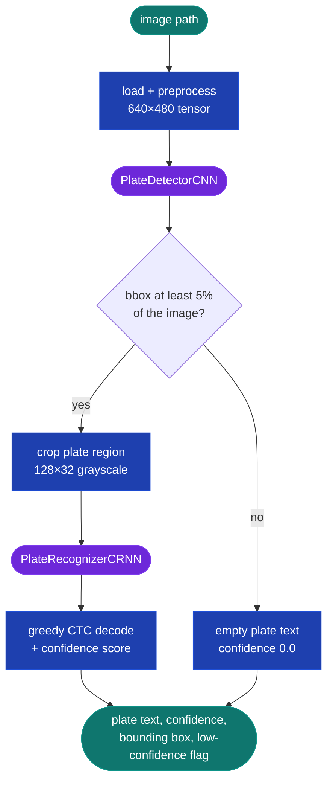

# Parking Lot Tracker

A parking lot management system that uses computer vision to read license plates from cars entering and exiting. It calculates parking duration and issues charges automatically — with no external CV APIs. All models are custom-trained on synthetic data.

**Stack:** Django 5.1 · PostgreSQL 16 · PyTorch · OpenCV · HTMX · Chart.js · Docker

## Table of Contents

- [Architecture Overview](#architecture-overview)
- [Getting Started](#getting-started)
- [Database Models](#database-models)
- [CV Pipeline](#cv-pipeline)
  - [Image Preprocessing](#image-preprocessing)
  - [Plate Detector CNN](#plate-detector-cnn)
  - [Plate Recognizer CRNN](#plate-recognizer-crnn)
  - [Plate Recognition Pipeline](#plate-recognition-pipeline)
- [Synthetic Training Data](#synthetic-training-data)
  - [Data Generation](#data-generation)
  - [Dataset Classes](#dataset-classes)
  - [Augmentations](#augmentations)
  - [Training the Models](#training-the-models)
- [Session & Billing](#session--billing)
- [Web Application](#web-application)
  - [Pages](#pages)
  - [API Endpoints](#api-endpoints)
  - [Scheduled Maintenance](#scheduled-maintenance)
- [Docker](#docker)
- [Security](#security)

---

## Architecture Overview

The system is organized into four Django apps with clear ownership boundaries:

| App | Owns |
|-----|------|
| `apps.accounts` | Custom `User(AbstractUser)` — no extra fields |
| `apps.parking` | Models, admin, `setup_defaults`, session/billing services |
| `apps.cv` | Preprocessing, custom models, synthetic data, training scripts, and inference pipeline |
| `apps.dashboard` | Staff-only pages, upload/dashboard APIs, settings form, HTMX partials, and revenue analytics |

**Request flow for an uploaded plate image:**

```
Upload (JPEG/PNG)
  └─ validate (MIME + Pillow + dimensions + 10 MB cap)
       └─ PlateRecognitionPipeline.process()
            ├─ load_image() → bgr_to_rgb() → resize_for_detector(640×480) → normalize → to_tensor()
            ├─ PlateDetectorCNN → bbox [cx, cy, w, h]
            ├─ crop_plate_region() → prepare_for_recognizer(128×32 gray)
            └─ PlateRecognizerCRNN → greedy CTC decode → plate_text + confidence
                 └─ handle_entry() or handle_exit()  (services.py)
                      └─ ParkingSession + PlateDetectionEvent  (DB)
```

---

## Getting Started

### Prerequisites

- Docker and Docker Compose ≥ 2.24
- Python 3.11+ (only needed outside Docker, for training CV models)
- PyTorch with MPS/CUDA (optional — CPU works, but training is slow)

### 1. Clone and configure environment

Copy the example env file and fill in values:

```bash
cp .env.example .env
```

Required variables: `SECRET_KEY`, `DB_NAME`, `DB_USER`, `DB_PASSWORD`, and
`DEBUG`. Compose maps the three `DB_*` values to PostgreSQL's internal
`POSTGRES_*` variables, so configure the `DB_*` names shown in `.env.example`.

### 2. Start services

```bash
# Development mode — Django runserver with live code mount
docker-compose up --build
```

### 3. Run migrations

```bash
docker-compose exec web python manage.py migrate
```

### 4. Seed the default lot and settings

This creates the default `ParkingLot` and `LotSettings` records. **Required before the application is usable.** Safe to run more than once.

```bash
docker-compose exec web python manage.py setup_defaults
```

### 5. Create a staff user

```bash
docker-compose exec web python manage.py createsuperuser
```

Log in at `http://localhost:8000/login/` with that account.

### 6. Run the test suite

```bash
# All tests
docker-compose exec web pytest

# With coverage gate — accounts + parking apps must stay at ≥ 80%
docker-compose exec web pytest --cov=apps/accounts --cov=apps/parking --cov-fail-under=80

# CV tests only (excluded from the coverage gate)
docker-compose exec web pytest apps/cv/tests/ -v
```

### 7. Train CV models (optional — pre-trained weights required for upload to work)

The weight files live in `apps/cv/weights/` (gitignored). To train from scratch:

```bash
# Generate synthetic training data (run outside Docker; requires background images in data/backgrounds/)
python -c "from apps.cv.training.synthetic_data import generate_detector_dataset; generate_detector_dataset(n=1000, output_dir='data/detector', bg_dir='data/backgrounds')"
python -c "from apps.cv.training.synthetic_data import generate_recognizer_dataset; generate_recognizer_dataset(n=5000, output_dir='data/recognizer')"

# Train models (uses MPS on Apple Silicon automatically)
python apps/cv/training/train_detector.py --epochs 50 --data-dir data/detector --output apps/cv/weights/detector.pth
python apps/cv/training/train_recognizer.py --epochs 100 --data-dir data/recognizer --output apps/cv/weights/recognizer.pth
```

### 8. Scheduled image cleanup

Preview expired images without deleting anything:

```bash
docker-compose exec web python manage.py cleanup_old_images --dry-run
```

See [Scheduled Maintenance](#scheduled-maintenance) for the crontab entry.

---

## Database Models

### User

Built on Django's `AbstractUser`. Controls who can access the dashboard or admin panel.

| Field | Description |
| :--- | :--- |
| `username` | Login identifier |
| `email` | Contact email address |
| `password` | Stored as a hashed password, never plain text |
| `first_name` | Optional display name |
| `last_name` | Optional display name |
| `is_staff` | `True` grants access to the operator dashboard and Django admin |
| `is_active` | `False` disables the account without deleting it |
| `is_superuser` | `True` bypasses all permission checks in the admin |
| `date_joined` | Auto-set timestamp when the account was created |
| `last_login` | Auto-updated timestamp on each authentication |

> Guest parking sessions are not linked to a user account.

---

### LicensePlate

License plates registered to a user account. A user can register multiple plates; each plate belongs to exactly one user.

| Field | Description |
| :--- | :--- |
| `user` | The user account that owns this plate |
| `plate_text` | The text of the license plate |
| `is_primary` | Whether this is the user's primary plate |
| `label` | Optional user-side label to identify the plate |

---

### ParkingLot

Each record represents one parking lot.

| Field | Description |
| :--- | :--- |
| `name` | The name of the parking lot (unique) |

---

### LotSettings

Per-lot billing and operational configuration.

| Field | Description |
| :--- | :--- |
| `lot` | The parking lot these settings apply to |
| `rate` | Rate per billing unit (hour or minute) in dollars |
| `billing_unit` | Unit of time for the rate (`hour` or `minute`) |
| `grace_period_minutes` | Minutes before a charge is issued |
| `daily_cap_enabled` | Whether to enable the daily charge cap |
| `daily_cap_amount` | Maximum charge per session |
| `image_retention_days` | How many days to keep uploaded plate images on disk before cleanup |
| `confidence_threshold` | Minimum CV confidence score to trust automatically |

---

### ParkingSession

The core transactional record — one row per car visit.

| Field | Description |
| :--- | :--- |
| `plate_text` | The text of the license plate |
| `license_plate` | The registered plate record (if any) |
| `user` | The user account the car is registered to |
| `lot` | The parking lot the car is parked in |
| `entry_time` | Time the car entered |
| `exit_time` | Time the car exited |
| `duration_seconds` | Duration of the parking session in seconds |
| `charge_amount` | Charge for the session in dollars |
| `status` | `active`, `completed`, or `void` |
| `has_duplicate_warning` | Whether this session replaced a missed exit |
| `was_orphaned` | Whether this session was voided due to a missed exit |

<details>
<summary><strong>Orphan Handling</strong></summary>

If a plate triggers an entry event while it already has an active session, the system assumes the exit was missed (e.g., camera outage). The old session is voided (`was_orphaned=True`, `status="void"`) and a new session is opened (`has_duplicate_warning=True`). No charge is issued on the voided session.

</details>

---

### PlateDetectionEvent

The CV audit log — records every entry and exit event from the CV pipeline.

| Field | Description |
| :--- | :--- |
| `session` | The parking session this event belongs to |
| `image` | Uploaded plate image file path |
| `raw_plate_text` | Plate text as read by the CV pipeline |
| `confidence_score` | Confidence score from the CV pipeline |
| `event_type` | `entry` or `exit` |
| `is_low_confidence` | Whether score is below the confidence threshold |
| `manually_corrected` | Whether an operator corrected the plate text |
| `corrected_plate` | The manually corrected plate text |
| `bounding_box` | Plate bounding box as a JSON array `[x, y, w, h]` |
| `timestamp` | Time the event was created |

---

### Database Integrity Rules

The database itself enforces billing-critical rules so bad data can't sneak in. Django validators only run when a model is saved through a form or `full_clean()` — `bulk_create`, `update()`, and raw SQL skip them entirely. Anything that protects billing math is therefore duplicated as a database-level constraint.

| Rule | Description |
| :--- | :--- |
| No duplicate plates per user | A user cannot register the same `plate_text` twice |
| Unique lot names | `setup_defaults` uses `get_or_create` — duplicate names would return an arbitrary row |
| Sessions survive lot deletion | Sessions are billing records, so deleting a lot with sessions is blocked (`PROTECT`) instead of cascading and wiping revenue history |
| Charges can't be negative | Enforced by both a validator and a database check constraint |
| Exit after entry | A car cannot exit before it entered — clock skew would otherwise produce negative durations |
| No negative durations | `duration_seconds` must be zero or greater |
| Voided sessions carry no charge | A voided session with a charge would corrupt revenue totals |
| Confidence stays in range | `confidence_score` must be between 0.0 and 1.0 |

<details>
<summary><strong>Partial Indexes</strong></summary>

Active sessions are a tiny fraction of the table once months of completed sessions accumulate. Two partial indexes (`plate_text` and `lot`, each filtered to `status='active'`) cover only the rows the entry/exit matcher and the 10-second dashboard poll actually touch, so they stay small enough to live in cache. A third partial index covers unreviewed low-confidence detection events for the manual review queue.

</details>

---

## CV Pipeline


### Image Preprocessing

**`load_image(path)`** — loads the image from disk using OpenCV after a security pre-check. Before any pixels are decoded, the resolved path is confirmed to stay inside `MEDIA_ROOT` (path traversal prevention), and Pillow inspects the file header to confirm the format is JPEG, PNG, or WEBP. Images larger than 12 MP (4000×3000) are rejected to prevent decompression bomb attacks. OpenCV then decodes the validated file into a BGR numpy array.

**`bgr_to_rgb(image)`** — converts the color channel order from BGR to RGB. OpenCV always loads images in BGR order (blue–green–red), but PyTorch models trained on ImageNet expect RGB (red–green–blue). Without this swap, the model would see the red and blue channels swapped on every image. The conversion uses `cv2.cvtColor` rather than array slicing because `cvtColor` produces a contiguous array that avoids a hidden memory copy later in the pipeline.

**`resize_for_detector(image)`** — resizes the image to 640×480 pixels using letterboxing (padding the shorter dimension with a neutral fill) to preserve the original aspect ratio. Stretching the image to fit would distort plate shapes and hurt detection accuracy, especially for narrow or wide plates.

**`normalize_pixels(image)`** — scales pixel values from the 0–255 integer range down to 0.0–1.0 floats by dividing by 255. Neural networks learn faster and more stably when inputs are in a small, consistent numeric range. Without normalization, large pixel values would cause large gradients and make the model sensitive to overall image brightness rather than plate features.

**`to_tensor(image)`** — converts the numpy array to a PyTorch `FloatTensor` and reorders the axes from HWC (Height × Width × Channels) to CHW (Channels × Height × Width). PyTorch's convolutional layers expect channels first. The conversion also moves the data from CPU memory into a tensor that can be transferred to GPU/MPS for inference.

**`crop_plate_region(image, bbox)`** — uses the detector's bounding box to crop just the plate area out of the full image. This gives the recognizer a tight view of the plate with minimal background clutter, which significantly improves character recognition accuracy. The crop is clamped to image bounds to handle any slight over-prediction from the detector.

**`prepare_for_recognizer(crop)`** — resizes the plate crop to 128×32 pixels and converts it to grayscale. The recognizer operates on grayscale because plate text recognition is a shape task — color carries no useful signal and including it would triple the input size for no accuracy gain. The 128×32 resolution is wide enough to fit the longest plate text while being small enough to keep the encoder fast.

---

### Plate Detector CNN

`PlateDetectorCNN` is a custom convolutional neural network with two main parts:

1. A **convolutional backbone** that extracts spatial features from the image.
2. A **fully connected head** that outputs the plate bounding box in YOLO format `[cx, cy, w, h]` with all values normalized to `[0, 1]`.

Dropout is set to 0.3 to prevent overfitting on synthetic data.

#### Convolutional Backbone

The detector receives input shaped `(batch, channels, height, width)`. Three convolutional blocks process the image sequentially, each applying:

1. **Conv2d** — learns spatial patterns (plate edges, letter locations).
2. **BatchNorm2d** — stabilizes activations during training so the weights update smoothly.
3. **ReLU** — introduces non-linearity; sets negative values to zero. `inplace=True` avoids creating a new tensor each pass.
4. **MaxPool2d** — subsamples by taking the maximum value in each window, shrinking the spatial size. Layer 3 preserves the height dimension so that tall characters like `B` and `8` remain distinguishable.

The three layers progress from low-level edge detection → letter localization → character discrimination. After the third block, `AdaptiveAvgPool2d(4×4)` produces a fixed-size feature map regardless of input size, which is then flattened to a 1D vector.

#### Fully Connected Head

The flattened features are compressed `2048 → 256 → 4`. A sigmoid at the output constrains all four values to `[0, 1]`, matching the normalized YOLO bounding box convention. The same sigmoid is applied during both training and inference so both share the same output space.

`predict(x)` wraps `forward()` under `@no_grad`, auto-switches to eval mode, and restores the prior training state via `try/finally` — safe to call mid-training without disrupting the training loop.

#### Training

Trained with `SmoothL1Loss` (Huber loss) + Adam optimizer + `ReduceLROnPlateau` learning rate scheduler. Target: **>0.7 IoU** on synthetic validation data after 50 epochs.


---

### Plate Recognizer CRNN

`PlateRecognizerCRNN` is a custom convolutional-recurrent neural network with three parts:

1. A **convolutional backbone** that encodes visual features from the plate crop.
2. A **bidirectional LSTM** that reads the encoded sequence left-to-right and right-to-left.
3. A **CTC output layer** that produces per-character probability distributions without requiring pre-segmented characters.

#### Convolutional Backbone

Three convolutional blocks identical in structure to the detector's (Conv2d + BatchNorm2d + ReLU + MaxPool2d). The final MaxPool uses a `(1×2)` kernel that preserves the height dimension so tall characters remain distinguishable. The 3-block stack maps `1 → 64 → 128 → 256` channels, then the feature map is reshaped to `(B, 2048, 16)` — 16 time-steps fed into the LSTM.

#### Bidirectional LSTM

The BiLSTM (`hidden=256, layers=2`) processes all 16 time-steps in both directions and concatenates the outputs, giving each time-step full context from the entire sequence. The 512-dimensional LSTM output at each step passes through a fully connected layer `(512 → 37)` followed by `log_softmax`, producing `(T=16, N, C=37)` log-probabilities — one distribution over 37 classes (26 letters + 10 digits + 1 CTC blank) per time-step.

`forward()` returns these log-probs directly (CTC-ready). Do **not** re-apply `log_softmax`.

#### Greedy CTC Decoder

`decode_predictions(output)` converts the `(T, N, C)` log-prob tensor to a list of plate strings. It takes the argmax at each time-step, collapses consecutive identical tokens, then removes blank tokens (index 0). If two identical letters appear adjacent with a blank in between, the blank is removed and both letters are kept.

#### Training

`CTCLoss` must run on CPU even on MPS devices (a PyTorch limitation) — training scripts call `log_probs.cpu()` before the loss. Targets: **>90% character accuracy, >80% full-plate accuracy** on synthetic validation data after 100 epochs.

Weights live in `apps/cv/weights/` (gitignored). Load with `torch.load(..., weights_only=True)`.


---

### Plate Recognition Pipeline

`PlateRecognitionPipeline` is the glue that connects every CV piece above into a single call. It takes one image path and runs the whole chain — load, preprocess, detect, crop, recognize — and returns one result dict:

```python
result = pipeline.process(image_path)
# {"plate_text": "ABC123", "confidence": 0.87, "bounding_box": [x, y, w, h], "is_low_confidence": False}
```



#### Model Loading

Both models are loaded once when the pipeline is created, not on every request. Loading weights from disk takes hundreds of milliseconds, so reloading per upload would make every request slow. After loading, models are moved to the best available device (MPS → CUDA → CPU) and switched to eval mode, so `process()` calls are stateless and safe to run from multiple threads.

Weights are loaded with `weights_only=True`, which blocks the arbitrary code execution that a pickle-based load of an untrusted `.pth` file would allow. If a weight file is missing, the pipeline raises a `FileNotFoundError` telling you to train that model first. If the file exists but is corrupt, truncated, or saved from an incompatible model version, it raises a `RuntimeError`. In both cases the error message never contains the file path — the full path is only written to the server log so a future API error response can't leak the server's directory layout.

#### Processing Steps

1. **Load and preprocess** — the image goes through the full preprocessing chain, ending as a 640×480 normalized tensor.
2. **Detect** — `PlateDetectorCNN` predicts the plate's bounding box in YOLO center format `[cx, cy, w, h]`.
3. **Reject tiny boxes** — if the box is narrower or shorter than 5% of the image, the detector found nothing meaningful (a 5% plate would be ~32 pixels wide — too small to read). The pipeline returns early with an empty plate text and confidence `0.0`.
4. **Crop** — the YOLO center box is converted to a top-left `[x, y, w, h]` box and the plate region is cropped from the resized image. The crop comes from the resized image (not the original) because the detector was trained on 640×480 inputs — its coordinates describe the image it actually saw.
5. **Recognize** — the crop is resized to 128×32 grayscale and `PlateRecognizerCRNN` reads the text using the greedy CTC decoder.
6. **Score** — the confidence score is computed from the non-blank time-steps and compared against the threshold.

#### Confidence Score

The recognizer emits 16 time-steps for every plate regardless of plate length, so on a 6-character plate most steps are blank tokens. The confidence score is the average certainty at each **non-blank** step — including blank steps would inflate the score and hide genuine uncertainty on the actual characters. If every step is blank, the plain average is used so the low value is preserved.

Confidence below `0.6` (`LOW_CONFIDENCE_THRESHOLD`) flags the result `is_low_confidence=True`. The per-lot `LotSettings.confidence_threshold` is the operator-configurable equivalent used by the billing services — events below that threshold land in the manual review queue rather than being silently trusted.

#### Bounding Box Coordinate System

The detector sees a letterboxed 640×480 canvas — the original photo is shrunk to fit and padded with neutral bars. The dashboard, however, draws boxes on the **original** upload. The pipeline removes the padding and re-normalizes the box to the original image, so the returned `bounding_box` lines up with the photo the operator uploaded. It is stored as `[x, y, w, h]` (top-left corner plus size, all values between 0 and 1), matching the `PlateDetectionEvent.bounding_box` field.

#### Singleton

`get_pipeline()` returns a module-level singleton — the first call creates the pipeline and every later call reuses it, so all Django requests in the process share one loaded copy of the models. Creation is guarded by double-checked locking so two simultaneous first requests can't each load the models concurrently.

The singleton is created lazily on the first request rather than at Django startup. Startup code also runs during management commands like `migrate` and `collectstatic`, where the weight files may not exist and inference is never needed — eager loading would crash migrations in CI just because the models hadn't been trained yet.

---

## Synthetic Training Data

The CV models are trained entirely on synthetic data generated at runtime. No real plate images are committed to the repository.

| Path | Purpose |
|------|---------|
| `data/backgrounds/` | Curated parking-lot photos for detector compositing (must exist before generating the detector dataset) |
| `data/detector/` | YOLO-format detector dataset (`images/`, `labels/`) |
| `data/recognizer/` | Recognizer crops + `labels.csv` |

### Data Generation

**`generate_detector_dataset()`** and **`generate_recognizer_dataset()`** live in `apps/cv/training/synthetic_data.py`. Plates are rendered for both US and Canadian formats at 400×120 pixels.

**How a synthetic plate image is built:**

1. **Generate plate text** randomly following country-specific format conventions:
   - US plates: `ABC 1234` (most common), `123 ABC`, or `ABC123`
   - Canadian plates: `ABC 123` or `A1B 2C3` (Ontario-style alphanumeric)
2. **Build the plate background** — a white rectangle with a dark border. Canadian plates add a solid blue strip across the top quarter to visually differentiate them from US plates.
3. **Render plate text** onto the background using a TrueType plate font. `textbbox` determines the plate center and the text is drawn in black ink. If the font file is missing, Pillow's default font is used as a fallback.
4. **Composite onto a background** — for the detector dataset, the plate is pasted onto a random 640×480 parking-lot background image at a random position, random scale, and random rotation (−15° to +15°). The plate is constrained to fit fully within the background.

**Detector dataset output** — saves full-scene `images/*.jpg` with paired `labels/*.txt` in YOLO format: `class_index cx cy w h` (all values normalized to `[0, 1]`). Existing files in the output directory are deleted before each run so re-runs don't mix generations.

**Recognizer dataset output** — saves only the cropped plate `images/*.png` (grayscale) with a `labels.csv` (`filename`, `text`, `country`). Existing files are deleted before each run.

Both builders count how many images they actually produced. If fewer than 90% of the requested samples were generated successfully, the run aborts with an error rather than silently writing an undersized dataset — a high skip rate means something is systematically broken (corrupt backgrounds, full disk), not just a stray bad file.

Both functions accept an optional `seed` parameter to make the generated dataset reproducible across runs.

### Dataset Classes

**`PlateDetectorDataset`** (`apps/cv/training/dataset.py`)

1. At startup, scans `images/*.jpg` (skips symlinks) and pairs each file with `labels/<same-stem>.txt`.
2. Each label file contains one YOLO line: `0 cx cy w h`. The leading class index `0` is dropped; the four floats are the box normalized to `[0, 1]`.
3. `__getitem__` loads the JPG, converts to an RGB tensor `(3, H, W)`, and returns `(image_tensor, bbox_tensor)` where `bbox_tensor` has shape `(4,)`.
4. Use the **default collate** function with a standard `DataLoader` — not `ctc_collate_fn`.

**`PlateRecognizerDataset`** (`apps/cv/training/dataset.py`)

1. At startup, reads `labels.csv` (`filename`, `text`; `country` is stored but not returned per sample).
2. `__getitem__` loads the matching PNG, converts to a grayscale tensor `(1, 32, 128)`, encodes the text to a list of character indices (spaces skipped), and returns `(image_tensor, label_list)`.
3. A `DataLoader` **must** set `collate_fn=ctc_collate_fn` because label lengths vary. The collate function stacks images to `(N, 1, 32, 128)`, concatenates all label lists into one 1D `targets` tensor, and builds `target_lengths` (how many indices belong to each sample).

**Character encoding** (recognizer only):
- `A→1` … `Z→26`, `0→27` … `9→36`
- Index `0` is reserved for the CTC blank token
- Spaces are skipped (not encoded)
- `CHAR_TO_IDX` / `VOCAB_SIZE=37` are the shared CTC encoding constants

### Augmentations

`apps/cv/training/augment.py` provides two transform classes that slightly modify training images so the models generalize to real parking cameras. Augmentations are applied **in memory** after the dataset loads the tensor — this module does not read files from disk.

**Two modes:**
- `train=True` — random changes each pass (used during training).
- `train=False` — normalization only, no random changes (used during evaluation).

**`DetectorAugment`** (full parking-lot photo, color):
- Random brightness/contrast/color tweaks (simulates different lighting conditions)
- Random slight blur
- 50% chance of horizontal flip (cars can enter from either direction)
- 10% chance of grayscale conversion (simulates black-and-white security cameras)
- ImageNet mean/std normalization

**`RecognizerAugment`** (small grayscale plate crop):
- Random brightness/contrast tweaks (faded or dirty plates)
- Random slight blur
- 50% chance of a mild perspective warp (angled camera, not a full flip)
- Grayscale normalization (mean 0.5, std 0.5)

The recognizer **never** flips the image horizontally — `"ABC 123"` backwards would not match the ground-truth label. The detector **can** flip because it only predicts where the plate is, not what it says.

### Training the Models

Run the training scripts outside Docker to use MPS on Apple Silicon (or CUDA on NVIDIA):

```bash
# Train the plate detector (target: >0.7 IoU after 50 epochs)
python apps/cv/training/train_detector.py \
    --epochs 50 \
    --data-dir data/detector \
    --output apps/cv/weights/detector.pth

# Train the plate recognizer (target: >90% char accuracy, >80% full-plate after 100 epochs)
python apps/cv/training/train_recognizer.py \
    --epochs 100 \
    --data-dir data/recognizer \
    --output apps/cv/weights/recognizer.pth
```

Both scripts save training-curve plots alongside the `.pth` files.

---

## Session & Billing

The CV pipeline answers *"what plate is in this photo?"*. The session and billing layer (`apps/parking/services.py`) answers the next question: *"what should happen now?"* — open a session, close one and charge for it, void a duplicate, or flag a bad read for an operator. It is the bridge between CV output and the database models.

Every detection is routed to one of two entry points based on whether the car is arriving or leaving:

- **Entry** → `handle_entry()` — voids any prior active session for the same plate (missed exit), opens a new active `ParkingSession`, and records a `PlateDetectionEvent`.
- **Exit** → `handle_exit()` — if it matches an active session, bills it and completes the session; if no active session matches, records a flagged event (`session=None`) for the operator review queue.

This layer is **pure business logic** — it never loads CV model weights or calls the pipeline. The caller runs the pipeline first and passes the already-extracted detection data (`plate_text`, `confidence`, `bounding_box`, `image`, `lot`) into these functions. That keeps it fast and trivially unit-testable with no `.pth` files required.

Two rules hold throughout: **all money is `Decimal`, never `float`** (float rounding errors accumulate into wrong revenue totals), and **no silent failures** — every branch logs, returns an explicit value, or raises.

---

<details>
<summary><code>normalize_plate(raw_text)</code></summary>

Collapses a raw plate reading into one canonical matching key. CV output and human input vary in spacing and case — `"abc 123"`, `"ABC 123"`, and `" abc123 "` all mean the same car — so all whitespace is stripped and the result is uppercased (`"ABC123"`). Hyphens and other characters are kept: the project uses an **exact-match policy**, so `"ABC-123"` stays distinct from `"ABC123"` and the system never guesses that two similar plates are the same vehicle. Empty, `None`, or whitespace-only input returns `""` (and logs a warning) rather than crashing.

</details>

<details>
<summary><code>calculate_charge(entry_time, exit_time, lot_settings)</code></summary>

Turns parking duration into a charge in dollars, as a `Decimal`. It is pure (no database writes) and isolated so the one place a bug costs real money can be tested against every boundary. The duration is built from **integer seconds**, never `Decimal(float)`, so binary-float noise can never pollute the cents. Four rules apply, in order:

1. **Grace period** — duration at or under `grace_period_minutes` is free (`$0.00`).
2. **Per-minute billing** — `ceil(total_minutes) × rate`.
3. **Per-hour billing** — `ceil(total_hours) × rate`. The billed quantity always rounds **up** because a car that parks 61 minutes occupied the spot into a second hour.
4. **Daily cap** — if `daily_cap_enabled` and the charge exceeds `daily_cap_amount`, the cap wins. If the cap is enabled but no amount is set, the charge is **not** silently zeroed — it logs a warning and bills the uncapped amount. An unknown `billing_unit` falls back to per-hour with a loud log.

The final result is rounded to the cent (`ROUND_HALF_UP`) before returning.

</details>

<details>
<summary><code>handle_entry(plate_text, confidence, bounding_box, image, lot)</code></summary>

Opens an active session when a car arrives, and records the entry event. Wrapped in `transaction.atomic()` because it may void a prior session **and** create a new session **and** create a detection event — those must all commit together or not at all.

- **Low confidence** is judged against the lot's own `confidence_threshold` (configurable per lot), not the CV pipeline's fixed constant, so operators can tune sensitivity per lot.
- **Orphan handling** — if the plate already has an active session in this lot, a single atomic `UPDATE` voids it (`status="void"`, `charge_amount=0`, `was_orphaned=True`) and the new session is flagged `has_duplicate_warning=True`. One `UPDATE` statement leaves no race window for two concurrent entries.
- **Guest vs registered** — if the normalized plate matches a registered `LicensePlate`, the session links to that user; otherwise it's a guest (`user=None`).
- An **empty plate** after normalization raises `ValueError` — an empty key would "match" every other blank read and corrupt the orphan/billing logic.

</details>

<details>
<summary><code>handle_exit(plate_text, confidence, bounding_box, image, lot)</code></summary>

Closes the matching active session when a car leaves and bills it. Also `transaction.atomic()`. It locks the oldest active session for the plate with `select_for_update()` so a concurrent exit can't double-bill, ordered by `entry_time` for a deterministic choice.

- **Exit without entry** — if no active session matches, it does **not** auto-create one and does **not** raise. It records a flagged event with `session=None` and `is_low_confidence=True` (forced, so it always lands in the review queue) and returns `None`.
- **Clock-skew guard** — to satisfy the exit-after-entry and non-negative-duration database constraints even with clock skew or sub-second turnaround, the exit time is bumped to at least one second after entry, and duration is `max(1, ...)`.
- On success, sets `status="completed"`, `exit_time`, `duration_seconds`, and `charge_amount` (via `calculate_charge`), saving only those changed fields.

</details>

<details>
<summary><code>correct_plate(event_id, corrected_text)</code></summary>

Applies an operator's manual correction to a detection event that landed in the review queue. Also `transaction.atomic()`. It marks the event `manually_corrected`, updates the linked session's `plate_text`, and **re-evaluates the registration link** — the corrected plate might now match a registered user, or no longer match (reverting the session to a guest). Both the event and session rows are locked with `select_for_update()` so the relink can't race a concurrent exit.

> **Authorization:** this service performs **no** access control. The `PATCH /api/events/<id>/correct/` view restricts access to authenticated staff before calling it; any direct callers must enforce equivalent access.

</details>

<details>
<summary><strong>Boundary Validation</strong></summary>

`services.py` is a system boundary — data arrives from CV output and web requests, both of which can be wrong or hostile — so inputs are cleaned before they reach the database. Plate text over 20 characters raises `ValueError` instead of being truncated (a truncated plate is a silently wrong matching key that would mis-bill the wrong car). An untrusted `bounding_box` is coerced to a 4-float list clamped to `[0, 1]`, or `[]` if malformed. Confidence is clamped to `[0.0, 1.0]` so an out-of-range value can't trip the `confidence_score` check constraint mid-insert.

</details>

---

## Web Application

Django 5.1 backend with server-rendered templates, HTMX for targeted live updates, and Chart.js for revenue visualization. HTMX and Chart.js are self-hosted under `static/js/vendor/`; the application does not require Node.js or React.

`templates/base.html` provides the responsive sidebar, top bar, active navigation, queue badge, flash messages, and the shared self-hosted HTMX asset.

### Pages

| Page | URL | Main features |
|------|-----|---------------|
| Login | `/login/` | Dark-themed authentication form with validation feedback |
| Dashboard | `/` | Live summary cards, active sessions, running charges, today's revenue and traffic, 10-second polling |
| Upload | `/upload/` | Entry/exit selection, lot selection, drag/drop JPEG or PNG, HTMX result swaps, plate bounding-box canvas overlay |
| Session Log | `/log/` | Plate/status/lot/entry-date filters, All/Registered/Guest tabs, running charge values, 25-row pagination |
| Error Queue | `/errors/` | Paginated low-confidence or unmatched events, private thumbnails, inline plate correction |
| Revenue | `/revenue/` | 7/30/90-day and custom date ranges, summary cards, daily revenue chart, lot and hour breakdowns |
| Settings | `/settings/` | Per-lot rate, billing unit, grace period, daily cap, image retention, and confidence threshold |

Every operator page and supporting API endpoint requires an authenticated staff account. The login and Django authentication routes remain public.

**Confidence indicator bands** are fixed across all pages:
- Green: ≥ 80%
- Yellow: 60–79%
- Red: < 60%

Authorization uses one global `is_staff` operator role. There is no per-lot tenant isolation — a staff user can access every configured lot.

### API Endpoints

All endpoints are staff-only. The upload endpoint runs the full CV pipeline and creates the session/event records. The image endpoint streams plate images privately; they are never served via a public media URL.

| Method | URL | Purpose |
|--------|-----|---------|
| POST | `/api/upload/` | Validate a JPEG/PNG, run CV, and create an entry/exit event |
| GET | `/api/sessions/` | Return the filtered, paginated HTMX session table |
| GET | `/api/dashboard-stats/` | Return the live dashboard region polled every 10 seconds |
| PATCH | `/api/events/<id>/correct/` | Correct a queued plate and reconcile its session |
| GET | `/api/revenue-data/` | Return exact-money summary, daily, lot, and hourly chart data |
| GET | `/api/events/<id>/image/` | Stream a detection image privately to authenticated staff |

The dashboard API module is split across four files for clarity: `api.py` (upload + shared `staff_required` decorator), `partials_api.py` (sessions/stats/correct), `revenue_api.py`, and `image_api.py`.

### Scheduled Maintenance

`cleanup_old_images` deletes uploaded plate images older than each lot's `image_retention_days` setting. It clears the `image` field on the `PlateDetectionEvent` row but **keeps** the session and event records intact for billing and audit purposes.

A lot with `image_retention_days = NULL` is treated as "keep forever" and is skipped entirely.

**Preview without deleting (always safe to run):**

```bash
docker-compose exec web python manage.py cleanup_old_images --dry-run
```

**Host crontab — run nightly at 02:00:**

```
0 2 * * * cd /path/to/parking-tracker && \
    docker compose -f docker-compose.yml -f docker-compose.prod.yml exec -T web \
    python manage.py cleanup_old_images
```

Orchestrators can use a native scheduler instead — for example, a Kubernetes `CronJob` running `python manage.py cleanup_old_images` directly in the web pod.

---

## Docker

The application runs as two containers orchestrated by Docker Compose:

| Container | Description |
| :--- | :--- |
| `db` | PostgreSQL 16 with a persistent named volume |
| `web` | Django application server |

### Development

```bash
# Start all services (Django runserver with live code mount)
docker-compose up --build

# Run migrations
docker-compose exec web python manage.py migrate

# Seed initial data — creates the default ParkingLot and LotSettings (safe to run repeatedly)
docker-compose exec web python manage.py setup_defaults

# Create an admin user
docker-compose exec web python manage.py createsuperuser

# Run the test suite with coverage gate
docker-compose exec web pytest --cov=apps/accounts --cov=apps/parking --cov-fail-under=80
```

### Production

The base `docker-compose.yml` targets local development (runserver, live code mount). For production, layer `docker-compose.prod.yml` on top — it swaps in Gunicorn, drops the dev source bind mount, and publishes port 8000 on host loopback only (`127.0.0.1`) so you must front it with a reverse proxy:

```bash
docker compose -f docker-compose.yml -f docker-compose.prod.yml up --build -d
```

The production override also runs `collectstatic` at startup via `entrypoint.sh`.

> **Requires Docker Compose ≥ 2.24.** The override uses the `!override` YAML tag to drop the development bind mount. On older Compose versions this tag is ignored and the mount is silently kept — re-exposing host source and `.env` inside the container. Verify with `docker compose version` before deploying.

**Startup guard:** `entrypoint.sh` aborts the container if `/app/.env` is present in a non-debug run, detecting a silently failed bind-mount drop before the server accepts traffic.

---

## Security

| Area | Protection |
| :--- | :--- |
| **Access control** | Every operator page and dashboard API requires an authenticated staff account (`is_staff = True`). Login and Django auth routes remain public. |
| **Image uploads** | Declared MIME type, Pillow structure, and format checks run before any CV decode. Uploads are capped at 10 MB (compressed) and 12 MP (pre-decode). Files are saved under randomized names in private storage. |
| **Plate images** | Never served via public `MEDIA_URL`. Only accessible through the authenticated `GET /api/events/<id>/image/` endpoint, which validates the stored path (must start with `plates/`, no `..`, extension allowlist) and sets `Cache-Control: private, no-store` on every response. The reverse proxy or object-storage bucket must also keep the backing media directory private. |
| **State-changing endpoints** | CSRF protection on all forms and PATCH endpoints. `correct_event` additionally uses `select_for_update()` inside `transaction.atomic()` to prevent concurrent double-correction. |
| **Injection** | Parameterized Django ORM throughout — no raw SQL. Revenue date inputs parsed with `date.fromisoformat()` (raises `ValueError` on bad input → HTTP 400). Lot IDs cast to `int()` before ORM lookup. |
| **Secrets** | All secrets via environment variables or a host `.env` file. `.dockerignore` excludes `.env` from the image build so secrets are never baked in. |
| **Content Security Policy** | A production CSP header is enforced via `django-csp` with `script-src 'self'` and no `unsafe-eval` or `unsafe-inline`. HTMX's `allowEval` and `allowScriptTags` options are disabled to align with this policy. |
| **HTTPS / transport** | HSTS, secure cookies, and SSL redirect are enabled in the production settings. |
| **Production deployment** | Gunicorn runs behind a reverse proxy. Port 8000 is bound to host loopback only (`127.0.0.1`). The dev source bind mount is dropped in the production Compose override. A startup guard in `entrypoint.sh` aborts the container if `/app/.env` is present in a non-debug run, detecting a silently failed bind-mount drop. |
