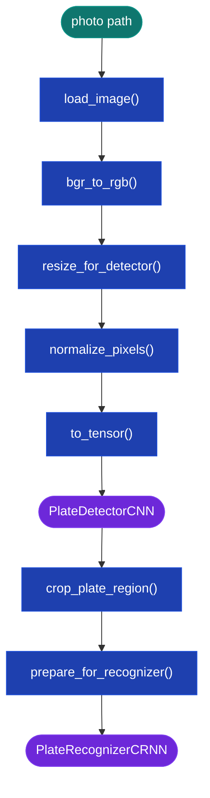
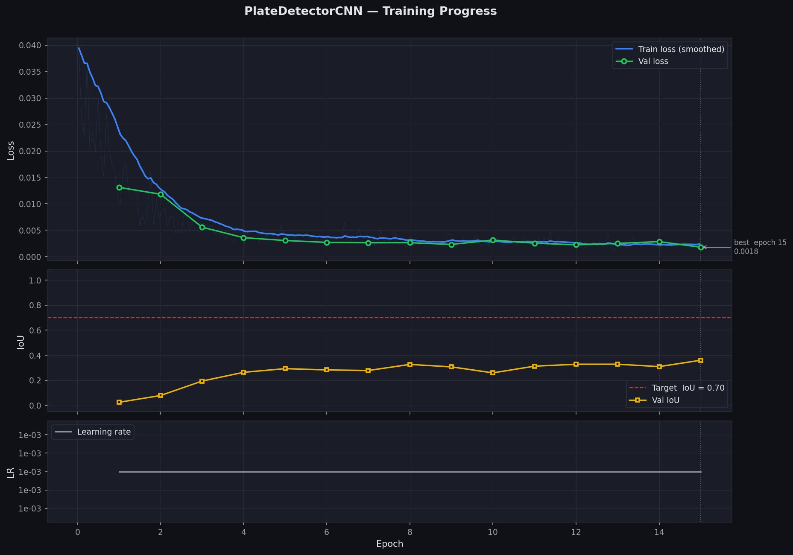
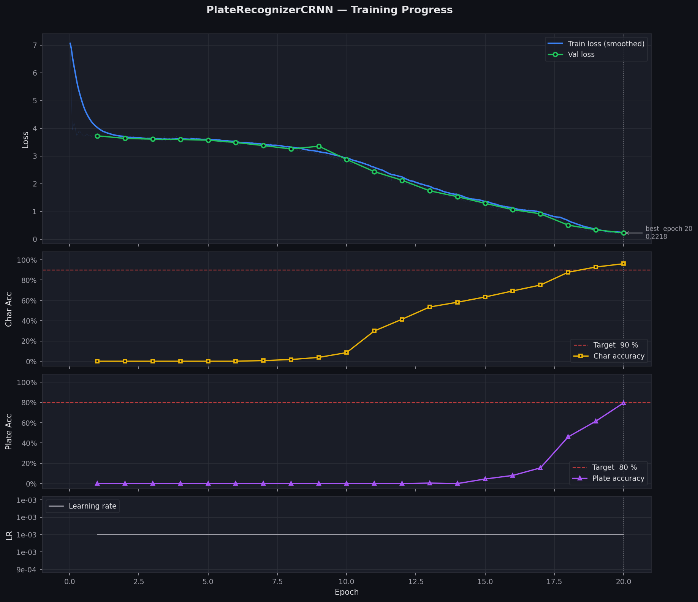

# Parking Lot Tracker

A parking lot management system that uses computer vision to read license plates from cars entering and exiting. It calculates parking duration and issues charges automatically.

## Table of Contents

- [Database Models](#database-models)
- [CV Pipeline](#cv-pipeline)
- [Branch: Synthetic Training Data Pipeline + Plate Detector CNN](#branch-synthetic-training-data-pipeline--plate-detector-cnn)
- [Branch: Plate Recognizer CRNN](#branch-plate-recognizer-crnn)
- [Branch: CV Inference Pipeline](#plate-recognition-pipeline)
- [Session & Billing](#session--billing)
- [Creating the Dataset for Training](#creating-the-dataset-for-training)
- [Web Application](#web-application)
- [Checking Day 9 and Day 10](#checking-day-9-and-day-10)
- [Docker](#docker)

---

## Database Models

### User

Built on top of Django's built-in user model. Controls who can access the dashboard or admin panel.

| Field&nbsp;&nbsp;&nbsp;&nbsp;&nbsp;&nbsp;&nbsp;&nbsp;&nbsp;&nbsp;&nbsp;&nbsp;&nbsp;&nbsp;&nbsp;&nbsp;&nbsp;&nbsp;&nbsp;&nbsp;&nbsp;&nbsp;&nbsp;&nbsp;&nbsp;&nbsp;&nbsp;&nbsp;&nbsp;&nbsp;&nbsp;&nbsp;&nbsp;&nbsp;&nbsp;&nbsp; | Description |
| :--- | :--- |
| `username` | Login identifier |
| `email` | Contact email address |
| `password` | Stored as a hashed password, never plain text |
| `first_name` | Optional display name |
| `last_name` | Optional display name |
| `is_staff` | `True` grants access to the Django admin site |
| `is_active` | `False` disables the account without deleting it |
| `is_superuser` | `True` bypasses all permission checks in the admin |
| `date_joined` | Auto-set timestamp when the account was created |
| `last_login` | Auto-updated timestamp on each authentication |

> If a user is a guest, their parking sessions are not linked to a user account.

---

### LicensePlate

License plates registered to a user account. A user can register multiple plates; each plate belongs to exactly one user.

| Field&nbsp;&nbsp;&nbsp;&nbsp;&nbsp;&nbsp;&nbsp;&nbsp;&nbsp;&nbsp;&nbsp;&nbsp;&nbsp;&nbsp;&nbsp;&nbsp;&nbsp;&nbsp;&nbsp;&nbsp;&nbsp;&nbsp;&nbsp;&nbsp;&nbsp;&nbsp;&nbsp;&nbsp;&nbsp;&nbsp;&nbsp;&nbsp;&nbsp;&nbsp;&nbsp;&nbsp; | Description |
| :--- | :--- |
| `user` | The user account that owns this plate |
| `plate_text` | The text of the license plate |
| `is_primary` | Whether this is the user's primary plate |
| `label` | Optional user-side label to identify the plate |

---

### ParkingLot

Each record represents one parking lot.

| Field&nbsp;&nbsp;&nbsp;&nbsp;&nbsp;&nbsp;&nbsp;&nbsp;&nbsp;&nbsp;&nbsp;&nbsp;&nbsp;&nbsp;&nbsp;&nbsp;&nbsp;&nbsp;&nbsp;&nbsp;&nbsp;&nbsp;&nbsp;&nbsp;&nbsp;&nbsp;&nbsp;&nbsp;&nbsp;&nbsp;&nbsp;&nbsp;&nbsp;&nbsp;&nbsp;&nbsp; | Description |
| :--- | :--- |
| `name` | The name of the parking lot |

---

### LotSettings

Settings for a specific parking lot.

| Field&nbsp;&nbsp;&nbsp;&nbsp;&nbsp;&nbsp;&nbsp;&nbsp;&nbsp;&nbsp;&nbsp;&nbsp;&nbsp;&nbsp;&nbsp;&nbsp;&nbsp;&nbsp;&nbsp;&nbsp;&nbsp;&nbsp;&nbsp;&nbsp;&nbsp;&nbsp;&nbsp;&nbsp;&nbsp;&nbsp;&nbsp;&nbsp;&nbsp;&nbsp;&nbsp;&nbsp; | Description |
| :--- | :--- |
| `lot` | The parking lot these settings apply to |
| `rate` | Rate per billing unit (hour or minute) in dollars |
| `billing_unit` | Unit of time for the rate (`hour` or `minute`) |
| `grace_period_minutes` | Minutes before a charge is issued |
| `daily_cap_enabled` | Whether to enable the daily charge cap |
| `daily_cap_amount` | Maximum charge per session (the day rate) |
| `image_retention_days` | Days to keep uploaded plate images on disk |
| `confidence_threshold` | Confidence threshold for the CV pipeline |

---

### ParkingSession

The core transactional record — one row per car visit.

| Field&nbsp;&nbsp;&nbsp;&nbsp;&nbsp;&nbsp;&nbsp;&nbsp;&nbsp;&nbsp;&nbsp;&nbsp;&nbsp;&nbsp;&nbsp;&nbsp;&nbsp;&nbsp;&nbsp;&nbsp;&nbsp;&nbsp;&nbsp;&nbsp;&nbsp;&nbsp;&nbsp;&nbsp;&nbsp;&nbsp;&nbsp;&nbsp;&nbsp;&nbsp;&nbsp;&nbsp; | Description |
| :--- | :--- |
| `plate_text` | The text of the license plate |
| `license_plate` | The registered plate record (if any) |
| `user` | The user account the car is registered to |
| `lot` | The parking lot the car is parked in |
| `entry_time` | Time the car entered |
| `exit_time` | Time the car exited |
| `duration_seconds` | Duration of the parking session in seconds |
| `charge_amount` | Charge for the session in dollars |
| `status` | `active`, `completed`, or `void` |
| `has_duplicate_warning` | Whether this session replaced a missed exit |
| `was_orphaned` | Whether this session was voided due to a missed exit |

<details>
<summary><strong>Orphan Handling</strong></summary>

If a plate triggers an entry event while it already has an active session, the system assumes the exit was missed (e.g., camera outage). The old session is voided (`was_orphaned=True`, `status="void"`) and a new session is opened (`has_duplicate_warning=True`). No charge is issued on the voided session.

</details>

---

### PlateDetectionEvent

The CV logging system — records every entry and exit event from the CV pipeline.

| Field&nbsp;&nbsp;&nbsp;&nbsp;&nbsp;&nbsp;&nbsp;&nbsp;&nbsp;&nbsp;&nbsp;&nbsp;&nbsp;&nbsp;&nbsp;&nbsp;&nbsp;&nbsp;&nbsp;&nbsp;&nbsp;&nbsp;&nbsp;&nbsp;&nbsp;&nbsp;&nbsp;&nbsp;&nbsp;&nbsp;&nbsp;&nbsp;&nbsp;&nbsp;&nbsp;&nbsp; | Description |
| :--- | :--- |
| `session` | The parking session this event belongs to |
| `image` | Uploaded plate image file path |
| `raw_plate_text` | Plate text as read by the CV pipeline |
| `confidence_score` | Confidence score from the CV pipeline |
| `event_type` | `entry` or `exit` |
| `is_low_confidence` | Whether score is below the confidence threshold |
| `manually_corrected` | Whether an operator corrected the plate text |
| `corrected_plate` | The manually corrected plate text |
| `bounding_box` | Plate bounding box as a JSON array `[x, y, w, h]` |
| `timestamp` | Time the event was created |

---

### Database Integrity Rules

The database itself enforces a set of rules so bad data can't sneak in. Django validators only run when a model is saved through a form or `full_clean()` — `bulk_create`, `update()`, and raw SQL skip them entirely. Anything that protects billing math is therefore duplicated as a database-level constraint.

| Rule&nbsp;&nbsp;&nbsp;&nbsp;&nbsp;&nbsp;&nbsp;&nbsp;&nbsp;&nbsp;&nbsp;&nbsp;&nbsp;&nbsp;&nbsp;&nbsp;&nbsp;&nbsp;&nbsp;&nbsp;&nbsp;&nbsp;&nbsp;&nbsp;&nbsp;&nbsp;&nbsp;&nbsp;&nbsp;&nbsp;&nbsp;&nbsp;&nbsp;&nbsp;&nbsp;&nbsp; | Description |
| :--- | :--- |
| No duplicate plates per user | A user cannot register the same `plate_text` twice |
| Unique lot names | `setup_defaults` uses `get_or_create` — duplicate names would make it return an arbitrary row |
| Sessions survive lot deletion | Sessions are billing records, so deleting a lot with sessions is blocked (`PROTECT`) instead of cascading and wiping revenue history |
| Charges can't be negative | Enforced by both a validator and a database check |
| Exit after entry | A car cannot exit before it entered — clock skew would otherwise produce negative durations |
| No negative durations | `duration_seconds` must be zero or greater |
| Voided sessions carry no charge | A voided session with a charge would corrupt revenue totals |
| Confidence stays in range | `confidence_score` must be between 0.0 and 1.0 |

<details>
<summary><strong>Partial Indexes</strong></summary>

Active sessions are a tiny fraction of the table once months of completed sessions pile up. Two partial indexes (`plate_text` and `lot`, each filtered to `status='active'`) cover only the rows the entry/exit matcher and the 10-second dashboard poll actually touch, so they stay small enough to live in cache. A third partial index covers unreviewed low-confidence detection events for the manual review queue.

</details>

---

## CV Pipeline



<details>
<summary><code>load_image(path)</code></summary>

Loads the image from disk using OpenCV after a security pre-check. Before any pixels are decoded, the resolved path is confirmed to stay inside `MEDIA_ROOT` (path traversal prevention), and Pillow inspects the file header to confirm the format is JPEG, PNG, or WEBP. Images larger than 12 MP (4000×3000) are rejected to prevent decompression bomb attacks. OpenCV then decodes the validated file into a BGR numpy array.

</details>

<details>
<summary><code>bgr_to_rgb(image)</code></summary>

Converts the color channel order from BGR to RGB. OpenCV always loads images in BGR order (blue–green–red), but PyTorch models trained on ImageNet expect RGB (red–green–blue). Without this swap, the model would see the red and blue channels swapped on every image, degrading accuracy. The conversion is done with `cv2.cvtColor` rather than slicing (`img[:, :, ::-1]`) because `cvtColor` produces a contiguous array that avoids a hidden memory copy later in the pipeline.

</details>

<details>
<summary><code>resize_for_detector(image)</code></summary>

Resizes the image to 640×480 pixels — the fixed input resolution the plate detector CNN expects. The resize uses letterboxing (padding the shorter dimension with a neutral fill) to preserve the original aspect ratio. Stretching the image to fit would distort plate shapes and hurt detection accuracy, especially for narrow or wide plates.

</details>

<details>
<summary><code>normalize_pixels(image)</code></summary>

Scales pixel values from the 0–255 integer range down to 0.0–1.0 floats by dividing by 255. Neural networks learn faster and more stably when inputs are in a small, consistent numeric range. Without normalization, large pixel values would cause large gradients and make the model sensitive to overall image brightness rather than plate features.

</details>

<details>
<summary><code>to_tensor(image)</code></summary>

Converts the numpy array to a PyTorch `FloatTensor` and reorders the axes from HWC (Height × Width × Channels) to CHW (Channels × Height × Width). PyTorch's convolutional layers expect channels first. The conversion also moves the data from CPU memory into a tensor that can be transferred to GPU/MPS for inference.

</details>


<details>
<summary><code>crop_plate_region(image, bbox)</code></summary>

Uses the detector's bounding box to crop just the plate area out of the full image. This gives the recognizer a tight view of the plate with minimal background clutter, which significantly improves character recognition accuracy. The crop is clamped to image bounds to handle any slight over-prediction from the detector.

</details>

<details>
<summary><code>prepare_for_recognizer(crop)</code></summary>

Resizes the plate crop to 128×32 pixels and converts it to grayscale. The recognizer operates on grayscale because plate text recognition is a shape task — color carries no useful signal and including it would triple the input size for no accuracy gain. The 128×32 resolution is wide enough to fit the longest plate text while being small enough to keep the encoder fast.

</details>


---
### Plate Detector CNN

The `PlateDetectorCNN` is a custom convolutional neural network which contains 2 main parts:
1. The convolutional backbone which looks through the image and extracts patterns,
2. A fully connected layer which outputs the bounding box of the plate in YOLO format [cx, cy, w, h] where all values are normalised to the range [0, 1] relative to the image dimensions.

Note that the drop out rate is set to 0.3 to prevent overfitting on the synthetic data.

#### Convolutional Backbone
The detector recieves input in the form of (batch size, number of channels, height, width).
The convolutional backbone contains 3 layers:
In each layer, the input is processed through the following steps:
1. Conv2d which looks and defines patterns within the image. For example, it might detect the edge of the plate, or where the first letter of the plate is located.
2. BatchNorm2d which keeps the numbers stable during training, this prevents the model from constantly changing the weights of the nodes in the network. The normalize helps the model learn faster and reduces chaos.
3. ReLU which keeps useful positive signals and sets all negative signals to 0. This introduces non-linearity into the network and allows for the model to learn more complex patterns. inplace=True is used to avoid creating a new tensor and just overwriting the existing one each time.
4. MaxPool2d which shrinks the image size by taken the maximum value of the window. kernal size refers to the size of the window, and stride refers to the number of pixels to move the window by each time. In layer 3, the height is kept the same to prevent the model from losing information when trying to predict the plate text. For example, B and 8 would be hard to tell apart if the height was cut in half.

Layer 1 is focused mainly detecting the edges of the plate and possible letters within the plate. Layer 2 is focused on detecting the where the letters are located within the plate. Layer 3 is focused on detecting what the letters are.
The output becomes (batch size, feature channels, height, width) which is then flattened into a 1D tensor with shape (batch size, feature channels * height * width). Low -> medium -> high level features. The padding is used to ensure that the output has the same shape as the input, and bias is prevent overfitting.

After the third layer, the output is flattened into a 1D tensor with shape (batch size, feature channels * height * width [feature values]).

#### Fully Connected Layer
The learned features outputed from the third layer is compressed into 256 and then into 4 feature value which represent the bounding box of the plate in YOLO format [cx, cy, w, h] where all values are normalised to the range [0, 1] relative to the image dimensions by using the sigmoid function.

#### Training the Model
The model is given a batch of images and the expected bounding box. The model then outputs the predicted bounding box based on the input image. The loss is calculated using the Smooth L1 loss function, which calculates the loss between the predicted bounding box and the expected bounding box. The loss is then backpropagated through the network to update the weights of the nodes in the network. The adam optimizer is used to update the weights of the nodes in the network. The learning rate is set to 0.001 and the batch size is set to 32. The model is trained for 100 epochs.

#### Evaluation the Model
The model is evaluated on a held out dataset of images and the expected bounding box. The model then outputs the predicted bounding box based on the input image. The IoU (Intersection over Union) is calculated between the predicted bounding box and the expected bounding box. The IoU is then used to evaluate the accuracy of the model. Higher IoU values are better.

#### Saving the Model
The model is saved to the `apps/cv/weights/detector.pth` file.

#### Training Results



### Plate Recognizer CRNN

`PlateRecognizerCRNN` is a custom convolutional-recurrent neural network which contains 3 main parts:
1. The convolutional backbone which looks through the image and extracts patterns,
2. A bidirectional LSTM which reads the image from left to right and right to left,
3. Output the predicted plate text with the help of the CTC loss function.

#### Convolutional Backbone

The convolutional backbone contains 3 layers:
In each layer, the input is processed through the following steps:
1. Conv2d which looks and defines patterns within the image. For example, it might detect the edge of the plate, or where the first letter of the plate is located.
2. BatchNorm2d which keeps the numbers stable during training, this prevents the model from constantly changing the weights of the nodes in the network. The normalize helps the model learn faster and reduces chaos.
3. ReLU which keeps useful positive signals and sets all negative signals to 0. This introduces non-linearity into the network and allows for the model to learn more complex patterns. inplace=True is used to avoid creating a new tensor and just overwriting the existing one each time.
4. MaxPool2d which shrinks the image size by taken the maximum value of the window. kernal size refers to the size of the window, and stride refers to the number of pixels to move the window by each time. In layer 3, the height is kept the same to prevent the model from losing information when trying to predict the plate text. For example, B and 8 would be hard to tell apart if the height was cut in half.

Layer 1 is focused mainly detecting the edges of the plate and possible letters within the plate. Layer 2 is focused on detecting the where the letters are located within the plate. Layer 3 is focused on detecting what the letters are.
The output becomes (batch size, feature channels, height, width) which is then flattened into a 1D tensor with shape (batch size, feature channels * height * width).

#### Bidirectional LSTM
The bidirectional LSTM reads the image from left to right and right to left. This helps the model to understand the context of the plate text and helps to avoid mistakes.
The input is a 1D tensor with shape (batch size, feature channels * height * width) which is given above, the output is a 1D tensor with shape (batch size, hidden size * 2).
The hidden size refers to the number of nodes in the hidden layer, the hidden layer like memory cells that the model uses to store information. The hidden size is doubled because the LSTM is bidirectional, so the output is the sum of the forward and backward hidden states. The output numbers from the hidden layer are turned into 37 scores (26 letters, 10 digits, and 1 blank) which represent the probability of each character which is then passed through a softmax function to get the final probabilities. The final output is a 1D tensor (shape, batch size, 37).

#### Greedy CTC Decoder
The function takes the predicted probabilities and turns them into a plate text. The function collapses consecutive identical tokens and removes blank tokens (index 0). If a two identical letters are preducted next to each other with a blank in between, the blank is removed and the two letters are kept.

#### Training the Model
The model is given a batch of plate images and the expected plate text. The model then outputs the predicted plate text based on the input image. The loss is calculated using the CTC loss function, which calculates the loss between the predicted plate text and the expected plate text. The loss is then backpropagated through the network to update the weights of the nodes in the network. The adam optimizer is used to update the weights of the nodes in the network. The learning rate is set to 0.001 and the batch size is set to 32. The model is trained for 100 epochs.

#### Training Results


### Plate Recognition Pipeline

`PlateRecognitionPipeline` is the glue that connects every CV piece above into a single call. It takes one image path and runs the whole chain — load, preprocess, detect, crop, recognize — and returns one result:

```python
result = pipeline.process(image_path)
# {"plate_text": "ABC123", "confidence": 0.87, "bounding_box": [x, y, w, h], "is_low_confidence": False}
```


#### Loading the Models

Both models are loaded once when the pipeline is created, not on every request. Loading weights from disk takes hundreds of milliseconds, so reloading per upload would make every request slow. After loading, the models are moved to the best available device (MPS → CUDA → CPU) and switched to eval mode, so `process()` calls are stateless and safe to run from multiple threads.

Weights are loaded with `weights_only=True`, which blocks the arbitrary code execution that a pickle-based load of an untrusted `.pth` file would allow. If a weight file is missing, the pipeline raises a `FileNotFoundError` telling you to train that model first. If the file exists but is corrupt, truncated, or saved from an incompatible model version, it raises a `RuntimeError` instead. In both cases the error message never contains the file path — the full path is only written to the server logs, so a future API error response can't leak the server's folder layout.

#### Processing an Image

1. **Load and preprocess** — the image goes through the same preprocessing chain shown at the top of [CV Pipeline](#cv-pipeline), ending as a 640×480 normalized tensor.
2. **Detect** — `PlateDetectorCNN` predicts the plate's bounding box in YOLO center format `[cx, cy, w, h]`.
3. **Reject tiny plates** — if the box is narrower or shorter than 5% of the image, the detector found nothing meaningful (a 5% plate would be ~32 pixels wide — too small to read). The pipeline returns early with an empty plate text and confidence `0.0`.
4. **Crop** — the YOLO center box is converted to a top-left `[x, y, w, h]` box and the plate region is cropped out of the resized image. The crop comes from the resized image (not the original) because the detector was trained on 640×480 inputs — its coordinates describe the image it actually saw.
5. **Recognize** — the crop is resized to 128×32 grayscale and `PlateRecognizerCRNN` reads the text using the greedy CTC decoder.
6. **Score** — a confidence score is computed (below) and compared against the threshold.

#### Confidence Score

The recognizer emits 16 time-steps for every plate regardless of length, so on a 6-character plate most steps are just the blank token. The confidence score is the average of the model's certainty at each **non-blank** step — including the blank steps would inflate the score and hide genuine uncertainty on the actual characters. If every step is blank (the model saw nothing), the plain average is used so the low value is preserved.

If the confidence falls below `0.6`, the result is flagged `is_low_confidence=True`. This mirrors the default `confidence_threshold` in `LotSettings`, and flagged events land in the operator's manual review queue rather than being silently trusted.

#### Bounding Box in the Result

The detector sees a letterboxed 640×480 canvas — the original photo is shrunk to fit and padded with neutral bars, so the detector's box is relative to the padded canvas. The dashboard, however, draws boxes on the **original** upload. The pipeline removes the padding and re-normalizes the box to the original image, so the returned `bounding_box` lines up with the photo the user actually uploaded. It is stored as `[x, y, w, h]` (top-left corner plus size, all values between 0 and 1), matching the `PlateDetectionEvent.bounding_box` field.

#### One Shared Pipeline

`get_pipeline()` returns a module-level singleton — the first call creates the pipeline and every later call reuses it, so all Django requests in a process share one loaded copy of the models. Creation is guarded by double-checked locking so two simultaneous first requests can't each load the models.

The singleton is created lazily on the first request rather than at Django startup. Startup code also runs during management commands like `migrate` and `collectstatic`, where the weight files may not exist and inference is never needed — loading eagerly would crash migrations in CI just because the models weren't trained yet.

## Session & Billing

The CV pipeline answers *"what plate is in this photo?"*. The session & billing layer (`apps/parking/services.py`) answers the next question: *"what should happen now?"* — open a session, close one and charge for it, void a duplicate, or flag a bad read for an operator. It is the bridge between the CV output and the [database models](#database-models).

Every detection from the CV pipeline (`plate_text`, `confidence`, `bounding_box`) is routed to one of two entry points based on whether the car is arriving or leaving:

- **Entry** → `handle_entry()`:
  - Voids any prior active session for the same plate (a missed exit), then opens a new active `ParkingSession`.
  - Records a `PlateDetectionEvent` for the entry.
- **Exit** → `handle_exit()`:
  - If it matches an active session, `calculate_charge()` bills it and the session is completed.
  - If no active session matches, a flagged event is recorded with `session = None` for the operator review queue.
  - Records a `PlateDetectionEvent` for the exit.

This layer is **pure business logic** — it never loads CV model weights or calls the pipeline. The caller runs the pipeline first and passes the already-extracted detection data (`plate_text`, `confidence`, `bounding_box`, `image`, `lot`) into these functions. That keeps it fast and trivially unit-testable (47 tests, no `.pth` files required). Two more rules hold throughout: **all money is `Decimal`, never `float`** (float rounding errors accumulate into wrong revenue totals), and **no silent failures** — every branch logs, returns an explicit value, or raises.

The five public functions:

<details>
<summary><code>normalize_plate(raw_text)</code></summary>

Collapses a raw plate reading into one canonical matching key. CV output and human input vary in spacing and case — `"abc 123"`, `"ABC 123"`, and `" abc123 "` all mean the same car — so all whitespace is stripped and the result is uppercased (`"ABC123"`). Hyphens and other characters are kept deliberately: the project uses an **exact-match policy**, so `"ABC-123"` stays distinct from `"ABC123"` and the system never guesses that two similar plates are the same vehicle. Empty, `None`, or whitespace-only input returns `""` (and logs a warning) rather than crashing — the caller decides what an empty plate means.

</details>

<details>
<summary><code>calculate_charge(entry_time, exit_time, lot_settings)</code></summary>

Turns parking duration into a charge, in dollars, as a `Decimal`. It is pure (no database writes) and isolated so the one place a bug costs real money can be tested against every boundary. The duration is built from **integer seconds**, never `Decimal(float)`, so binary-float noise can never pollute the cents. Four rules apply, in order:

1. **Grace period** — duration at or under `grace_period_minutes` is free (`$0.00`).
2. **Per-minute billing** — `ceil(total_minutes) × rate`.
3. **Per-hour billing** — `ceil(total_hours) × rate`. The billed quantity always rounds **up** because a car that parks 61 minutes occupied the spot into a second hour.
4. **Daily cap** — if `daily_cap_enabled` and the charge exceeds `daily_cap_amount`, the cap wins. If the cap is enabled but no amount is set, the charge is **not** silently zeroed — it logs a warning and bills the uncapped amount. An unknown `billing_unit` falls back to per-hour with a loud log.

The final result is rounded to the cent (`ROUND_HALF_UP`) before it returns.

</details>

<details>
<summary><code>handle_entry(plate_text, confidence, bounding_box, image, lot)</code></summary>

Opens an active session when a car arrives, and records the entry event. Wrapped in `transaction.atomic()` because it may void a prior session **and** create a new session **and** create a detection event — those must commit together or not at all.

- **Low confidence** is judged against the lot's **own** `confidence_threshold` (configurable per lot), not the CV pipeline's fixed `0.6` constant, so operators can tune sensitivity per lot.
- **Orphan handling** — if the plate already has an active session in this lot, a single atomic `UPDATE` voids it (`status="void"`, `charge_amount=0`, `was_orphaned=True`) and the new session is flagged `has_duplicate_warning=True`. One `UPDATE` statement (rather than read-then-write) leaves no race window for two concurrent entries.
- **Guest vs registered** — if the normalized plate matches a registered `LicensePlate`, the session links to that user; otherwise it's a guest (`user=None`).
- An **empty plate** after normalization raises `ValueError` — an empty key would "match" every other blank read and corrupt the orphan/billing logic. Unreadable reads are the caller's job to queue for review.

</details>

<details>
<summary><code>handle_exit(plate_text, confidence, bounding_box, image, lot)</code></summary>

Closes the matching active session when a car leaves and bills it. Also `transaction.atomic()`. It locks the oldest active session for the plate with `select_for_update()` so a concurrent exit can't double-bill, ordered by `entry_time` for a deterministic choice.

- **Exit without entry** — if no active session matches, it does **not** auto-create one and does **not** raise. It records a flagged event with `session=None` and `is_low_confidence=True` (forced, so it always lands in the review queue) and returns `None`. An empty/unreadable plate naturally takes this same path.
- **Clock-skew guard** — to satisfy the *exit-after-entry* and *non-negative-duration* database constraints even with clock skew or sub-second turnaround, the exit time is bumped to at least one second after entry, and duration is `max(1, ...)`.
- On success it sets `status="completed"`, `exit_time`, `duration_seconds`, and `charge_amount` (via `calculate_charge`), saving only those changed fields, then records the exit event and returns the completed session.

</details>

<details>
<summary><code>correct_plate(event_id, corrected_text)</code></summary>

Applies an operator's manual correction to a detection event that landed in the review queue. Also `transaction.atomic()`. It marks the event `manually_corrected`, updates the linked session's `plate_text`, and **re-evaluates the registration link** — the corrected plate might now match a registered user, or no longer match (reverting the session to a guest). Both the event and session rows are locked with `select_for_update()` so the relink can't race a concurrent exit.

> **Authorization:** this service performs **no** access control. The implemented
> `PATCH /api/events/<id>/correct/` view therefore restricts access to authenticated
> staff before calling it; direct service callers must enforce equivalent access.

</details>

<details>
<summary><strong>Boundary validation</strong></summary>

`services.py` is a system boundary — data arrives from CV output and web requests, both of which can be wrong or hostile — so inputs are cleaned before they reach the database. Plate text over 20 characters raises `ValueError` instead of being truncated (a truncated plate is a silently wrong matching key that would mis-bill the wrong car). An untrusted `bounding_box` is coerced to a 4-float list clamped to `[0, 1]`, or `[]` if malformed. Confidence is clamped to `[0.0, 1.0]` so an out-of-range value can't trip the `confidence_score` check constraint mid-insert.

</details>

## Creating the Dataset for Training

### Preprocessing — `apps/cv/preprocessing.py`

Before an image enters the CV pipeline, it is preprocessed to reject bad input early and ensure consistency with deployment conditions. The preprocessing steps are:

1. Open the image using Pillow
2. Verify the compressed file size is under 64 MB
3. Verify the image is smaller than 12 MP (4000×3000)
4. Check the image is not corrupt
5. Confirm the image format is JPEG, PNG, or WEBP — checked from the file's magic bytes, not the file extension

If any check fails, the image is rejected and an error is logged. Otherwise, the loaded image proceeds to the next stage of the pipeline.

### Synthetic Data Generation — `apps/cv/training/synthetic_data.py`

Plates are generated for both Canadian and United States formats at 400×120 pixels. A few setup rules apply to the assets:

- Background images and font files are cached to avoid reloading on each generation.
- Background images must be `.jpg`, `.jpeg`, or `.png`.
- The font must be a TrueType plate font — if the font file is missing or unreadable, Pillow's default font is used as a fallback.

**How a synthetic image is built**

1. **Generate the plate text** randomly, following the format conventions of each country:
   - US plates use one of three formats: `ABC 1234` (most common), `123 ABC`, or `ABC123`.
   - Canadian plates use one of two formats: `ABC 123` or `A1B 2C3` (Ontario-style alphanumeric).
2. **Build the plate background** — a rectangle with a white background that's fully opaque. Canadian plates also have a solid blue strip across the top quarter to visually differentiate them from US plates. A dark border is added to the edges of the plate to help the AI detector model learn the plate's boundaries.
3. **Render the plate text** onto the plate background using the font file. The `textbbox` function determines the center of the plate, and then the text is drawn onto the center of the plate in black ink using the `draw.text` function.
4. **Composite onto a background** — the plate is placed onto a random background image. The background image is resized to 640×480 pixels and then the plate is pasted onto it at a random position and scale. The plate is then rotated between -15 and 15 degrees to simulate the camera angle of the camera in the parking lot. The plate's position is constrained so it always fits fully within the background image. Then the full image is converted to an RGB image and the bounding box coordinates of the plate are returned.

Two builders use this process to produce the training datasets:

- **Detector dataset** — generates 10,000 plate + background images by default. Before generating, any existing `.jpg` and `.txt` files in the output directory are deleted so re-runs do not mix data from previous runs. Images are saved to `data/detector/images` as `.jpg`. A corresponding `.txt` file is generated for each image in `data/detector/labels`, containing the bounding box in YOLO format: class index, normalized center x, normalized center y, normalized width, and normalized height (all values between 0 and 1).
- **Recognizer dataset** — generates 50,000 plates by default; only the cropped plate images are saved, in grayscale. Before generating, any existing `.png` files in the output directory are deleted and `labels.csv` is rewritten from scratch so re-runs do not mix data from previous runs. Plates are saved to `data/recognizer/images` as `.png`. A `labels.csv` file is also generated, containing the filename of the cropped plate image, the plate text, and the country.

Both functions accept an optional `seed` parameter to make the generated dataset reproducible across runs.

Both builders also count how many images they actually produced. If fewer than 90% of the requested samples were generated, the run aborts with an error instead of silently writing an undersized dataset — a high skip rate means something is systematically broken (corrupt backgrounds, a full disk), not a stray bad file.

### Loading training data — `apps/cv/training/dataset.py`

After `synthetic_data.py` writes files under `data/detector/` and `data/recognizer/`, this module loads them for PyTorch training. Default transforms convert images to tensors with **pixel values in [0, 1]** (not the height/width indices).

**Character encoding (recognizer only)**

- `A→1` … `Z→26`, `0→27` … `9→36`
- Index `0` is reserved for the CTC blank token
- **Spaces are skipped** (not encoded)
- Each `PlateRecognizerDataset` sample returns a **list** of indices; `ctc_collate_fn` builds the batch tensors (below)

**`PlateDetectorDataset`** (`data/detector/`)

1. At startup, scans `images/*.jpg` (skips symlinks) and pairs each file with `labels/<same-stem>.txt`.
2. Each label file is one YOLO line: `0 cx cy w h`. The leading class `0` is dropped; the four floats are the box `[cx, cy, w, h]` (normalized between 0 and 1).
3. `__getitem__` loads the JPG with `safe_open_image`, converts to an RGB tensor `(3, H, W)`, and returns `(image_tensor, bbox_tensor)` where `bbox_tensor` has shape `(4,)`.
4. A `DataLoader` (e.g. batch size 32) uses **default collate** — not using `ctc_collate_fn`. It stacks batches to `(N, 3, H, W)` and `(N, 4)`.

**`PlateRecognizerDataset`** (`data/recognizer/`)

1. At startup, reads `labels.csv` (`filename`, `text`; `country` is stored but not returned per sample).
2. `__getitem__` loads the matching PNG from `images/`, converts to a grayscale tensor `(1, 32, 128)`, encodes text to a list of indices (spaces skipped), and returns `(image_tensor, label_list)`.
3. A `DataLoader` must set `collate_fn=ctc_collate_fn` because label lengths vary. For each batch it:
   - Unzips the list of `(image, label_list)` pairs into separate image and label lists
   - Stacks images with `torch.stack` → `(N, 1, 32, 128)`
   - Concatenates all label lists into one 1D `targets` tensor
   - Builds `target_lengths` (how many indices belong to each sample)
   - Returns `{"images", "targets", "target_lengths"}` for CTC training

### Augmentations — `apps/cv/training/augment.py`

While the model is **learning**, we slightly change each training image (brighter, blurrier, flipped, and so on) so practice pictures feel more like real parking cameras. This file does **not** load images from disk — `dataset.py` does that first; augment only tweaks the numbers already in memory.

**Two modes**

- **`train=True`** — random changes each time (used during training).
- **`train=False`** — no random changes; only **normalize** (rescales pixel numbers for the network). Used when checking accuracy.

**Normalize** means: adjust each pixel with a fixed formula `(pixel - mean) / std` so the model gets inputs in the range it expects. This is not resizing the image.

**Detector** (`DetectorAugment`) — full parking-lot photo, color:

- Random brightness/contrast/color tweaks (different lighting).
- Random slight blur.
- 50% chance to flip the image left–right (car can come from either direction).
- Sometimes turn the image grayscale (10% chance), like a black-and-white security camera.
- Then normalize (ImageNet mean/std — standard for color models).

**Recognizer** (`RecognizerAugment`) — small gray plate crop only:

- Random brightness/contrast tweaks (faded or dirty plates).
- Random slight blur.
- 50% chance of a mild “angled camera” warp (not a full flip).
- Then normalize (simple gray scale: mean 0.5, std 0.5).

**Important:** the recognizer **never** flips the image horizontally. `"ABC 123"` backwards would not match the answer in `labels.csv`. The detector **can** flip because we only care where the plate is, not reading the text yet.

## Web Application

Django 5.1 backend with server-rendered templates, HTMX for targeted live updates,
and Chart.js for revenue visualization. HTMX and Chart.js are self-hosted under
`static/js/vendor/`; the application does not require Node.js or React.

The Day 9 and Day 10 implementation follows the imported Claude Design project
and provides the complete staff operator interface:

| Page | URL | Main features |
|------|-----|---------------|
| Login | `/login/` | Dark themed authentication form with validation feedback |
| Dashboard | `/` | Live summary cards, active sessions, running charges, recent events, and 10-second polling |
| Upload | `/upload/` | Entry/exit selection, lot selection, drag/drop JPEG or PNG upload, HTMX results, and plate bounding-box canvas |
| Session Log | `/log/` | Plate/status/lot/entry-date filters, All/Registered/Guest tabs, running values, and pagination |
| Error Queue | `/errors/` | Paginated low-confidence or unmatched events, private thumbnails, and inline plate correction |
| Revenue | `/revenue/` | 7/30/90-day and custom ranges, summary cards, daily revenue chart, and lot/hour breakdown |
| Settings | `/settings/` | Per-lot rate, billing unit, grace period, daily cap, retention, and confidence threshold |

Every operator page and supporting dashboard endpoint requires an authenticated
staff account. The login page remains public so operators can authenticate.
Detection images are served through a protected endpoint with `private, no-store`
caching rather than a public media URL. The reverse proxy or object-storage bucket
must also keep the backing media private. The upload API limits verified JPEG/PNG
files to 10 MB and applies a pre-decode 12-megapixel dimension limit.

Authorization uses one global `is_staff` operator role. It does not provide
per-lot tenant isolation: a staff user can access every configured lot.

Confidence indicators use consistent fixed display bands:

- Green: `>= 80%`
- Yellow: `60–79%`
- Red: `< 60%`


## Docker

The application runs as two containers orchestrated by Docker Compose:

| Container&nbsp;&nbsp;&nbsp;&nbsp;&nbsp;&nbsp;&nbsp;&nbsp;&nbsp;&nbsp;&nbsp;&nbsp;&nbsp;&nbsp;&nbsp;&nbsp;&nbsp;&nbsp;&nbsp;&nbsp;&nbsp;&nbsp;&nbsp;&nbsp;&nbsp;&nbsp;&nbsp;&nbsp;&nbsp;&nbsp; | Description |
| :--- | :--- |
| `db` | PostgreSQL 16 with a persistent named volume |
| `web` | Django served by Gunicorn on port 8000 |

```bash
# Start all services
docker-compose up --build

# Run migrations
docker-compose exec web python manage.py migrate

# Seed initial data — creates a superuser, default ParkingLot, and LotSettings (safe to run multiple times)
docker-compose exec web python manage.py setup_defaults

# Create an admin user
docker-compose exec web python manage.py createsuperuser

# Run the test suite
docker-compose exec web pytest --cov=apps/accounts --cov=apps/parking --cov-fail-under=80
```
