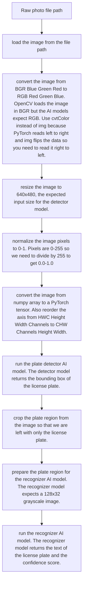

# Parking Lot Tracker

The parking lot management system uses computer vision to read license plates from cars entering and exiting the parking lot. It then calculates the amount of time the car was parked and its respective charge.

## Database Models

### User

Built on top of django's built-in user model, the user model checks who is allowed access into the dashboard or admin panel.

- username: login identifier
- email: contact email address
- password: stored as a hashed password not in plain text
- first_name: optional display name
- last_name: optional display name
- is_staff: True grants access to the Django admin site
- is_active: False disables the account without deleting it, user cannot login
- is_superuser: True bypasses all permission checks in the admin
- date_joined: auto-set timestamp when the account was created
- last_login: auto-updated timestamp on each authentication

If user is a guest, their parking sessions are not linked to a user account.


### LicensePlate

The license plates that are registered to a user account. A user can register multiple plates; however, each plate belongs to exactly one user. 

- user: the user account that owns this license plate
- plate_text: the text of the license plate
- is_primary: whether this is the user's primary plate
- label: optional for user side to identify the plate

### ParkingLot

Each model represents one parking lot.

- name: the name of the parking lot

### LotSettings

The settings for a specific parking lot.

- lot: the parking lot that these settings apply to. Taken from the ParkingLot model.
- rate: the rate per billing unit (hour or minute) in dollars
- billing_unit: the unit of time for the rate (hour or minute)
- grace_period_minutes: the number of minutes for the grace period, no charge is issued for parking sessions shorter than this amount.
- daily_cap_enabled: whether to enable the daily cap
- daily_cap_amount: the maximum charge per session, if enabled. The day rate.
- image_retention_days: the number of days to keep uploaded plate images on disk, if enabled.
- confidence_threshold: the confidence threshold for the CV pipeline.

### ParkingSession

The core transactional record. One row per car visit.

- plate_text: the text of the license plate
- license_plate: the license plate that the car is registered to
- user: the user account that the car is registered to
- lot: the parking lot that the car is parked in
- entry_time: the time the car entered the parking lot
- exit_time: the time the car left the parking lot
- duration_seconds: the duration of the parking session in seconds
- charge_amount: the charge for the parking session in dollars
- status: the status of the parking session (active, completed, void)
- has_duplicate_warning: whether the parking session is a duplicate warning
- was_orphaned: whether the parking session was orphaned. 

<details>
<summary><strong>Orphan Handling</strong></summary>

If a plate triggers an entry event while it already has an active session, the system assumes the exit was missed (e.g., camera outage). The old session is voided (`was_orphaned=True`, `status="void"`) and a new session is opened (`has_duplicate_warning=True`). No charge is issued on the voided session.

</details>

### PlateDetectionEvent

The CV logging system, where the CV pipeline logs entry and exit events.

- session: the parking session that this event belongs to
- image: the uploaded plate image file path
- raw_plate_text: the text of the license plate as read by the CV pipeline
- confidence_score: the confidence score from the CV pipeline
- event_type: the type of event (entry or exit)
- is_low_confidence: whether the confidence score is below the confidence threshold
- manually_corrected: whether the plate text was manually corrected by an operator
- corrected_plate: the manually corrected plate text
- bounding_box: the bounding box of the license plate as a JSON array [x, y, w, h]
- timestamp: the time the event was created

### CV pipeline




## Web Application

Django 5.1 backend with HTMX for reactive partials and Chart.js for revenue visualization. No Node.js, no React — server-rendered templates with targeted DOM swaps.

All pages require authentication. No public routes.

## Docker

The application runs as two containers orchestrated by Docker Compose:

1. **db** — PostgreSQL 16 with a persistent named volume
2. **web** — Django served by Gunicorn on port 8000

```bash
# Start all services
docker-compose up --build

# Run migrations
docker-compose exec web python manage.py migrate

# Seed initial data — creates a superuser, default ParkingLot, and LotSettings (safe to run multiple times)
docker-compose exec web python manage.py setup_defaults

# Create an admin user
docker-compose exec web python manage.py createsuperuser

# Run the test suite
docker-compose exec web pytest --cov=apps/accounts --cov=apps/parking --cov-fail-under=80
```