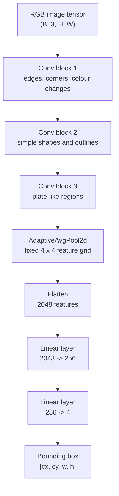
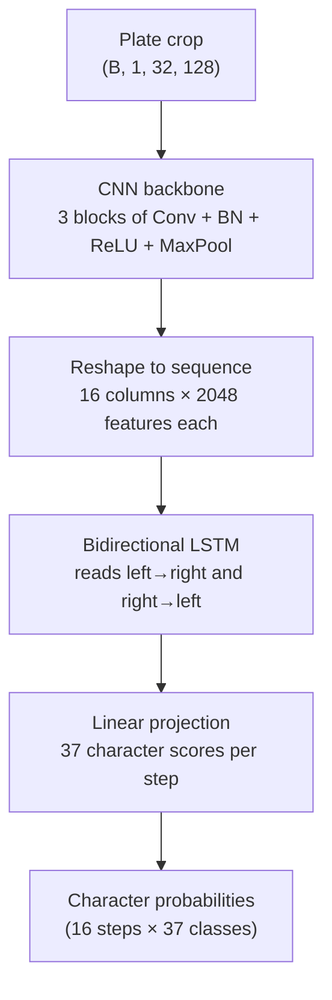

# Parking Lot Tracker

A parking lot management system that uses computer vision to read license plates from cars entering and exiting. It calculates parking duration and issues charges automatically.

## Table of Contents

- [Database Models](#database-models)
- [CV Pipeline](#cv-pipeline)
- [Branch: Synthetic Training Data Pipeline + Plate Detector CNN](#branch-synthetic-training-data-pipeline--plate-detector-cnn)
- [Branch: Plate Recognizer CRNN](#branch-plate-recognizer-crnn)
- [Creating the Dataset for Training](#creating-the-dataset-for-training)
- [Web Application](#web-application)
- [Docker](#docker)

---

## Database Models

### User

Built on top of Django's built-in user model. Controls who can access the dashboard or admin panel.

| Field&nbsp;&nbsp;&nbsp;&nbsp;&nbsp;&nbsp;&nbsp;&nbsp;&nbsp;&nbsp;&nbsp;&nbsp;&nbsp;&nbsp;&nbsp;&nbsp;&nbsp;&nbsp;&nbsp;&nbsp;&nbsp;&nbsp;&nbsp;&nbsp;&nbsp;&nbsp;&nbsp;&nbsp;&nbsp;&nbsp;&nbsp;&nbsp;&nbsp;&nbsp;&nbsp;&nbsp; | Description |
| :--- | :--- |
| `username` | Login identifier |
| `email` | Contact email address |
| `password` | Stored as a hashed password, never plain text |
| `first_name` | Optional display name |
| `last_name` | Optional display name |
| `is_staff` | `True` grants access to the Django admin site |
| `is_active` | `False` disables the account without deleting it |
| `is_superuser` | `True` bypasses all permission checks in the admin |
| `date_joined` | Auto-set timestamp when the account was created |
| `last_login` | Auto-updated timestamp on each authentication |

> If a user is a guest, their parking sessions are not linked to a user account.

---

### LicensePlate

License plates registered to a user account. A user can register multiple plates; each plate belongs to exactly one user.

| Field&nbsp;&nbsp;&nbsp;&nbsp;&nbsp;&nbsp;&nbsp;&nbsp;&nbsp;&nbsp;&nbsp;&nbsp;&nbsp;&nbsp;&nbsp;&nbsp;&nbsp;&nbsp;&nbsp;&nbsp;&nbsp;&nbsp;&nbsp;&nbsp;&nbsp;&nbsp;&nbsp;&nbsp;&nbsp;&nbsp;&nbsp;&nbsp;&nbsp;&nbsp;&nbsp;&nbsp; | Description |
| :--- | :--- |
| `user` | The user account that owns this plate |
| `plate_text` | The text of the license plate |
| `is_primary` | Whether this is the user's primary plate |
| `label` | Optional user-side label to identify the plate |

---

### ParkingLot

Each record represents one parking lot.

| Field&nbsp;&nbsp;&nbsp;&nbsp;&nbsp;&nbsp;&nbsp;&nbsp;&nbsp;&nbsp;&nbsp;&nbsp;&nbsp;&nbsp;&nbsp;&nbsp;&nbsp;&nbsp;&nbsp;&nbsp;&nbsp;&nbsp;&nbsp;&nbsp;&nbsp;&nbsp;&nbsp;&nbsp;&nbsp;&nbsp;&nbsp;&nbsp;&nbsp;&nbsp;&nbsp;&nbsp; | Description |
| :--- | :--- |
| `name` | The name of the parking lot |

---

### LotSettings

Settings for a specific parking lot.

| Field&nbsp;&nbsp;&nbsp;&nbsp;&nbsp;&nbsp;&nbsp;&nbsp;&nbsp;&nbsp;&nbsp;&nbsp;&nbsp;&nbsp;&nbsp;&nbsp;&nbsp;&nbsp;&nbsp;&nbsp;&nbsp;&nbsp;&nbsp;&nbsp;&nbsp;&nbsp;&nbsp;&nbsp;&nbsp;&nbsp;&nbsp;&nbsp;&nbsp;&nbsp;&nbsp;&nbsp; | Description |
| :--- | :--- |
| `lot` | The parking lot these settings apply to |
| `rate` | Rate per billing unit (hour or minute) in dollars |
| `billing_unit` | Unit of time for the rate (`hour` or `minute`) |
| `grace_period_minutes` | Minutes before a charge is issued |
| `daily_cap_enabled` | Whether to enable the daily charge cap |
| `daily_cap_amount` | Maximum charge per session (the day rate) |
| `image_retention_days` | Days to keep uploaded plate images on disk |
| `confidence_threshold` | Confidence threshold for the CV pipeline |

---

### ParkingSession

The core transactional record — one row per car visit.

| Field&nbsp;&nbsp;&nbsp;&nbsp;&nbsp;&nbsp;&nbsp;&nbsp;&nbsp;&nbsp;&nbsp;&nbsp;&nbsp;&nbsp;&nbsp;&nbsp;&nbsp;&nbsp;&nbsp;&nbsp;&nbsp;&nbsp;&nbsp;&nbsp;&nbsp;&nbsp;&nbsp;&nbsp;&nbsp;&nbsp;&nbsp;&nbsp;&nbsp;&nbsp;&nbsp;&nbsp; | Description |
| :--- | :--- |
| `plate_text` | The text of the license plate |
| `license_plate` | The registered plate record (if any) |
| `user` | The user account the car is registered to |
| `lot` | The parking lot the car is parked in |
| `entry_time` | Time the car entered |
| `exit_time` | Time the car exited |
| `duration_seconds` | Duration of the parking session in seconds |
| `charge_amount` | Charge for the session in dollars |
| `status` | `active`, `completed`, or `void` |
| `has_duplicate_warning` | Whether this session replaced a missed exit |
| `was_orphaned` | Whether this session was voided due to a missed exit |

<details>
<summary><strong>Orphan Handling</strong></summary>

If a plate triggers an entry event while it already has an active session, the system assumes the exit was missed (e.g., camera outage). The old session is voided (`was_orphaned=True`, `status="void"`) and a new session is opened (`has_duplicate_warning=True`). No charge is issued on the voided session.

</details>

---

### PlateDetectionEvent

The CV logging system — records every entry and exit event from the CV pipeline.

| Field&nbsp;&nbsp;&nbsp;&nbsp;&nbsp;&nbsp;&nbsp;&nbsp;&nbsp;&nbsp;&nbsp;&nbsp;&nbsp;&nbsp;&nbsp;&nbsp;&nbsp;&nbsp;&nbsp;&nbsp;&nbsp;&nbsp;&nbsp;&nbsp;&nbsp;&nbsp;&nbsp;&nbsp;&nbsp;&nbsp;&nbsp;&nbsp;&nbsp;&nbsp;&nbsp;&nbsp; | Description |
| :--- | :--- |
| `session` | The parking session this event belongs to |
| `image` | Uploaded plate image file path |
| `raw_plate_text` | Plate text as read by the CV pipeline |
| `confidence_score` | Confidence score from the CV pipeline |
| `event_type` | `entry` or `exit` |
| `is_low_confidence` | Whether score is below the confidence threshold |
| `manually_corrected` | Whether an operator corrected the plate text |
| `corrected_plate` | The manually corrected plate text |
| `bounding_box` | Plate bounding box as a JSON array `[x, y, w, h]` |
| `timestamp` | Time the event was created |

---

## CV Pipeline


<details>
<summary><code>load_image(path)</code></summary>

Loads the image from disk using OpenCV after a security pre-check. Before any pixels are decoded, the resolved path is confirmed to stay inside `MEDIA_ROOT` (path traversal prevention), and Pillow inspects the file header to confirm the format is JPEG, PNG, or WEBP. Images larger than 12 MP (4000×3000) are rejected to prevent decompression bomb attacks. OpenCV then decodes the validated file into a BGR numpy array.

</details>

<details>
<summary><code>bgr_to_rgb(image)</code></summary>

Converts the color channel order from BGR to RGB. OpenCV always loads images in BGR order (blue–green–red), but PyTorch models trained on ImageNet expect RGB (red–green–blue). Without this swap, the model would see the red and blue channels swapped on every image, degrading accuracy. The conversion is done with `cv2.cvtColor` rather than slicing (`img[:, :, ::-1]`) because `cvtColor` produces a contiguous array that avoids a hidden memory copy later in the pipeline.

</details>

<details>
<summary><code>resize_for_detector(image)</code></summary>

Resizes the image to 640×480 pixels — the fixed input resolution the plate detector CNN expects. The resize uses letterboxing (padding the shorter dimension with a neutral fill) to preserve the original aspect ratio. Stretching the image to fit would distort plate shapes and hurt detection accuracy, especially for narrow or wide plates.

</details>

<details>
<summary><code>normalize_pixels(image)</code></summary>

Scales pixel values from the 0–255 integer range down to 0.0–1.0 floats by dividing by 255. Neural networks learn faster and more stably when inputs are in a small, consistent numeric range. Without normalization, large pixel values would cause large gradients and make the model sensitive to overall image brightness rather than plate features.

</details>

<details>
<summary><code>to_tensor(image)</code></summary>

Converts the numpy array to a PyTorch `FloatTensor` and reorders the axes from HWC (Height × Width × Channels) to CHW (Channels × Height × Width). PyTorch's convolutional layers expect channels first. The conversion also moves the data from CPU memory into a tensor that can be transferred to GPU/MPS for inference.

</details>

<details>
<summary><code>PlateDetectorCNN</code></summary>

A custom convolutional neural network that takes the RGB image tensor and outputs a bounding box `[cx, cy, w, h]` localising the license plate in the image. Trained from scratch on synthetic composite images generated by `synthetic_data.py`. Uses Smooth L1 loss for bounding box regression. Weights are stored in `apps/cv/weights/detector.pth` (gitignored).

</details>

<details>
<summary><code>crop_plate_region(image, bbox)</code></summary>

Uses the detector's bounding box to crop just the plate area out of the full image. This gives the recognizer a tight view of the plate with minimal background clutter, which significantly improves character recognition accuracy. The crop is clamped to image bounds to handle any slight over-prediction from the detector.

</details>

<details>
<summary><code>prepare_for_recognizer(crop)</code></summary>

Resizes the plate crop to 128×32 pixels and converts it to grayscale. The recognizer operates on grayscale because plate text recognition is a shape task — color carries no useful signal and including it would triple the input size for no accuracy gain. The 128×32 resolution is wide enough to fit the longest plate text while being small enough to keep the encoder fast.

</details>

<details>
<summary><code>PlateRecognizerCRNN</code></summary>

A convolutional–recurrent network (CNN backbone + bidirectional LSTM) that reads the 128×32 grayscale plate crop and outputs the plate text character by character. The CNN extracts visual features; the LSTM reads those features left-to-right and right-to-left to model character order; a final projection layer turns each position into a probability over the 37-character alphabet (A–Z, 0–9, plus a blank token used during training). Trained with CTC loss, which teaches the model to find the right characters in the right order without needing to know exactly where each character starts or ends in the image. Weights are stored in `apps/cv/weights/recognizer.pth` (gitignored).

</details>

---

## Branch: Synthetic Training Data Pipeline + Plate Detector CNN

This branch adds the first trainable computer vision model for the project: a
license plate detector. The detector does not read the plate text yet. Its job
is to find the plate region inside a full parking-lot image and return a
bounding box.

### What this branch adds

| File | Purpose |
| :--- | :--- |
| `apps/cv/models/__init__.py` | Exposes CV model classes through `apps.cv.models` |
| `apps/cv/models/plate_detector.py` | Defines `PlateDetectorCNN`, the CNN that predicts a plate bounding box |
| `apps/cv/training/train_detector.py` | Trains `PlateDetectorCNN` on the synthetic detector dataset |
| `apps/cv/tests/test_plate_detector.py` | Tests the detector model and IoU helper |

### Detector model

`PlateDetectorCNN` takes a full RGB image tensor and predicts one bounding box:

```text
input image batch: (B, 3, H, W)
output boxes:      (B, 4)
box format:        [cx, cy, w, h]
```

The four output values are normalized between `0` and `1`:

- `cx` is the plate center position from left to right.
- `cy` is the plate center position from top to bottom.
- `w` is the plate width compared to the full image width.
- `h` is the plate height compared to the full image height.

Example:

```text
[0.50, 0.60, 0.22, 0.08]
```

This means the plate is centered halfway across the image, 60% down the image,
22% as wide as the image, and 8% as tall as the image.

The model structure is:



Each convolution block uses this pattern:

```text
Conv2d -> BatchNorm2d -> ReLU -> MaxPool2d
```

- `Conv2d` learns visual patterns.
- `BatchNorm2d` keeps the numbers stable during training.
- `ReLU` keeps useful positive signals.
- `MaxPool2d` shrinks the image features while keeping the strongest signals.

The final layer uses `sigmoid`, so predictions stay inside `[0, 1]`. That keeps
training and inference in the same coordinate format.

### Training script

`apps/cv/training/train_detector.py` trains the detector with synthetic data.
It expects a detector dataset that has already been generated:

```text
data/detector/
├── images/
│   ├── sample_000000.jpg
│   └── ...
└── labels/
    ├── sample_000000.txt
    └── ...
```

Each label file stores one YOLO-style bounding box:

```text
0 cx cy w h
```

The leading `0` is the class id. Since this detector only finds license plates,
there is only one class.

Typical training command:

```bash
python apps/cv/training/train_detector.py \
    --data-dir data/detector \
    --epochs 50 \
    --batch-size 16 \
    --output apps/cv/weights/detector.pth
```

The script:

1. Loads `PlateDetectorDataset`.
2. Splits it into 80% training data and 20% validation data.
3. Trains `PlateDetectorCNN` with `SmoothL1Loss`.
4. Tracks validation loss and validation IoU.
5. Saves the best model weights to `apps/cv/weights/detector.pth`.

`SmoothL1Loss` is used because bounding box training can have large early
mistakes. It is gentler than mean squared error when the model is very wrong,
but still smooth when the model gets close.

### IoU metric

The training script also computes IoU, which means Intersection over Union. IoU
measures how much the predicted box overlaps the correct box:

```text
IoU = overlap area / combined area
```

```text
IoU = 1.0  perfect overlap
IoU = 0.5  partial overlap
IoU = 0.0  no overlap
```

IoU is useful because loss values can be hard to understand. IoU directly tells
whether the predicted plate box lines up with the real plate box.

### Tests

`apps/cv/tests/test_plate_detector.py` checks the important behavior:

- The model returns shape `(batch_size, 4)`.
- Batch size `1` works correctly.
- Different image sizes work because the model uses adaptive pooling.
- `forward()` and `predict()` both return values in `[0, 1]`.
- `predict()` does not track gradients.
- Evaluation mode is deterministic because dropout is disabled.
- Training mode changes outputs because dropout is enabled.
- The model parameter count stays in a reasonable range.
- The IoU helper returns correct values for perfect, empty, and partial overlap.

---

## Branch: Plate Recognizer CRNN

This branch adds the second trainable model in the pipeline: a plate text
recognizer. Where the detector finds the plate region and draws a box around it,
the recognizer takes that cropped box and reads the characters on the plate.

Together the two models cover the full CV chain: **find the plate → read the plate**.

### What this branch adds

| File | Purpose |
| :--- | :--- |
| `apps/cv/models/recognizer.py` | Defines `PlateRecognizerCRNN`, the model that reads plate text |
| `apps/cv/training/train_recognizer.py` | Trains `PlateRecognizerCRNN` on the synthetic recognizer dataset |
| `apps/cv/tests/test_plate_recognizer.py` | Tests the recognizer model and CTC decode logic |

### Recognizer model

`PlateRecognizerCRNN` takes a 128×32 grayscale plate crop and returns a sequence
of character predictions — one per horizontal position in the image:

```text
input plate crop:  (B, 1, 32, 128)   — grayscale, height 32, width 128
output sequence:   (16, B, 37)        — 16 time-steps, 37 possible characters
```

The 37 characters are `A–Z` (26 letters), `0–9` (10 digits), and one special
blank token used internally during training.

The model is built in three stages:



**Stage 1 — CNN backbone**

Three convolutional blocks shrink the image while extracting character features.
The third block uses a non-square pool that keeps the width at 16 columns (one
per time-step) while compressing the height:

```text
Block 1: Conv(1→64)  + BN + ReLU + MaxPool(2×2)  → (B, 64,  16, 64)
Block 2: Conv(64→128)+ BN + ReLU + MaxPool(2×2)  → (B, 128,  8, 32)
Block 3: Conv(128→256)+ BN + ReLU + MaxPool(1×2) → (B, 256,  8, 16)
```

**Stage 2 — Reshape to sequence**

The 16 width columns become the 16 time-steps the LSTM will read. Each column
carries a 2048-dimensional feature vector (256 channels × 8 rows stacked together).

**Stage 3 — Bidirectional LSTM**

A two-layer LSTM reads the feature columns left-to-right and right-to-left
simultaneously, then combines both directions. Reading both ways helps resolve
ambiguous characters — for example, distinguishing `D` from `O` is easier when
the model can also see what letter comes after it.

### What is CTC loss?

CTC stands for **Connectionist Temporal Classification**. It is the training
technique that teaches the model to produce the right plate text without needing
to know exactly which pixels map to which character.

Think of it like this: when a human reads a plate, they do not count the exact
pixels where each letter starts and ends. They just see the letters and know what
they say. CTC works the same way — it only asks the model to output the right
letters in the right order, and figures out the alignment on its own.

The blank token (index 0) is how CTC separates repeated characters. For example,
if a plate has `AA` (two A's), the sequence `A blank A` tells the decoder these
are two separate letters, not one.

### Training script

`apps/cv/training/train_recognizer.py` trains the recognizer with synthetic data.
It expects a recognizer dataset that has already been generated:

```text
data/recognizer/
├── images/
│   ├── plate_000000.png
│   └── ...
└── labels.csv
```

Each row in `labels.csv` has the filename, the plate text, and the country:

```text
filename,text,country
plate_000000.png,ABC123,US
plate_000001.png,K3V 4X9,CA
```

Typical training command:

```bash
python apps/cv/training/train_recognizer.py \
    --data-dir data/recognizer \
    --epochs 100 \
    --batch-size 32 \
    --output apps/cv/weights/recognizer.pth
```

The script:

1. Loads `PlateRecognizerDataset`.
2. Splits it into 80% training data and 20% validation data.
3. Trains `PlateRecognizerCRNN` with `CTCLoss`.
4. Tracks validation loss, character accuracy, and full-plate accuracy each epoch.
5. Saves the best model weights to `apps/cv/weights/recognizer.pth`.
6. Saves a training progress chart alongside the weights.

> **Note for Apple Silicon Macs:** PyTorch's Metal (MPS) backend does not support
> CTC loss. The script detects this automatically and runs the loss step on CPU,
> while keeping the model itself on the GPU for speed. No extra setup is needed.

### Accuracy metrics

The training script tracks two accuracy metrics per epoch:

| Metric | What it measures |
| :--- | :--- |
| **Character accuracy** | What fraction of individual letters and digits were predicted correctly |
| **Plate accuracy** | What fraction of plates were predicted perfectly (every character correct) |

Plate accuracy is the harder metric — a single wrong character fails the whole
plate. The target is **>90% character accuracy** and **>80% plate accuracy** on
the synthetic validation set.

### Tests

`apps/cv/tests/test_plate_recognizer.py` checks the important behavior:

- The model returns shape `(16, batch_size, 37)`.
- All output values are ≤ 0 (log-probabilities are always non-positive).
- Exponentiated outputs sum to 1.0 across the character dimension (valid probability distribution).
- `predict()` does not track gradients.
- Evaluation mode is deterministic because dropout is disabled.
- Training mode changes outputs because dropout is enabled.
- `decode_predictions()` removes blank tokens from the output.
- `decode_predictions()` collapses consecutive repeated tokens (`[A, A, B]` → `"AB"`).
- Two identical characters separated by a blank decode to two characters (`[A, blank, A]` → `"AA"`).
- All-blank sequences decode to an empty string.
- The model parameter count stays in a reasonable range.

---

## Creating the Dataset for Training

### Preprocessing — `apps/cv/preprocessing.py`

Before an image enters the CV pipeline, it is preprocessed to reject bad input early and ensure consistency with deployment conditions. The preprocessing steps are:

1. Open the image using Pillow
2. Verify the compressed file size is under 64 MB
3. Verify the image is smaller than 12 MP (4000×3000)
4. Check the image is not corrupt
5. Confirm the image format is JPEG, PNG, or WEBP — checked from the file's magic bytes, not the file extension

If any check fails, the image is rejected and an error is logged. Otherwise, the loaded image proceeds to the next stage of the pipeline.

### Synthetic Data Generation — `apps/cv/training/synthetic_data.py`

Plates are generated for both Canadian and United States formats at 400×120 pixels. A few setup rules apply to the assets:

- Background images and font files are cached to avoid reloading on each generation.
- Background images must be `.jpg`, `.jpeg`, or `.png`.
- The font must be a TrueType plate font — if the font file is missing or unreadable, Pillow's default font is used as a fallback.

**How a synthetic image is built**

1. **Generate the plate text** randomly, following the format conventions of each country:
   - US plates use one of three formats: `ABC 1234` (most common), `123 ABC`, or `ABC123`.
   - Canadian plates use one of two formats: `ABC 123` or `A1B 2C3` (Ontario-style alphanumeric).
2. **Build the plate background** — a rectangle with a white background that's fully opaque. Canadian plates also have a solid blue strip across the top quarter to visually differentiate them from US plates. A dark border is added to the edges of the plate to help the AI detector model learn the plate's boundaries.
3. **Render the plate text** onto the plate background using the font file. The `textbbox` function determines the center of the plate, and then the text is drawn onto the center of the plate in black ink using the `draw.text` function.
4. **Composite onto a background** — the plate is placed onto a random background image. The background image is resized to 640×480 pixels and then the plate is pasted onto it at a random position and scale. The plate is then rotated between -15 and 15 degrees to simulate the camera angle of the camera in the parking lot. The plate's position is constrained so it always fits fully within the background image. Then the full image is converted to an RGB image and the bounding box coordinates of the plate are returned.

Two builders use this process to produce the training datasets:

- **Detector dataset** — generates 10,000 plate + background images by default. Before generating, any existing `.jpg` and `.txt` files in the output directory are deleted so re-runs do not mix data from previous runs. Images are saved to `data/detector/images` as `.jpg`. A corresponding `.txt` file is generated for each image in `data/detector/labels`, containing the bounding box in YOLO format: class index, normalized center x, normalized center y, normalized width, and normalized height (all values between 0 and 1).
- **Recognizer dataset** — generates 50,000 plates by default; only the cropped plate images are saved, in grayscale. Before generating, any existing `.png` files in the output directory are deleted and `labels.csv` is rewritten from scratch so re-runs do not mix data from previous runs. Plates are saved to `data/recognizer/images` as `.png`. A `labels.csv` file is also generated, containing the filename of the cropped plate image, the plate text, and the country.

Both functions accept an optional `seed` parameter to make the generated dataset reproducible across runs.

### Loading training data — `apps/cv/training/dataset.py`

After `synthetic_data.py` writes files under `data/detector/` and `data/recognizer/`, this module loads them for PyTorch training. Default transforms convert images to tensors with **pixel values in [0, 1]** (not the height/width indices).

**Character encoding (recognizer only)**

- `A→1` … `Z→26`, `0→27` … `9→36`
- Index `0` is reserved for the CTC blank token
- **Spaces are skipped** (not encoded)
- Each `PlateRecognizerDataset` sample returns a **list** of indices; `ctc_collate_fn` builds the batch tensors (below)

**`PlateDetectorDataset`** (`data/detector/`)

1. At startup, scans `images/*.jpg` (skips symlinks) and pairs each file with `labels/<same-stem>.txt`.
2. Each label file is one YOLO line: `0 cx cy w h`. The leading class `0` is dropped; the four floats are the box `[cx, cy, w, h]` (normalized between 0 and 1).
3. `__getitem__` loads the JPG with `safe_open_image`, converts to an RGB tensor `(3, H, W)`, and returns `(image_tensor, bbox_tensor)` where `bbox_tensor` has shape `(4,)`.
4. A `DataLoader` (e.g. batch size 32) uses **default collate** — not using `ctc_collate_fn`. It stacks batches to `(N, 3, H, W)` and `(N, 4)`.

**`PlateRecognizerDataset`** (`data/recognizer/`)

1. At startup, reads `labels.csv` (`filename`, `text`; `country` is stored but not returned per sample).
2. `__getitem__` loads the matching PNG from `images/`, converts to a grayscale tensor `(1, 32, 128)`, encodes text to a list of indices (spaces skipped), and returns `(image_tensor, label_list)`.
3. A `DataLoader` must set `collate_fn=ctc_collate_fn` because label lengths vary. For each batch it:
   - Unzips the list of `(image, label_list)` pairs into separate image and label lists
   - Stacks images with `torch.stack` → `(N, 1, 32, 128)`
   - Concatenates all label lists into one 1D `targets` tensor
   - Builds `target_lengths` (how many indices belong to each sample)
   - Returns `{"images", "targets", "target_lengths"}` for CTC training

### Augmentations — `apps/cv/training/augment.py`

While the model is **learning**, we slightly change each training image (brighter, blurrier, flipped, and so on) so practice pictures feel more like real parking cameras. This file does **not** load images from disk — `dataset.py` does that first; augment only tweaks the numbers already in memory.

**Two modes**

- **`train=True`** — random changes each time (used during training).
- **`train=False`** — no random changes; only **normalize** (rescales pixel numbers for the network). Used when checking accuracy.

**Normalize** means: adjust each pixel with a fixed formula `(pixel - mean) / std` so the model gets inputs in the range it expects. This is not resizing the image.

**Detector** (`DetectorAugment`) — full parking-lot photo, color:

- Random brightness/contrast/color tweaks (different lighting).
- Random slight blur.
- 50% chance to flip the image left–right (car can come from either direction).
- Sometimes turn the image grayscale (10% chance), like a black-and-white security camera.
- Then normalize (ImageNet mean/std — standard for color models).

**Recognizer** (`RecognizerAugment`) — small gray plate crop only:

- Random brightness/contrast tweaks (faded or dirty plates).
- Random slight blur.
- 50% chance of a mild “angled camera” warp (not a full flip).
- Then normalize (simple gray scale: mean 0.5, std 0.5).

**Important:** the recognizer **never** flips the image horizontally. `"ABC 123"` backwards would not match the answer in `labels.csv`. The detector **can** flip because we only care where the plate is, not reading the text yet.

## Web Application

Django 5.1 backend with HTMX for reactive partials and Chart.js for revenue visualization. No Node.js, no React — server-rendered templates with targeted DOM swaps.

All pages require authentication. No public routes.

---

## Docker

The application runs as two containers orchestrated by Docker Compose:

| Container&nbsp;&nbsp;&nbsp;&nbsp;&nbsp;&nbsp;&nbsp;&nbsp;&nbsp;&nbsp;&nbsp;&nbsp;&nbsp;&nbsp;&nbsp;&nbsp;&nbsp;&nbsp;&nbsp;&nbsp;&nbsp;&nbsp;&nbsp;&nbsp;&nbsp;&nbsp;&nbsp;&nbsp;&nbsp;&nbsp; | Description |
| :--- | :--- |
| `db` | PostgreSQL 16 with a persistent named volume |
| `web` | Django served by Gunicorn on port 8000 |

```bash
# Start all services
docker-compose up --build

# Run migrations
docker-compose exec web python manage.py migrate

# Seed initial data — creates a superuser, default ParkingLot, and LotSettings (safe to run multiple times)
docker-compose exec web python manage.py setup_defaults

# Create an admin user
docker-compose exec web python manage.py createsuperuser

# Run the test suite
docker-compose exec web pytest --cov=apps/accounts --cov=apps/parking --cov-fail-under=80
```
