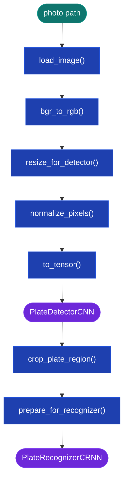
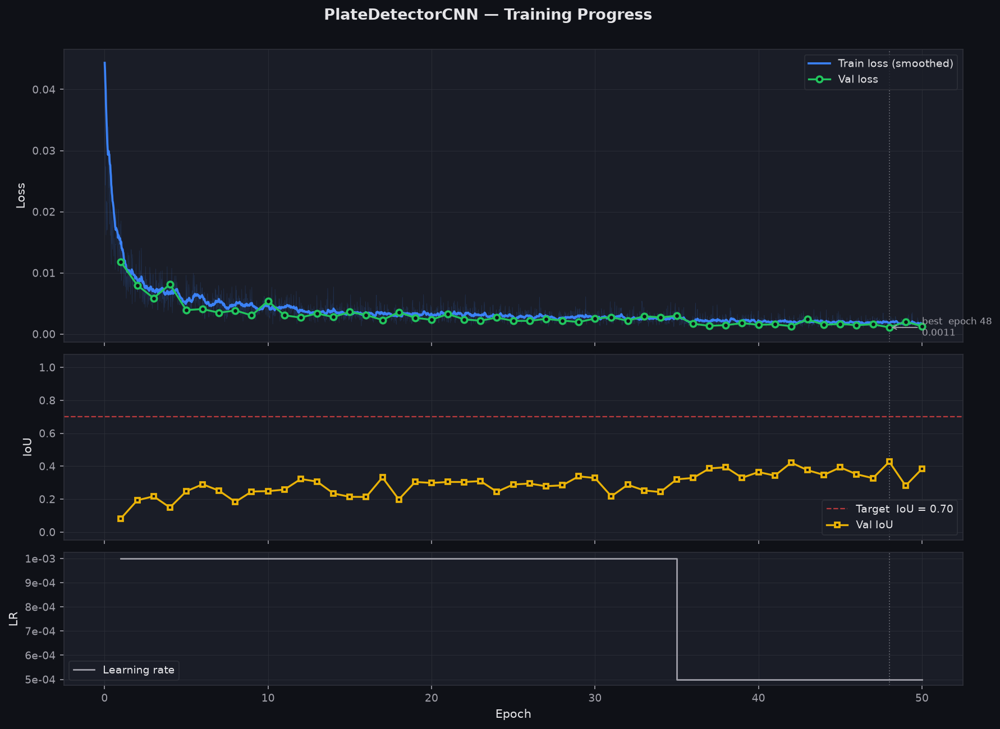
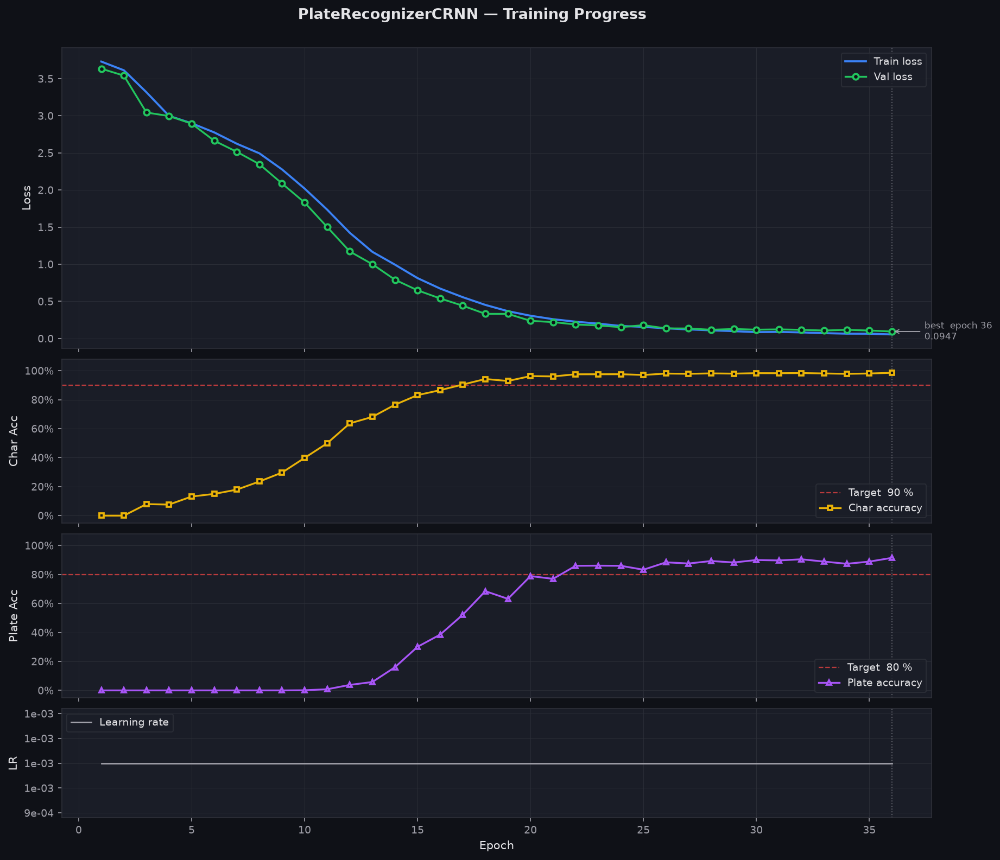
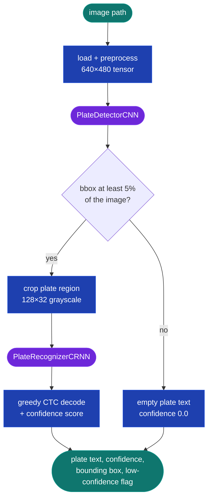

# Parking Lot Tracker

A parking lot management system modeled on **Chinese self-service LPR parking**.
A public, unmanned **gate kiosk** lets a driver upload a plate photo (standing
in for the camera); a from-scratch computer vision pipeline (PyTorch +
OpenCV — no external CV APIs, all models custom-trained on synthetic data)
reads the plate, opens/closes a parking session, and computes the charge.
**Registered plates auto-bill the owner's prepaid wallet**; guests see the
amount due at the kiosk. Anyone can self-register, link plates, and top up a
wallet through a placeholder payment seam. Staff are reduced to
configuration + oversight, nested under `/staff/`.

**Stack:** Django 5.1 · PostgreSQL 16 · PyTorch · OpenCV · HTMX · Chart.js · Docker — no Node.js, no frontend framework.

> **CV model status:** neither the plate detector nor the recognizer is fully
> fine-tuned yet — both are expected to get more accurate with additional
> training. See [CV Model Status](#cv-model-status) before trusting the
> reported accuracy numbers.

**Feature overview:**

- Public unmanned gate kiosk (`/`) — plate-photo upload standing in for a camera, entry/exit detection, privacy-reduced response
- Resident self-service portal — signup, plate linking (`/plates/`), wallet balance/history (`/wallet/`), top-up (`/wallet/topup/`)
- Prepaid wallet with an immutable, signed ledger — `Wallet.balance == SUM(WalletTransaction.amount)`, auto-deducted on a registered plate's exit
- Placeholder payment gateway seam (`apps/parking/payments.py`) — fails closed, ready for a real provider
- Staff oversight dashboard (`/staff/`) — session log, low-confidence error queue with manual correction, revenue analytics, per-lot billing settings
- Per-IP rate limiting on public kiosk and wallet endpoints; private image retention + cleanup

## Table of Contents

- [Architecture Overview](#architecture-overview)
- [Getting Started](#getting-started)
- [Database Models](#database-models)
- [CV Pipeline](#cv-pipeline)
  - [Image Preprocessing](#image-preprocessing)
  - [Plate Detector CNN](#plate-detector-cnn)
  - [Plate Recognizer CRNN](#plate-recognizer-crnn)
  - [Plate Recognition Pipeline](#plate-recognition-pipeline)
- [CV Design Rationale](#cv-design-rationale)
  - [Why Build the CV Stack From Scratch](#why-build-the-cv-stack-from-scratch)
  - [Two-Stage Detector → Recognizer, Not One End-to-End Model](#two-stage-detector--recognizer-not-one-end-to-end-model)
  - [Detector Design Choices](#detector-design-choices)
  - [Recognizer Design Choices](#recognizer-design-choices)
  - [Synthetic Data: Why, and How It's Kept Honest](#synthetic-data-why-and-how-its-kept-honest)
  - [Preprocessing as a Security Boundary](#preprocessing-as-a-security-boundary)
  - [Inference Engineering](#inference-engineering)
  - [Confidence as a Product Decision, Not Just a Metric](#confidence-as-a-product-decision-not-just-a-metric)
- [CV Model Status](#cv-model-status)
- [Synthetic Training Data](#synthetic-training-data)
  - [Data Generation](#data-generation)
  - [Dataset Classes](#dataset-classes)
  - [Augmentations](#augmentations)
  - [Training the Models](#training-the-models)
- [Session & Billing](#session--billing)
- [Web Application](#web-application)
  - [Pages](#pages)
  - [Screenshots](#screenshots)
  - [API Endpoints](#api-endpoints)
  - [Scheduled Maintenance](#scheduled-maintenance)
- [Docker](#docker)
- [Security](#security)

---

## Architecture Overview

The system is modeled on **Chinese self-service LPR parking**: a public,
unmanned gate kiosk lets a driver upload a plate photo (standing in for the
in-lane camera), a from-scratch CV pipeline reads the plate and opens/closes a
session, and a **registered plate auto-bills its owner's prepaid wallet** — no
cashier, no per-visit payment. Guests without a registered plate just see the
amount due at the kiosk. Anyone can self-register an account, link plates, and
top up a wallet through a placeholder payment seam. Staff are reduced to
configuration + oversight, nested under `/staff/`.

The system is organized into five Django apps with clear ownership boundaries:

| App | Owns |
|-----|------|
| `apps.accounts` | Custom `User(AbstractUser)` — no extra fields |
| `apps.parking` | Models (incl. `Wallet`/`WalletTransaction`), admin, `setup_defaults`, session/billing services, wallet money ops (`wallet.py`), placeholder payment seam (`payments.py`) |
| `apps.cv` | Preprocessing, custom models, synthetic data, training scripts, and inference pipeline — see [CV Pipeline](#cv-pipeline) for mechanics, [CV Design Rationale](#cv-design-rationale) for why each piece is shaped the way it is |
| `apps.dashboard` | **Staff-only** pages and support APIs (nested under `/staff/`), settings form, HTMX partials, private event images, and revenue analytics; also owns `scan_core.run_plate_scan`, the shared image→CV→session core reused by the public kiosk |
| `apps.public` | **Public** (site root): the unmanned gate kiosk, resident signup, plate management, wallet + top-up/history, and the per-IP rate limiter |

**Request flow for a kiosk plate scan** (CV pipeline internals collapsed here — see [CV Pipeline](#cv-pipeline)):

```
Driver uploads plate photo at the kiosk ("/")
  └─ validate (MIME + Pillow + dimensions + 10 MB cap)
       └─ scan_core.run_plate_scan()
            └─ PlateRecognitionPipeline.process()  →  plate_text + confidence + bbox
                 └─ handle_entry() or handle_exit()  (services.py)
                      ├─ ParkingSession + PlateDetectionEvent  (DB)
                      └─ registered plate on exit → wallet.py debits the owner's
                         Wallet automatically; guest plates just report the charge
```

The public kiosk response is privacy-reduced: it returns only plate text,
status, and charge — never the image URL, event id, owner identity, or wallet
balance.

---

## Getting Started

### Prerequisites

- Docker and Docker Compose ≥ 2.24
- Python 3.11+ (only needed outside Docker, for training CV models)
- PyTorch with MPS/CUDA (optional — CPU works, but training is slow)

### 1. Clone and configure environment

Copy the example env file and fill in values:

```bash
cp .env.example .env
```

Required variables: `SECRET_KEY`, `DB_NAME`, `DB_USER`, `DB_PASSWORD`,
`DEBUG`, and `KIOSK_ACTIVATION_TOKEN`. Compose maps the three `DB_*` values to
PostgreSQL's internal `POSTGRES_*` variables, so configure the `DB_*` names
shown in `.env.example`.

Generate a kiosk activation token instead of inventing or reusing a password:

```bash
openssl rand -hex 32
```

Paste the generated value into `.env` using the placeholder below. Never add
the real token or account credentials to tracked documentation or source code.

```dotenv
KIOSK_ACTIVATION_TOKEN=<paste-generated-token>
```

If `.env` changes after the services are running, recreate the web container
so Django receives the new values:

```bash
docker compose up -d --force-recreate web
```

### 2. Start services

```bash
# Development mode — Django runserver with live code mount
docker-compose up --build
```

For a production-shaped run (Gunicorn, no dev source bind mount, port bound to
host loopback only) see [Docker → Production](#production).

### 3. Run migrations

```bash
docker-compose exec web python manage.py migrate
```

### 4. Seed the default lot and settings

This creates the default `ParkingLot` and `LotSettings` records. **Required before the application is usable.** Safe to run more than once.

```bash
docker-compose exec web python manage.py setup_defaults
```

### 5. Create accounts

Residents create their own unprivileged account at
`http://localhost:8000/register/`. Self-registration always creates an account
with `is_staff=False` and `is_superuser=False`.

Create the initial administrator interactively. This account can use both the
operator dashboard and Django Admin:

```bash
docker-compose exec web python manage.py createsuperuser
```

To give an existing, deliberately selected resident account operator access,
set only its `is_staff` flag. Replace `<username>` with the exact account name:

```bash
docker-compose exec web python manage.py shell -c "from django.contrib.auth import get_user_model; user = get_user_model().objects.get(username='<username>'); user.is_staff = True; user.save(update_fields=['is_staff'])"
```

Reset a forgotten password without exposing it in shell history or
documentation:

```bash
docker-compose exec web python manage.py changepassword <username>
```

All account types sign in at `http://localhost:8000/login/`. Staff and
superusers are sent to `/staff/`; residents are sent to `/wallet/`.

### 6. Run the test suite

```bash
# All tests
docker-compose exec web pytest

# With coverage gate — accounts + parking apps must stay at ≥ 80%
docker-compose exec web pytest --cov=apps/accounts --cov=apps/parking --cov-fail-under=80

# CV tests only (excluded from the coverage gate)
docker-compose exec web pytest apps/cv/tests/ -v
```

### 7. Train CV models (optional — pre-trained weights required for upload to work)

The weight files live in `apps/cv/weights/` (gitignored). To train from scratch:

```bash
# Generate synthetic training data (run outside Docker; requires background images in data/backgrounds/)
python -c "from apps.cv.training.synthetic_data import generate_detector_dataset; generate_detector_dataset(n=1000, output_dir='data/detector', bg_dir='data/backgrounds')"
python -c "from apps.cv.training.synthetic_data import generate_recognizer_dataset; generate_recognizer_dataset(n=5000, output_dir='data/recognizer')"

# Train models (uses MPS on Apple Silicon automatically)
python apps/cv/training/train_detector.py --epochs 50 --data-dir data/detector --output apps/cv/weights/detector.pth
python apps/cv/training/train_recognizer.py --epochs 100 --data-dir data/recognizer --output apps/cv/weights/recognizer.pth
```

### 8. Scheduled image cleanup

Preview expired images without deleting anything:

```bash
docker-compose exec web python manage.py cleanup_old_images --dry-run
```

See [Scheduled Maintenance](#scheduled-maintenance) for the crontab entry.

---

## Database Models

PostgreSQL is used for the database, because it can store decimal values exactly, support for native JSON columns, and allows for multiple simultaneous writers.

### User

Built on Django's `AbstractUser`. Controls who can access the dashboard or admin panel.

| Field | Description |
| :--- | :--- |
| `username` | Login identifier |
| `email` | Contact email address |
| `password` | Stored as a hashed password, never plain text |
| `first_name` | Optional display name |
| `last_name` | Optional display name |
| `is_staff` | `True` grants operator-dashboard access and permits Django Admin login; model actions still require explicit permissions |
| `is_active` | `False` disables the account without deleting it |
| `is_superuser` | `True` bypasses all permission checks in the admin |
| `date_joined` | Auto-set timestamp when the account was created |
| `last_login` | Auto-updated timestamp on each authentication |

> Guest parking sessions are not linked to a user account.

---

### LicensePlate

License plates registered to a user account. A user can register multiple plates; each plate belongs to exactly one user.

| Field | Description |
| :--- | :--- |
| `user` | The user account that owns this plate |
| `plate_text` | The text of the license plate |
| `is_primary` | Whether this is the user's primary plate |
| `label` | Optional user-side label to identify the plate |

---

### ParkingLot

Each record represents one parking lot.

| Field | Description |
| :--- | :--- |
| `name` | The name of the parking lot (unique) |

---

### LotSettings

Per-lot billing and operational configuration.

| Field | Description |
| :--- | :--- |
| `lot` | The parking lot these settings apply to |
| `rate` | Rate per billing unit (hour or minute) in dollars |
| `billing_unit` | Unit of time for the rate (`hour` or `minute`) |
| `grace_period_minutes` | Minutes before a charge is issued |
| `daily_cap_enabled` | Whether to enable the daily charge cap |
| `daily_cap_amount` | Maximum charge per session |
| `image_retention_days` | How many days to keep uploaded plate images on disk before cleanup |
| `confidence_threshold` | Minimum CV confidence score to trust automatically |

---

### ParkingSession

The core transactional record — one row per car visit.

| Field | Description |
| :--- | :--- |
| `plate_text` | The text of the license plate |
| `license_plate` | The registered plate record (if any) |
| `user` | The user account the car is registered to |
| `lot` | The parking lot the car is parked in |
| `entry_time` | Time the car entered |
| `exit_time` | Time the car exited |
| `duration_seconds` | Duration of the parking session in seconds |
| `charge_amount` | Charge for the session in dollars |
| `status` | `active`, `completed`, or `void` |
| `has_duplicate_warning` | Whether this session replaced a missed exit |
| `was_orphaned` | Whether this session was voided due to a missed exit |

<details>
<summary><strong>Orphan Handling</strong></summary>

If a plate triggers an entry event while it already has an active session, the system assumes the exit was missed (e.g., camera outage). The old session is voided (`was_orphaned=True`, `status="void"`) and a new session is opened (`has_duplicate_warning=True`). No charge is issued on the voided session.

</details>

---

### PlateDetectionEvent

The CV audit log — records every entry and exit event from the CV pipeline.

| Field | Description |
| :--- | :--- |
| `session` | The parking session this event belongs to |
| `lot` | The parking lot this event belongs to |
| `image` | Uploaded plate image file path |
| `raw_plate_text` | Plate text as read by the CV pipeline |
| `confidence_score` | Confidence score from the CV pipeline |
| `event_type` | `entry` or `exit` |
| `is_low_confidence` | Whether score is below the confidence threshold |
| `manually_corrected` | Whether an operator corrected the plate text |
| `corrected_plate` | The manually corrected plate text |
| `bounding_box` | Plate bounding box as a JSON array `[x, y, w, h]` |
| `timestamp` | Time the event was created |

---

### Wallet

A prepaid balance attached to a user account — the China auto-pay model. When a registered plate exits, the parking charge is deducted automatically; no cashier, no per-visit payment.

| Field | Description |
| :--- | :--- |
| `user` | The account this wallet belongs to (one wallet per user) |
| `balance` | Cached running total in dollars; must always equal `SUM(WalletTransaction.amount)` |
| `created_at` / `updated_at` | Auto-managed timestamps |

`balance` is deliberately allowed to go **negative** — an exit is never blocked for insufficient funds, because the barrier must not strand a car. A short account simply owes money, visible to staff. There is no `MinValueValidator` on `balance` by product decision.

---

### WalletTransaction

One immutable, signed ledger entry — the money audit trail. Rows are insert-only: created once, never updated or deleted.

| Field | Description |
| :--- | :--- |
| `wallet` | The wallet this entry belongs to (`PROTECT` — deleting a wallet can never erase its ledger) |
| `amount` | Signed dollars: positive = credit (top-up), negative = debit (parking charge) |
| `kind` | `topup`, `charge`, or `adjustment` |
| `session` | The `ParkingSession` this charge settled, if any (`SET_NULL` — the ledger outlives the session record) |
| `description` | Human-readable note (never raw plate text, to limit PII exposure) |
| `reference` | External payment-provider confirmation id, for top-ups |
| `created_at` | Insert timestamp (no `updated_at` — rows never change) |

`SUM(amount) == balance` is the money invariant; every credit/debit is written atomically with the balance update under `select_for_update()` (`apps/parking/wallet.py`), and a test reconciles the two. A unique constraint on non-blank `reference` values makes a provider's retried top-up confirmation idempotent — the same confirmation can authorize exactly one credit.

**Payment gateway seam** (`apps/parking/payments.py`) — `PaymentConnector` is a placeholder `Protocol` for a future real provider (Stripe/WeChat Pay/Alipay). It holds no secrets and **fails closed**: the top-up page stays available, but no spendable credit is created until a real connector verifies a provider response.

---

### Database Integrity Rules

The database itself enforces billing-critical rules so bad data can't sneak in. Django validators only run when a model is saved through a form or `full_clean()` — `bulk_create`, `update()`, and raw SQL skip them entirely. Anything that protects billing math is therefore duplicated as a database-level constraint.

| Rule | Description |
| :--- | :--- |
| No duplicate plates per user | A user cannot register the same `plate_text` twice |
| Unique lot names | `setup_defaults` uses `get_or_create` — duplicate names would return an arbitrary row |
| Sessions survive lot deletion | Sessions are billing records, so deleting a lot with sessions is blocked (`PROTECT`) instead of cascading and wiping revenue history |
| Charges can't be negative | Enforced by both a validator and a database check constraint |
| Exit after entry | A car cannot exit before it entered — clock skew would otherwise produce negative durations |
| No negative durations | `duration_seconds` must be zero or greater |
| Voided sessions carry no charge | A voided session with a charge would corrupt revenue totals |
| Confidence stays in range | `confidence_score` must be between 0.0 and 1.0 |

<details>
<summary><strong>Partial Indexes</strong></summary>

Active sessions are a tiny fraction of the table once months of completed sessions accumulate. Two partial indexes (`plate_text` and `lot`, each filtered to `status='active'`) cover only the rows the entry/exit matcher and the 10-second dashboard poll actually touch, so they stay small enough to live in cache. A third partial index covers unreviewed low-confidence detection events for the manual review queue.

</details>

---

## CV Pipeline

This section is the mechanics reference for `apps/cv/` — exact shapes, layers,
constants, and control flow, precise enough to reimplement the pipeline from
this section alone. For *why* each shape and choice was made instead of an
alternative, see [CV Design Rationale](#cv-design-rationale). For measured
accuracy numbers, see [CV Model Status](#cv-model-status).


```mermaid
flowchart TD
    IMG(["photo path"])

    LOAD["load_image()"]
    BGR["bgr_to_rgb()"]
    RESIZE["resize_for_detector()"]
    NORM["normalize_pixels()"]
    TENSOR["to_tensor()"]

    DETECTOR(["PlateDetectorCNN"])

    CROP["crop_plate_region()"]
    PREP["prepare_for_recognizer()"]

    RECOG(["PlateRecognizerCRNN"])

    IMG --> LOAD --> BGR --> RESIZE --> NORM --> TENSOR --> DETECTOR --> CROP --> PREP --> RECOG

    classDef preproc fill:#1e40af,stroke:#1d4ed8,color:#fff
    classDef model fill:#6d28d9,stroke:#7c3aed,color:#fff
    classDef io fill:#0f766e,stroke:#0d9488,color:#fff

    class LOAD,BGR,RESIZE,NORM,TENSOR,CROP,PREP preproc
    class DETECTOR,RECOG model
    class IMG io
```

### Image Preprocessing

Every function below lives in `apps/cv/preprocessing.py`. Signatures and I/O
shapes are exact:

```
path:str → load_image() → bgr_to_rgb() → resize_for_detector()   # (480, 640, 3) uint8 RGB
        → normalize_pixels() → to_tensor()                       # (3, 480, 640) float32 tensor
bbox → crop_plate_region() → prepare_for_recognizer()             # (32, 128) grayscale, recognizer input
```

**`load_image(path: str) -> np.ndarray`** (returns `(H, W, 3)` `uint8` BGR) — the
only function that touches raw, potentially attacker-controlled bytes; on the
public kiosk anyone can reach it with no account, so its load contract is a
security boundary as much as an I/O routine:

- **Path containment** (`_assert_safe_path`) — resolves symlinks and `..`
  segments; the resolved path must live under `MEDIA_ROOT` (or
  `CV_PROCESSING_TEMP_ROOT`). Violations raise `UnsafeImagePathError`
  (a `ValueError` subclass, importable from `preprocessing`).
- **Format allowlist by content, not extension** — Pillow inspects the actual
  file header; only JPEG, PNG, and WEBP pass. BMP is rejected outright
  regardless of extension (richer CVE history in both Pillow's and OpenCV's
  BMP parsers, for a format no real camera upload uses).
- **12 MP cap (4000×3000) before decode** — checked from the header (cheap)
  and again post-decode as defense in depth, rejecting decompression-bomb-style
  images (tiny compressed file, huge decoded buffer) before OpenCV ever
  allocates the pixel array.
- **Single bounded read, not double-open** — the file is read once, capped at
  `MAX_IMAGE_BYTES + 1` bytes; both the Pillow validation and the
  `cv2.imdecode` call operate on that same in-memory buffer, closing a TOCTOU
  window where the file could be swapped between a validate-then-load pair of
  operations.
- **Path-stripped errors** — on failure, callers see a generic
  `FileNotFoundError` or `RuntimeError` with no path in the message; only a
  6-byte hash (`_path_id`) goes to the server log, so an API error response
  can't leak server directory layout even if it echoes the exception text.

OpenCV decodes the validated buffer into a BGR numpy array only after every
check above passes.

**`bgr_to_rgb(image: np.ndarray) -> np.ndarray`** — `(H, W, 3)` BGR → `(H, W,
3)` RGB via `cv2.cvtColor`, not array slicing — `cvtColor` returns a
contiguous array, avoiding a hidden copy later in the pipeline.

**`resize_for_detector(image: np.ndarray) -> np.ndarray`** — any `(H, W, 3)` →
letterboxed `(480, 640, 3)`. The image is scaled to fit and the shorter
dimension is padded with a neutral fill rather than stretched, so aspect
ratio (and plate shape) is preserved.

**`normalize_pixels(image: np.ndarray) -> np.ndarray`** — `uint8 [0, 255]` →
`float32 [0.0, 1.0]` (divide by 255).

**`to_tensor(image: np.ndarray) -> torch.FloatTensor`** — `(H, W, C)` → `(C,
H, W)`; for the detector input this is `(3, 480, 640)`, matching PyTorch's
channels-first convention.

**`crop_plate_region(image: np.ndarray, bbox) -> np.ndarray`** — crops the
resized `(480, 640, 3)` image to a top-left `[x, y, w, h]` box, clamped to
image bounds to absorb any slight over-prediction from the detector.

**`prepare_for_recognizer(crop: np.ndarray) -> np.ndarray`** — crop → grayscale
`(32, 128)`. Grayscale because plate reading is a shape task (color carries no
signal and would triple input size for no accuracy gain); 128×32 is wide
enough for the longest supported plate text and small enough to keep the
encoder fast.

---

### Plate Detector CNN

`PlateDetectorCNN` (`apps/cv/models/plate_detector.py`) regresses one
normalized bounding box `[cx, cy, w, h]` per image — YOLO center format, all
four values in `[0, 1]`.

**Input:** `(B, 3, H, W)` float32, nominally `(B, 3, 480, 640)` after
preprocessing (`AdaptiveAvgPool2d` below tolerates other sizes).

**Convolutional backbone** — three blocks, each `Conv2d(bias=False) →
BatchNorm2d → ReLU(inplace=True) → MaxPool2d(2×2)`:

| Block | Channels in→out | Output shape (from 480×640 input) |
|---|---|---|
| 1 | 3 → 32 | `(B, 32, 240, 320)` |
| 2 | 32 → 64 | `(B, 64, 120, 160)` |
| 3 | 64 → 128 | `(B, 128, 60, 80)` |

`AdaptiveAvgPool2d((4, 4))` then collapses any spatial size to a fixed `(B,
128, 4, 4)`, flattened to `(B, 2048)`.

**Fully connected head:** `2048 → 256` (`fc1`) → `ReLU` → `Dropout(p=0.3)` →
`256 → 4` (`fc2`) → `sigmoid`. The final output is `(B, 4)`, `[cx, cy, w, h]`
in `[0, 1]`. Sigmoid is applied **inside** `forward()`, not as a
separate inference-only step, so `SmoothL1Loss` trains against the exact
`[0, 1]` output space `predict()` returns at inference.

```python
x = self.block1(x)   # (B, 32,  240, 320)
x = self.block2(x)   # (B, 64,  120, 160)
x = self.block3(x)   # (B, 128, 60,  80)
x = self.pool(x)     # (B, 128, 4,   4)
x = x.flatten(1)      # (B, 2048)
x = self.fc1(x)       # (B, 256)
x = self.dropout(self.relu_fc(x))
x = self.fc2(x)       # (B, 4) raw logits
return torch.sigmoid(x)   # (B, 4), [cx, cy, w, h] in [0, 1]
```

**`predict(x)`** wraps `forward()` under `@torch.no_grad()`, temporarily
forces `eval()` mode, and restores the model's prior `training`/`eval` state
via `try/finally` — safe to call mid-training (e.g. a validation callback)
without corrupting the training loop's own mode state. This same
no-grad/eval/restore pattern is used by `PlateRecognizerCRNN.predict()` below.

**Training** (`train_detector.py`): `SmoothL1Loss` (Huber) + Adam +
`ReduceLROnPlateau(factor=0.5, patience=5)`. Target: **>0.7 IoU** on synthetic
validation data after 50 epochs — actual result and diagnosis in
[CV Model Status](#cv-model-status).



---

### Plate Recognizer CRNN

`PlateRecognizerCRNN` (`apps/cv/models/recognizer.py`) reads text from a
cropped, grayscale plate image via a CNN backbone → bidirectional LSTM → CTC
output.

**Input:** `(B, 1, 32, 128)` float32 grayscale, values in `[0, 1]`. Height 32
and width 128 must be exact — produced by `prepare_for_recognizer()`.

**Convolutional backbone** — three blocks, each `Conv2d(bias=False) →
BatchNorm2d → ReLU(inplace=True) → MaxPool2d`:

| Block | Channels in→out | Pool kernel | Output shape |
|---|---|---|---|
| 1 | 1 → 64 | `(2, 2)` | `(B, 64, 16, 64)` |
| 2 | 64 → 128 | `(2, 2)` | `(B, 128, 8, 32)` |
| 3 | 128 → 256 | `(1, 2)` | `(B, 256, 8, 16)` |

Block 3's `MaxPool2d(kernel_size=(1, 2))` halves width (32→16) but leaves
height at 8 — width becomes the 16-step character sequence the LSTM reads one
column at a time, while the preserved height keeps vertical stroke detail
that disambiguates look-alikes like `I`/`1` or `O`/`0`.

**Reshape to sequence:** `(B, 256, 8, 16)` → `reshape(B, 2048, 16)` (256
channels × 8 rows flattened to a 2048-dim feature per column) →
`permute(2, 0, 1)` → `(T=16, B, 2048)`. `reshape()` (not `view()`) is used
because `MaxPool2d` can leave the tensor non-contiguous.

**Bidirectional LSTM:** `hidden_size=256, num_layers=2, bidirectional=True,
dropout=0.3` (fires between the two layers only), `batch_first=False`. Input
`(16, B, 2048)` → output `(16, B, 512)` (256 × 2 directions concatenated).

**Output projection:** `Linear(512, 37)` → `log_softmax(dim=-1)` → `(T=16, N,
C=37)` log-probabilities, one distribution over 37 classes (26 letters + 10
digits + 1 CTC blank at index 0) per time-step. `forward()` returns these
log-probs directly — **do not** re-apply `log_softmax`; doing so silently
corrupts `CTCLoss` by compressing probabilities a second time.

```python
x = self.block1(x)                                    # (B, 64,  16, 64)
x = self.block2(x)                                    # (B, 128,  8, 32)
x = self.block3(x)                                    # (B, 256,  8, 16)
x = x.reshape(B, 2048, 16).permute(2, 0, 1)           # (16, B, 2048)
x, _ = self.lstm(x)                                    # (16, B, 512)
x = self.fc(x)                                         # (16, B, 37)
return F.log_softmax(x, dim=-1)                        # (T=16, N, C=37)
```

**`predict(x)`** — same no-grad/eval/restore contract as
`PlateDetectorCNN.predict()` above; returns `(T=16, N, C=37)` log-probs.

**`decode_predictions(output) -> list[str]`** — greedy CTC decode:

1. `argmax(dim=-1)` over the class dimension at every time-step → `(T, N)`
   predicted indices.
2. Collapse consecutive identical tokens (`[A, A, B]` → `[A, B]` — CTC
   spreads one character across multiple frames, it does not mean the plate
   reads `"AAB"`).
3. Drop blank tokens (index 0).
4. Map remaining indices to characters and join.

A plate where every time-step decodes to blank returns `""`.

**Training** (`train_recognizer.py`): `CTCLoss` **must** run on CPU even when
the model trains on MPS — PyTorch's MPS backend has no native CTC-loss
kernel as of PyTorch 2.x. The training loop moves only `log_probs` to CPU
before the loss call (`log_probs.cpu()`); the model itself keeps training on
MPS, and autograd tracks the `.cpu()` transfer as part of the graph so
gradients still flow back correctly. `predict()` and `decode_predictions()`
never touch `CTCLoss`, so kiosk inference runs fully on MPS/CUDA with no
forced CPU hop. Target: **>90% character accuracy, >80% full-plate accuracy**
on synthetic validation data after 100 epochs — actual result and diagnosis
in [CV Model Status](#cv-model-status).



Weights for both models live in `apps/cv/weights/` (gitignored). Load with
`torch.load(..., weights_only=True)`.

---

### Plate Recognition Pipeline

`PlateRecognitionPipeline` (`apps/cv/pipeline.py`) wires every piece above
into one call: image path in, structured result out.

```python
result = pipeline.process(image_path)
# {"plate_text": "ABC123", "confidence": 0.87, "bounding_box": [x, y, w, h], "is_low_confidence": False}
```


```mermaid
flowchart TD
    IMG(["image path"])
    PRE["load + preprocess<br/>640×480 tensor"]
    DET(["PlateDetectorCNN"])
    SIZE{"bbox at least 5%<br/>of the image?"}
    EMPTY["empty plate text<br/>confidence 0.0"]
    CROP["crop plate region<br/>128×32 grayscale"]
    RECOG(["PlateRecognizerCRNN"])
    CONF["greedy CTC decode<br/>+ confidence score"]
    RESULT(["plate text, confidence,<br/>bounding box, low-confidence flag"])

    IMG --> PRE --> DET --> SIZE
    SIZE -- no --> EMPTY
    SIZE -- yes --> CROP --> RECOG --> CONF --> RESULT
    EMPTY --> RESULT

    classDef preproc fill:#1e40af,stroke:#1d4ed8,color:#fff
    classDef model fill:#6d28d9,stroke:#7c3aed,color:#fff
    classDef io fill:#0f766e,stroke:#0d9488,color:#fff

    class PRE,CROP,CONF,EMPTY preproc
    class DET,RECOG model
    class IMG,RESULT io
```

#### Model Loading

Both models load once at pipeline construction (`__init__`), not per request
— hundreds of milliseconds per `.pth` load would otherwise land on every
kiosk scan. Weights are loaded with `weights_only=True`, which blocks the
arbitrary code execution a pickle-based load of an untrusted `.pth` file
would allow.

Each checkpoint is a dict, not a bare state dict, and must declare a matching
`preprocessing_version` (`NORMALIZED_PREPROCESSING_VERSION`,
`apps/cv/training/augment.py`) before its `state_dict` is loaded
(`_load_weights`). A checkpoint with no version, or a mismatched one, is
rejected with `RuntimeError` rather than loaded and silently fed input it
was never trained to expect — the load fails closed instead of risking a
confident misread from an invisible normalization mismatch.

- Missing weight file → `FileNotFoundError` naming which training script to
  run.
- Present but corrupt/truncated/incompatible file, or a version mismatch →
  `RuntimeError`.
- In both cases the exception message never contains the real file path;
  only the server log gets the full path, so a future API error response
  can't leak server directory layout.

After loading, both models are moved to the best available device (`MPS →
CUDA → CPU`, `apps/cv/utils/device.py::get_device`, shared by the training
scripts and this pipeline) and switched to `eval()` mode, so `process()`
calls are stateless and safe to run from multiple threads.

#### Processing Steps

1. **Load and preprocess** — full preprocessing chain, ending as a `(3, 480,
   640)` normalized tensor.
2. **Detect** — `PlateDetectorCNN.predict()` returns `[cx, cy, w, h]` in
   YOLO center format.
3. **Reject tiny boxes** — if `w` or `h` is below `_MIN_BBOX_SIZE = 0.05`
   (≈32 px on a 640 px image), the pipeline returns early with
   `plate_text=""`, `confidence=0.0`, `is_low_confidence=True` — too small a
   crop to contain readable character strokes regardless of recognizer
   quality.
4. **Crop** — the YOLO center box converts to top-left `[x, y, w, h]` and
   `crop_plate_region()` cuts the plate out of the **resized** (not
   original) image, because the detector's coordinates describe the
   640×480 canvas it actually saw.
5. **Recognize** — `prepare_for_recognizer()` → `(1, 32, 128)` →
   `PlateRecognizerCRNN.predict()` → `decode_predictions()`.
6. **Score** — confidence is computed from the non-blank time-steps (below).

#### Confidence Score

The recognizer emits 16 time-steps for every plate regardless of length, so
on a 6-character plate most steps are blank. Confidence is the mean
max-class probability over **non-blank** steps only — including blank steps
would inflate the score and hide genuine uncertainty on the actual
characters. If every step is blank (or `plate_text` is empty), confidence is
`0.0`.

`confidence < LOW_CONFIDENCE_THRESHOLD` (`0.6`, `apps/cv/pipeline.py`) sets
`is_low_confidence=True`. This constant is a CV-layer default, not the value
that gates billing — `services.py` checks the separate, per-lot,
operator-tunable `LotSettings.confidence_threshold` instead (see
[Confidence as a Product Decision](#confidence-as-a-product-decision-not-just-a-metric)
for why two thresholds exist).

#### Bounding Box Coordinate System

The detector sees a letterboxed 640×480 canvas — the original photo shrunk to
fit and padded with neutral bars. The dashboard draws boxes on the
**original** upload, so the pipeline removes the padding and re-normalizes
the box back to the original image before returning it. The returned
`bounding_box` is `[x, y, w, h]` (top-left corner plus size, all values in
`[0, 1]`), matching the `PlateDetectionEvent.bounding_box` field.

#### Singleton

`get_pipeline(detector_path, recognizer_path)` returns a module-level
singleton — the first call constructs the pipeline, every later call reuses
it, so one Django process shares one loaded copy of both models across all
requests. Construction is guarded by double-checked locking so two
concurrent first requests can't each load their own copy.

The singleton is created lazily on first use, not at Django startup
(`AppConfig.ready()`), because `ready()` also runs during management
commands like `migrate` and `collectstatic`, where weight files may not
exist yet and inference is never needed — eager loading would break those
commands in CI for lacking a trained model no one asked for at that point.

---

## CV Design Rationale

This section explains the *why* behind the CV stack in `apps/cv/` — not
that a detector and recognizer exist, but why each shape was chosen and
what was traded away to get it. For the exact layers, shapes, and constants
behind each claim, see [CV Pipeline](#cv-pipeline); for measured results, see
[CV Model Status](#cv-model-status).

### Why Build the CV Stack From Scratch

**Decision:** PyTorch + OpenCV, two custom-trained models, zero external
ANPR/OCR APIs (no Google Vision, no AWS Rekognition, no commercial LPR SDK).

**Why:** This constraint was self-imposed from the outset — the point of
the project was to build and understand a CV stack end to end, not to wire
up a vendor SDK. That goal happens to line up with several properties the
deployment genuinely needs. A hosted ANPR API would solve plate reading in an afternoon at
near-100% accuracy — but it would also mean per-scan cost that scales with
traffic, a hard dependency on a third party's uptime for a physical gate
that must open cars in and out, and no way to reason about *why* a read
failed (commercial APIs are black boxes; you get a string and a
confidence float, not a bounding box you can debug or a training set you
can extend). It would also make "confidence" mean whatever the vendor
defines it to mean, when the billing logic in `services.py` needs a
per-lot tunable threshold (`LotSettings.confidence_threshold`) that gates
real money movement.

**Tradeoff accepted:** the from-scratch stack is exactly as good as its
training data, which here is 100% synthetic (see below). The detector
misses its accuracy target as a direct, measured consequence of that
choice — an honest cost, not swept under the rug (see
[CV Model Status](#cv-model-status)). In exchange, the system never has a
network dependency in its billing-critical path, never sends a photo of
someone's car to a third party, and every failure mode is inspectable down
to the tensor.

### Two-Stage Detector → Recognizer, Not One End-to-End Model

**Decision:** `PlateDetectorCNN` finds *where* the plate is; a separate crop
step hands that region to `PlateRecognizerCRNN`, which reads *what* it says
(see [Plate Recognition Pipeline](#plate-recognition-pipeline) for the exact
call chain).

**Why split instead of one network doing both:** the two sub-problems have
different input scales (a 640×480 scene vs. a 128×32 crop), different loss
functions (bbox regression vs. CTC sequence loss), and different failure
modes that need to be diagnosable independently. A combined model (e.g. a
single YOLO-style head that outputs both box and per-character classes)
conflates them: if the plate text comes out wrong, you cannot tell whether
the box was off, the crop was bad, or the reader itself misclassified a
character, without additional instrumentation. Two small models trained and
validated separately let [CV Model Status](#cv-model-status) report the
detector's IoU and the recognizer's character/plate accuracy as two
independent numbers — which is exactly how the current failure was found
(recognizer met its targets in isolation; detector did not, and that gap is
now visible instead of hidden inside one combined loss curve).

**Alternative considered and rejected:** an end-to-end single-box detector
with a joint OCR head (closer to real-world ANPR systems). Rejected because
it needs a much larger, harder-to-synthesize training set to converge
(joint losses on small custom nets are notoriously unstable), and it removes
the ability to swap or retrain just the underperforming piece — here, the
detector — without touching the piece that already meets its target.

**Cost of the split:** a bad detector crop (loose box, clipped characters,
included car body) directly degrades the recognizer's input regardless of
how good the recognizer is on its own — documented explicitly in
[CV Model Status](#cv-model-status). The two-stage design makes this
failure legible instead of eliminating it.

### Detector Design Choices

| Decision | Why | Alternative rejected |
|---|---|---|
| Direct regression of one normalized box, not multi-box detection | One gate camera frame has exactly one plate to find. A single-box regressor is the simplest model that fits that constraint. | Anchor-based / YOLO-style multi-box detection with objectness scores and NMS. Rejected as over-engineered for a single-plate-per-frame problem; it also would have let the model express "no plate here," which the current architecture explicitly cannot (a real gap, tracked in [CV Model Status](#cv-model-status)) — deferred rather than solved with disproportionate complexity for v1. |
| `AdaptiveAvgPool2d((4, 4))` before the FC head (see [Plate Detector CNN](#plate-detector-cnn) for the exact shapes) | Lets the model tolerate minor resizing from augmentation without being hard-wired to one exact input resolution, while keeping enough spatial structure (vs. a 1×1 global average pool) that the FC head still knows roughly *where* in the frame the plate-like texture concentrated. | A fixed `Flatten()` after a fixed-size conv stack — simpler, but locks the architecture to one exact input size and discards even more spatial position information. |
| `SmoothL1Loss` (Huber) instead of `MSELoss` | Bounding-box regression targets can have occasional bad synthetic labels or extreme early-training predictions; `MSELoss` penalizes those quadratically, producing gradient spikes that destabilize a small network with no batch-norm-heavy backbone to absorb them. `SmoothL1` behaves like L2 near zero (smooth convergence) and like L1 on large errors (bounded gradient). | Plain L1 — more outlier-robust but has a constant-magnitude gradient even very close to the optimum, making fine-grained convergence noisier; rejected because it would make the last few percent of IoU improvement harder to reach. |
| `ReduceLROnPlateau(factor=0.5, patience=5)` | Lets the optimizer take large steps early and only slow down once validation loss actually plateaus, without hand-scheduling epoch cutoffs the way a fixed step-decay would require guessing in advance. | A fixed step-decay schedule — rejected because the 50-epoch budget is small enough that guessing the right decay epoch ahead of time is more likely to hurt than a reactive scheduler. |
| Dropout `p=0.3` before the final FC layer | Synthetic data has far less visual variance than real camera footage (one font, ~11 backgrounds — see [Synthetic Data](#synthetic-data-why-and-how-its-kept-honest) below), so without regularization the model can memorize background-specific cues instead of plate features. | No dropout — rejected because the training run shows a pattern (bottomed-out val loss, low IoU; diagnosed in [CV Model Status](#cv-model-status)) consistent with fitting the limited synthetic distribution rather than plate geometry generally — more regularization pressure, not less, is the likely next lever. |

### Recognizer Design Choices

**CRNN + CTC, not per-character segmentation.** The detector hands over a
crop of unknown character count (US plates run 6–7 characters, Canadian
formats add 2 more format variants) with no per-character bounding boxes.
A segmentation-then-classify approach would need the synthetic generator to
*also* fabricate character-level boxes, and it breaks the moment two
characters touch or the crop is slightly skewed — exactly the conditions a
loose detector crop produces. A CRNN with a CTC output sidesteps both
problems: it emits a fixed-length sequence regardless of plate length, and
CTC's alignment is learned, not hand-labeled (see
[Plate Recognizer CRNN](#plate-recognizer-crnn) for the exact architecture).

| Decision | Why | Alternative rejected |
|---|---|---|
| Final block halves width but preserves height (see [Plate Recognizer CRNN](#plate-recognizer-crnn) for the exact pooling shapes) | Horizontal resolution *is* the character sequence here — each resulting column is what the LSTM reads one time-step at a time. Halving height as aggressively as width (the detector's pattern) would throw away the sequence signal the whole architecture depends on; preserving height also keeps the vertical stroke detail that disambiguates look-alikes like `I`/`1` or `O`/`0`. | Symmetric pooling on all three blocks (as in the detector) — rejected because it would leave too few time-steps, too coarse to place 6–8 characters distinctly for CTC alignment. |
| Bidirectional LSTM over the character sequence | Reading both directions gives every time-step context from the *entire* plate, not just what came before it — resolves ambiguous single-frame reads (e.g. a smudged `D` is easier to call once you also know a digit run follows). | A unidirectional LSTM or plain 1D-CNN sequence head — rejected as strictly less contextual for a sequence this short; the added BiLSTM cost is negligible at this scale. |
| CTC loss instead of a fixed-length cross-entropy per position | Plate length varies (`ABC123` is 6 chars, `LLL DDDD` runs 7) and there is no reliable per-character ground-truth alignment to a fixed-length target grid. CTC learns the alignment between the emitted time-steps and the variable-length label itself, via the blank token. | Fixed-length classification per output slot — would require padding/truncating every label to one length and inventing an alignment (which character occupies which slot) the model has no principled way to learn correctly. |
| Greedy CTC decode (argmax → collapse repeats → drop blank) instead of beam search | Sufficient accuracy on a short sequence over a small vocabulary at negligible compute; this is a synchronous per-scan kiosk path where added decode latency has no accuracy return the current model (undertrained, see [CV Model Status](#cv-model-status)) can actually cash in on. | CTC beam search — meaningfully helps only when the language model / prefix scoring has signal to exploit; on short, low-vocabulary plate strings with a still-improving base model, the accuracy gain would not justify the added latency and complexity. |
| `CTCLoss` forced onto CPU even when the model runs on MPS | PyTorch's MPS backend has no native CTC-loss kernel as of PyTorch 2.x (mechanism and exact call site in [Plate Recognizer CRNN → Training](#plate-recognizer-crnn)). | Training entirely on CPU to avoid the split — rejected as far slower for the conv/LSTM forward-backward passes, which *are* MPS-accelerated; only the loss call needs the workaround. |
| 37-class vocab (26 letters + 10 digits + CTC blank) | Matches exactly the character set the synthetic generator emits — no lowercase, no punctuation, so the model never has to represent a class it will never see. | A larger vocab including punctuation/lowercase — rejected as pure unused capacity; the format templates in `synthetic_data.py` never produce those characters. |

### Synthetic Data: Why, and How It's Kept Honest

**Why synthetic instead of a real labeled plate dataset:** there is no
project-owned corpus of labeled parking-lot plate photos, real plates are
personally identifying (a committed dataset of real plates would itself be a
privacy liability this project explicitly tries to minimize elsewhere — see
the kiosk's privacy-reduced responses), and a generator gives exact control
over the label distribution (format mix, plate count per frame, occlusion
level) that a scraped dataset would not. The cost of this choice is measured,
not hidden — see [CV Model Status](#cv-model-status).

**Why composite onto real backgrounds, not synthetic ones** — plates are
pasted onto curated real parking-lot photos rather than solid colors or
procedurally generated scenes. Training the detector against flat
backgrounds would let it learn "plate = the only textured rectangle in the
frame," a shortcut that collapses instantly against real clutter (parked
cars, curbs, shadows, signage). Real backgrounds force the detector to learn
actual plate appearance rather than a scene-composition trick. See
[Synthetic Training Data](#synthetic-training-data) for exactly how images
are generated, augmented, and turned into datasets.

**Why the 90%-yield floor fails loudly instead of writing whatever it got:**
a high skip rate during generation means something is systemically broken —
a corrupt background directory, a missing font, a full disk — not a handful
of unlucky samples. Silently training on an undersized, skip-biased dataset
would produce a model with unknown, untraceable blind spots; the loud
failure (mechanics in [Data Generation](#data-generation)) forces the root
cause to be fixed before a single epoch runs.

**Known, documented limits of the synthetic distribution** — one plate font,
only 5 fixed format templates, and a small, reused set of background photos.
These are load-bearing facts behind the domain-gap discussion, not a
separate concern from the model architecture; see
[CV Model Status](#cv-model-status) for the full list and its measured
impact.

### Preprocessing as a Security Boundary

`load_image()` is not "resize the image" — it is the first parser that
touches attacker-controlled bytes on a **public, unmanned kiosk**. Anyone can
upload a file there with no account and no staff oversight, which makes
image decode itself part of the attack surface, not an implementation
detail. Every concrete control (path containment, content-based format
allowlist, decompression-bomb cap, single bounded read, path-stripped
errors) is documented once, as part of the function's load contract, in
[CV Pipeline → Image Preprocessing](#image-preprocessing); the summary of
the overall security posture lives in [Security](#security). None of it is
generic "input validation" boilerplate — each check maps to a specific
attack a public, credential-free upload endpoint invites.

### Inference Engineering

- **Lazy singleton with double-checked locking** — loading two `.pth` files
  costs hundreds of milliseconds, too slow to redo per kiosk request. Lazy
  (rather than at Django startup) because startup code also runs during
  `migrate`/`collectstatic`, where weight files may not exist yet — eager
  loading would break those commands in CI just for lacking a trained model
  no one asked for at that point. See
  [Plate Recognition Pipeline → Singleton](#plate-recognition-pipeline) for
  the exact locking mechanism.
- **`predict()` under `@torch.no_grad()`, restoring train/eval state** (both
  models) — makes inference safe to call *during* training (e.g. a
  mid-epoch validation callback) without corrupting the training loop's own
  mode state; exact contract in [CV Pipeline](#cv-pipeline).
- **Device auto-detection, MPS → CUDA → CPU** — one function
  (`get_device()`) used by both training scripts and the inference
  pipeline, so there is exactly one place that decides hardware, not
  independently-drifting copies.
- **The CTC-on-CPU workaround is training-only** — `predict()` and
  `decode_predictions()` never touch `CTCLoss`, so kiosk inference runs
  fully on MPS/CUDA with no forced CPU hop; only the training loop pays that
  cost (see [Recognizer Design Choices](#recognizer-design-choices)).
- **Weight files are versioned, not bare state dicts** — a checkpoint that
  doesn't declare a matching preprocessing version is rejected outright
  rather than loaded and silently fed mismatched input statistics (exact
  mechanism in [Plate Recognition Pipeline → Model Loading](#plate-recognition-pipeline)).
  Failing closed here trades convenience (you must retrain through the
  current scripts) for never confidently misreading a plate because of an
  invisible normalization mismatch.

### Confidence as a Product Decision, Not Just a Metric

Two different thresholds exist on purpose, at two different layers:

| Threshold | Lives in | Who can change it | What it does |
|---|---|---|---|
| `LOW_CONFIDENCE_THRESHOLD` | `apps/cv/pipeline.py` (fixed constant) | No one at runtime | Flags `PipelineResult.is_low_confidence` as a CV-layer signal (exact value in [Confidence Score](#plate-recognition-pipeline)) |
| `LotSettings.confidence_threshold` | `apps/parking` model, per-lot, DB-backed | Staff, via `/staff/settings/` | The value `services.handle_entry`/`handle_exit` actually check before trusting a read for billing |

The pipeline's constant is a reasonable default, not the value that gates
money movement — `services.py` deliberately reads the *operator-tunable*
threshold instead, so a lot with worse camera placement or more glare can be
made stricter (or looser) without touching CV code or redeploying weights.

**Tiny-box rejection** — a detected box below a minimum fraction of the
frame (exact constant in
[Plate Recognition Pipeline → Processing Steps](#plate-recognition-pipeline))
is treated as "no plate found" rather than handed to the recognizer, because
a crop that small cannot contain readable character strokes regardless of
recognizer quality; forcing a read anyway would just manufacture a
confident-looking wrong answer.

**Low confidence degrades to human review, it never blocks the gate.** This
is the core product decision: `handle_exit`/`handle_entry` still open or
close the session even when `is_low_confidence=True` — they just also
create a flagged `PlateDetectionEvent` for the `/staff/errors/` queue (see
[Session & Billing](#session--billing)). A barrier-arm system that refuses
to act on a low-confidence read would strand a car at the gate every time
the model is unsure — worse than occasionally billing off a low-confidence
guess and letting a human correct it after the fact via `correct_plate()`.
The system is designed to degrade gracefully to staff correction, not to
refuse service.

---

## CV Model Status

**Neither CV model is fully fine-tuned yet, and both are expected to get more
accurate with additional training cycles.** This section states current
results plainly, including where targets were missed, so the numbers aren't
read as more finished than they are. It is the single source of truth for
every CV accuracy number in this README — other sections link here rather
than repeating them.

| Model | Run | Result | Target | Status |
| :--- | :--- | :--- | :--- | :--- |
| `PlateDetectorCNN` | 50/50 epochs, best epoch 48, val loss 0.0011 | **~0.43 IoU** | >0.70 IoU | **Not met** — the current accuracy bottleneck |
| `PlateRecognizerCRNN` | Stopped at **epoch 36 of a planned 100** (best epoch on every metric; kept as final) | val loss 0.094675, **98.59% char accuracy, 91.50% full-plate accuracy** | >90% char / >80% full-plate | **Met** — but undertrained by design of the run, not converged-and-final |

These numbers match the tracked training-curve figures at
`artifacts/cv-training/`; nothing in the repository contradicts them.

A loose detector box directly degrades the recognizer downstream — a crop
that clips characters or includes surrounding car body is a worse input than
a tight one, regardless of how well the recognizer itself performs (this is
the direct cost of the two-stage design; see
[Two-Stage Detector → Recognizer](#two-stage-detector--recognizer-not-one-end-to-end-model)).

**Both models were trained and validated exclusively on self-generated
synthetic data and have never been evaluated against real photographs.** The
numbers above describe in-distribution synthetic performance, not
real-world accuracy, and should not be read as a benchmark for how the
system performs on an actual parking lot.

**Known domain-gap limitations:**

- A single plate font and only 5 fixed plate formats (US + Canadian) are rendered — no font or format diversity.
- Only 11 background photos are reused across the entire synthetic detector set.
- Detector augmentation has no perspective warp — only flat rotation within ±15° — and no directional motion blur.
- The detector regresses exactly one box per image with no objectness score: it cannot express "no plate present" and cannot handle multiple plates in frame.
- Detector inference letterboxes non-4:3 source images with black padding bars that never appeared during training.

**Why the detector likely underperforms, in order of suspected impact:**

1. **Synthetic-to-synthetic overfitting, not synthetic-to-real gap, is the
   first-order effect here** — val loss bottomed out at epoch 48 of 50 while
   IoU stayed at 0.43. That combination (loss still falling or flat, IoU not
   rising) is what a model looks like when it is fitting the *coordinates*
   of the ~11 recycled backgrounds and one plate font well in an L1 sense,
   without generalizing the notion of "plate," which IoU punishes far more
   harshly at the edges of a box than `SmoothL1` does.
2. **Single-box regression has no way to express uncertainty about scene
   ambiguity** — with one plate composited per image but no learned
   objectness/attention, the network has to commit to one box per forward
   pass; on a background where multiple textured regions could plausibly be
   "a plate," it averages, producing a soft, imprecise box rather than a
   confident wrong one — consistent with a bounded loss but weak IoU.
3. **Background diversity (11 images) is almost certainly a binding
   constraint** — a detector that has seen a plate glued onto the same 11
   scenes thousands of times over has had very little pressure to learn
   background-invariant plate features.

**What to try next, roughly in expected-payoff order:** materially expand
`data/backgrounds/` (tens to low hundreds of distinct lots/angles/lighting
conditions, the single highest-leverage change given point 3 above); add a
coarse objectness/no-plate class or move to a small anchor-based head so the
network can express confidence rather than always emitting a box; swap
`SmoothL1Loss` for an IoU- or GIoU-based loss so the training objective
directly optimizes the metric the target is measured in instead of a
coordinate-distance proxy for it; and widen augmentation to include
perspective warp and directional motion blur, both currently absent from
`DetectorAugment` despite being present on the recognizer side.

These are expected consequences of an intentionally from-scratch,
synthetic-data-only CV stack, not signs of a broken pipeline. The clear
paths to improvement are: more training epochs (especially the detector,
which completed its full run and still fell short), richer augmentation
(perspective warp, motion blur, wider scale range, negative/no-plate
samples), and eventually fine-tuning on real labeled plate photographs.

---

## Synthetic Training Data

The CV models are trained entirely on synthetic data generated at runtime. No real plate images are committed to the repository.

| Path | Purpose |
|------|---------|
| `data/backgrounds/` | Curated parking-lot photos for detector compositing (must exist before generating the detector dataset) |
| `data/detector/` | YOLO-format detector dataset (`images/`, `labels/`) |
| `data/recognizer/` | Recognizer crops + `labels.csv` |

### Data Generation

**`generate_detector_dataset()`** and **`generate_recognizer_dataset()`** live in `apps/cv/training/synthetic_data.py`. Plates are rendered for both US and Canadian formats at 400×120 pixels.

**How a synthetic plate image is built:**

1. **Generate plate text** randomly following country-specific format conventions:
   - US plates: `ABC 1234` (most common), `123 ABC`, or `ABC123`
   - Canadian plates: `ABC 123` or `A1B 2C3` (Ontario-style alphanumeric)
2. **Build the plate background** — a white rectangle with a dark border. Canadian plates add a solid blue strip across the top quarter to visually differentiate them from US plates.
3. **Render plate text** onto the background using a TrueType plate font (`composite_on_background`). `textbbox` determines the plate center and the text is drawn in black ink. If the font file is missing, Pillow's default font is used as a fallback.
4. **Composite onto a background** — for the detector dataset, the plate is pasted onto a random 640×480 parking-lot background image at a random position, random scale, and random rotation (−15° to +15°). The plate is constrained to fit fully within the background.

**Detector dataset output** — saves full-scene `images/*.jpg` with paired `labels/*.txt` in YOLO format: `class_index cx cy w h` (all values normalized to `[0, 1]`). Existing files in the output directory are deleted before each run so re-runs don't mix generations.

**Recognizer dataset output** — saves only the cropped plate `images/*.png` (grayscale) with a `labels.csv` (`filename`, `text`, `country`). Existing files are deleted before each run.

**The 90%-yield hard failure** (`generate_detector_dataset` / `generate_recognizer_dataset`, `synthetic_data.py:461-476, 552-564`) — both builders count how many images they actually produced. If fewer than 90% of the requested samples were generated successfully, the run raises `RuntimeError` instead of silently writing an undersized dataset. Both functions accept an optional `seed` parameter to make the generated dataset reproducible across runs.

### Dataset Classes

**`PlateDetectorDataset`** (`apps/cv/training/dataset.py`)

1. At startup, scans `images/*.jpg` (skips symlinks) and pairs each file with `labels/<same-stem>.txt`.
2. Each label file contains one YOLO line: `0 cx cy w h`. The leading class index `0` is dropped; the four floats are the box normalized to `[0, 1]`.
3. `__getitem__` loads the JPG, converts to an RGB tensor `(3, H, W)`, and returns `(image_tensor, bbox_tensor)` where `bbox_tensor` has shape `(4,)`.
4. Use the **default collate** function with a standard `DataLoader` — not `ctc_collate_fn`.

**`PlateRecognizerDataset`** (`apps/cv/training/dataset.py`)

1. At startup, reads `labels.csv` (`filename`, `text`; `country` is stored but not returned per sample).
2. `__getitem__` loads the matching PNG, converts to a grayscale tensor `(1, 32, 128)`, encodes the text to a list of character indices (spaces skipped), and returns `(image_tensor, label_list)`.
3. A `DataLoader` **must** set `collate_fn=ctc_collate_fn` because label lengths vary. The collate function stacks images to `(N, 1, 32, 128)`, concatenates all label lists into one 1D `targets` tensor, and builds `target_lengths` (how many indices belong to each sample).

**Character encoding** (recognizer only, shared with [Plate Recognizer CRNN](#plate-recognizer-crnn)'s output layer):

- `A→1` … `Z→26`, `0→27` … `9→36`
- Index `0` is reserved for the CTC blank token
- Spaces are skipped (not encoded)
- `CHAR_TO_IDX` / `VOCAB_SIZE=37` are the shared CTC encoding constants

### Augmentations

`apps/cv/training/augment.py` provides two transform classes that slightly modify training images so the models generalize to real parking cameras, applied **in memory** after the dataset loads the tensor — this module does not read files from disk.

**Two modes:**

- `train=True` — random changes each pass (used during training).
- `train=False` — normalization only, no random changes (used during evaluation).

**`DetectorAugment`** (full parking-lot photo, color):

| Augmentation | Real-world failure it targets |
|---|---|
| `ColorJitter` | Camera white-balance/exposure drift across time of day and lot lighting |
| `GaussianBlur` | Lens defocus, motion blur, JPEG compression artifacts |
| `RandomGrayscale` (10%) | Monochrome/IR security camera feeds |
| Horizontal flip (50%, bbox-aware) | Vehicles entering from either direction |
| ImageNet mean/std normalization | — |

**`RecognizerAugment`** (small grayscale plate crop):

| Augmentation | Real-world failure it targets |
|---|---|
| Brightness/contrast tweaks | Faded or dirty plates |
| `GaussianBlur` | Lens defocus, motion blur |
| `RandomPerspective` (50%, mild) | Off-axis gate camera angle — plate not shot square-on |
| **No flip** (deliberately absent) | Mirrored plate text is not a valid alternate reading, it's wrong data — flipping would poison the labels, not augment them |
| Grayscale normalization (mean 0.5, std 0.5) | — |

The recognizer **never** flips the image horizontally — `"ABC 123"` backwards would not match the ground-truth label. The detector **can** flip because it only predicts where the plate is, not what it says.

### Training the Models

Run the training scripts outside Docker to use MPS on Apple Silicon (or CUDA on NVIDIA):

```bash
# Train the plate detector (target: >0.7 IoU after 50 epochs;
# actual last run: completed all 50 epochs, best IoU ~0.43 — target not met)
python apps/cv/training/train_detector.py \
    --epochs 50 \
    --data-dir data/detector \
    --output apps/cv/weights/detector.pth

# Train the plate recognizer (target: >90% char accuracy, >80% full-plate after 100 epochs;
# actual last run: concluded at epoch 36/100 (best epoch on all metrics, kept as final) —
# 98.59% char / 91.50% full-plate — both targets met)
python apps/cv/training/train_recognizer.py \
    --epochs 100 \
    --data-dir data/recognizer \
    --output apps/cv/weights/recognizer.pth
```

Both scripts save training-curve plots alongside the `.pth` files.

---

## Session & Billing

The CV pipeline answers *"what plate is in this photo?"*. The session and billing layer (`apps/parking/services.py`) answers the next question: *"what should happen now?"* — open a session, close one and charge for it, void a duplicate, or flag a bad read for an operator. It is the bridge between CV output and the database models.

Every detection is routed to one of two entry points based on whether the car is arriving or leaving:

- **Entry** → `handle_entry()` — voids any prior active session for the same plate (missed exit), opens a new active `ParkingSession`, and records a `PlateDetectionEvent`.
- **Exit** → `handle_exit()` — if it matches an active session, bills it and completes the session; if no active session matches, records a flagged event (`session=None`) for the operator review queue.

This layer is **pure business logic** — it never loads CV model weights or calls the pipeline. The caller runs the pipeline first and passes the already-extracted detection data (`plate_text`, `confidence`, `bounding_box`, `image`, `lot`) into these functions. That keeps it fast and trivially unit-testable with no `.pth` files required.

Two rules hold throughout: **all money is `Decimal`, never `float`** (float rounding errors accumulate into wrong revenue totals), and **no silent failures** — every branch logs, returns an explicit value, or raises.

---

<details>
<summary><code>normalize_plate(raw_text)</code></summary>

Collapses a raw plate reading into one canonical matching key. CV output and human input vary in spacing and case — `"abc 123"`, `"ABC 123"`, and `" abc123 "` all mean the same car — so all whitespace is stripped and the result is uppercased (`"ABC123"`). Hyphens and other characters are kept: the project uses an **exact-match policy**, so `"ABC-123"` stays distinct from `"ABC123"` and the system never guesses that two similar plates are the same vehicle. Empty, `None`, or whitespace-only input returns `""` (and logs a warning) rather than crashing.

</details>

<details>
<summary><code>calculate_charge(entry_time, exit_time, lot_settings)</code></summary>

Turns parking duration into a charge in dollars, as a `Decimal`. It is pure (no database writes) and isolated so the one place a bug costs real money can be tested against every boundary. The duration is built from **integer seconds**, never `Decimal(float)`, so binary-float noise can never pollute the cents. Four rules apply, in order:

1. **Grace period** — duration at or under `grace_period_minutes` is free (`$0.00`).
2. **Per-minute billing** — `ceil(total_minutes) × rate`.
3. **Per-hour billing** — `ceil(total_hours) × rate`. The billed quantity always rounds **up** because a car that parks 61 minutes occupied the spot into a second hour.
4. **Daily cap** — if `daily_cap_enabled` and the charge exceeds `daily_cap_amount`, the cap wins. If the cap is enabled but no amount is set, the charge is **not** silently zeroed — it logs a warning and bills the uncapped amount. An unknown `billing_unit` falls back to per-hour with a loud log.

The final result is rounded to the cent (`ROUND_HALF_UP`) before returning.

</details>

<details>
<summary><code>handle_entry(plate_text, confidence, bounding_box, image, lot)</code></summary>

Opens an active session when a car arrives, and records the entry event. Wrapped in `transaction.atomic()` because it may void a prior session **and** create a new session **and** create a detection event — those must all commit together or not at all.

- **Low confidence** is judged against the lot's own `confidence_threshold` (configurable per lot), not the CV pipeline's fixed constant, so operators can tune sensitivity per lot.
- **Orphan handling** — if the plate already has an active session in this lot, a single atomic `UPDATE` voids it (`status="void"`, `charge_amount=0`, `was_orphaned=True`) and the new session is flagged `has_duplicate_warning=True`. One `UPDATE` statement leaves no race window for two concurrent entries.
- **Guest vs registered** — if the normalized plate matches a registered `LicensePlate`, the session links to that user; otherwise it's a guest (`user=None`).
- An **empty plate** after normalization raises `ValueError` — an empty key would "match" every other blank read and corrupt the orphan/billing logic.

</details>

<details>
<summary><code>handle_exit(plate_text, confidence, bounding_box, image, lot)</code></summary>

Closes the matching active session when a car leaves and bills it. Also `transaction.atomic()`. It locks the oldest active session for the plate with `select_for_update()` so a concurrent exit can't double-bill, ordered by `entry_time` for a deterministic choice.

- **Exit without entry** — if no active session matches, it does **not** auto-create one and does **not** raise. It records a flagged event with `session=None` and `is_low_confidence=True` (forced, so it always lands in the review queue) and returns `None`.
- **Clock-skew guard** — to satisfy the exit-after-entry and non-negative-duration database constraints even with clock skew or sub-second turnaround, the exit time is bumped to at least one second after entry, and duration is `max(1, ...)`.
- On success, sets `status="completed"`, `exit_time`, `duration_seconds`, and `charge_amount` (via `calculate_charge`), saving only those changed fields.

</details>

<details>
<summary><code>correct_plate(event_id, corrected_text)</code></summary>

Applies an operator's manual correction to a detection event that landed in the review queue. Also `transaction.atomic()`. It marks the event `manually_corrected`, updates the linked session's `plate_text`, and **re-evaluates the registration link** — the corrected plate might now match a registered user, or no longer match (reverting the session to a guest). Both the event and session rows are locked with `select_for_update()` so the relink can't race a concurrent exit.

> **Authorization:** this service performs **no** access control. The `PATCH /api/events/<id>/correct/` view restricts access to authenticated staff before calling it; any direct callers must enforce equivalent access.

</details>

<details>
<summary><strong>Boundary Validation</strong></summary>

`services.py` is a system boundary — data arrives from CV output and web requests, both of which can be wrong or hostile — so inputs are cleaned before they reach the database. Plate text over 20 characters raises `ValueError` instead of being truncated (a truncated plate is a silently wrong matching key that would mis-bill the wrong car). An untrusted `bounding_box` is coerced to a 4-float list clamped to `[0, 1]`, or `[]` if malformed. Confidence is clamped to `[0.0, 1.0]` so an out-of-range value can't trip the `confidence_score` check constraint mid-insert.

</details>

---

## Web Application

Django 5.1 backend with server-rendered templates, HTMX for targeted live updates, and Chart.js for revenue visualization. HTMX and Chart.js are self-hosted under `static/js/vendor/`; the application does not require Node.js or React.

`templates/base.html` provides the responsive sidebar, top bar, active navigation, queue badge, flash messages, and the shared self-hosted HTMX asset.

### Pages

| Audience | Page | URL | Main features |
|----------|------|-----|---------------|
| Public | Gate kiosk | `/` | Token activation, entry/exit lane selection, and plate-image scanning |
| Public | Resident registration | `/register/` | Creates an unprivileged resident account |
| Public | Login | `/login/` | Shared sign-in with role-based post-login routing |
| Resident | Plates | `/plates/` | Add and remove registered licence plates |
| Resident | Wallet | `/wallet/` | View balance and wallet ledger activity |
| Resident | Wallet top-up | `/wallet/topup/` | Add funds through the configured payment connector |
| Staff | Dashboard | `/staff/` | Live summary cards, active sessions, running charges, revenue, and traffic |
| Staff | Session log | `/staff/log/` | Plate/status/lot/date filters, session tabs, charges, and pagination |
| Staff | Error queue | `/staff/errors/` | Review private thumbnails and correct low-confidence or unmatched events |
| Staff | Revenue | `/staff/revenue/` | Date ranges, summary cards, daily charts, and lot/hour breakdowns |
| Staff | Settings | `/staff/settings/` | Configure rates, billing units, grace periods, caps, retention, and confidence |
| Administrator | Django Admin | `/admin/` | Manage users and registered database models subject to Django permissions |

The kiosk owns `/`; there is no standalone `/upload/` page. Every operator
page and supporting `/staff/api/` endpoint requires an authenticated account
with `is_staff=True`. The login and Django authentication routes remain public.

Staff and superusers see the same operator pages under `/staff/`. A superuser
also bypasses Django's model permission checks in `/admin/`; an ordinary staff
account can enter Django Admin only for models covered by permissions explicitly
granted to that account.

**Confidence indicator bands** are fixed across all pages:

- Green: ≥ 80%
- Yellow: 60–79%
- Red: < 60%

Authorization uses one global `is_staff` operator role. There is no per-lot tenant isolation — a staff user can access every configured lot.

### Screenshots

Dashboard proof screenshots are generated locally under
`artifacts/dashboard-proof/`. They are intentionally gitignored and are not
embedded here so the README does not contain links to untracked artifacts.

### API Endpoints

Kiosk endpoints are capability-protected and rate-limited. Dashboard endpoints
are staff-only. The scan endpoint runs the full CV pipeline and creates the
session/event records. The image endpoint streams plate images privately; they
are never served via a public media URL.

| Method | URL | Purpose |
|--------|-----|---------|
| POST | `/kiosk/activate/` | Exchange the environment token and lane scope for a revocable browser capability |
| POST | `/kiosk/scan/` | Validate a plate image, consume a kiosk nonce, run CV, and create an entry/exit event |
| GET | `/staff/api/sessions/` | Return the filtered, paginated HTMX session table |
| GET | `/staff/api/dashboard-stats/` | Return the live dashboard region polled every 10 seconds |
| PATCH | `/staff/api/events/<id>/correct/` | Correct a queued plate and reconcile its session |
| GET | `/staff/api/revenue-data/` | Return exact-money summary, daily, lot, and hourly chart data |
| GET | `/staff/api/events/<id>/image/` | Stream a detection image privately to authenticated staff |

The dashboard API module is split across four files for clarity: `api.py`
(shared `staff_required` decorator), `partials_api.py`
(sessions/stats/correct), `revenue_api.py`, and `image_api.py`. Public kiosk
activation and scanning live in `apps/public/scan.py`.

### Scheduled Maintenance

`cleanup_old_images` deletes uploaded plate images older than each lot's `image_retention_days` setting. It clears the `image` field on the `PlateDetectionEvent` row but **keeps** the session and event records intact for billing and audit purposes.

A lot with `image_retention_days = NULL` is treated as "keep forever" and is skipped entirely.

**Preview without deleting (always safe to run):**

```bash
docker-compose exec web python manage.py cleanup_old_images --dry-run
```

**Host crontab — run nightly at 02:00:**

```
0 2 * * * cd /path/to/parking-tracker && \
    docker compose -f docker-compose.yml -f docker-compose.prod.yml exec -T web \
    python manage.py cleanup_old_images
```

Orchestrators can use a native scheduler instead — for example, a Kubernetes `CronJob` running `python manage.py cleanup_old_images` directly in the web pod.

---

## Docker

The application runs as two containers orchestrated by Docker Compose:

| Container | Description |
| :--- | :--- |
| `db` | PostgreSQL 16 with a persistent named volume |
| `web` | Django application server |

### Development

```bash
# Start all services (Django runserver with live code mount)
docker-compose up --build

# Run migrations
docker-compose exec web python manage.py migrate

# Seed initial data — creates the default ParkingLot and LotSettings (safe to run repeatedly)
docker-compose exec web python manage.py setup_defaults

# Create an admin user
docker-compose exec web python manage.py createsuperuser

# Run the test suite with coverage gate
docker-compose exec web pytest --cov=apps/accounts --cov=apps/parking --cov-fail-under=80
```

### Production

The base `docker-compose.yml` targets local development (runserver, live code mount). For production, layer `docker-compose.prod.yml` on top — it swaps in Gunicorn, drops the dev source bind mount, and publishes port 8000 on host loopback only (`127.0.0.1`) so you must front it with a reverse proxy:

```bash
docker compose -f docker-compose.yml -f docker-compose.prod.yml up --build -d
```

The production override also runs `collectstatic` at startup via `entrypoint.sh`.

> **Requires Docker Compose ≥ 2.24.** The override uses the `!override` YAML tag to drop the development bind mount. On older Compose versions this tag is ignored and the mount is silently kept — re-exposing host source and `.env` inside the container. Verify with `docker compose version` before deploying.

**Startup guard:** `entrypoint.sh` aborts the container if `/app/.env` is present in a non-debug run, detecting a silently failed bind-mount drop before the server accepts traffic.

---

## Security

| Area | Protection |
| :--- | :--- |
| **Access control** | Every operator page and `/staff/api/` endpoint requires an authenticated staff account (`is_staff = True`). Public kiosk, registration, plate, and wallet routes are the only unauthenticated surface. Login and Django auth routes remain public. |
| **Image uploads** | Declared MIME type, Pillow structure, and format checks run before any CV decode (`scan_core.run_plate_scan`, shared by the kiosk and formerly by staff upload). Uploads are capped at 10 MB (compressed) and 12 MP (pre-decode). Files are saved under randomized names in private storage. |
| **CV image decode** | `load_image()` is a second, CV-side security boundary on the same public upload — path containment under `MEDIA_ROOT`, content-based format allowlist, a 12 MP decompression-bomb cap, a single bounded read, and path-stripped errors. Full control list in [CV Pipeline → Image Preprocessing](#image-preprocessing); rationale in [Preprocessing as a Security Boundary](#preprocessing-as-a-security-boundary). |
| **Plate images** | Never served via public `MEDIA_URL`, and never returned by the public kiosk response at all. Only accessible through the authenticated `GET /staff/api/events/<id>/image/` endpoint, which validates the stored path (must start with `plates/`, no `..`, extension allowlist) and sets `Cache-Control: private, no-store` on every response. The reverse proxy or object-storage bucket must also keep the backing media directory private. |
| **Kiosk activation** | `POST /kiosk/activate/` exchanges the server-held `KIOSK_ACTIVATION_TOKEN` and a lane scope for a short-lived, revocable browser capability; the scan endpoint requires that capability plus a single-use nonce rather than trusting the token directly on every request. |
| **Public rate limiting** | Cache-based per-IP limiter (`apps/public/ratelimit.py`) applied to kiosk activation, kiosk scanning, wallet top-up, login, and password reset — bounding both credential-guessing and plate-scan abuse. |
| **State-changing endpoints** | CSRF protection on all forms and PATCH endpoints. `correct_event` additionally uses `select_for_update()` inside `transaction.atomic()` to prevent concurrent double-correction. Wallet debits/credits are similarly atomic and row-locked (`apps/parking/wallet.py`), with `Wallet.balance == SUM(WalletTransaction.amount)` as an invariant. |
| **Injection** | Parameterized Django ORM throughout — no raw SQL. Revenue date inputs parsed with `date.fromisoformat()` (raises `ValueError` on bad input → HTTP 400). Lot IDs cast to `int()` before ORM lookup. |
| **Secrets** | All secrets via environment variables or a host `.env` file. `.dockerignore` excludes `.env` from the image build so secrets are never baked in. |
| **Content Security Policy** | A production CSP header is enforced via `django-csp` with `script-src 'self'` and no `unsafe-eval` or `unsafe-inline`. HTMX's `allowEval` and `allowScriptTags` options are disabled to align with this policy. |
| **HTTPS / transport** | HSTS, secure cookies, and SSL redirect are enabled in the production settings. |
| **Production deployment** | Gunicorn runs behind a reverse proxy. Port 8000 is bound to host loopback only (`127.0.0.1`). The dev source bind mount is dropped in the production Compose override. A startup guard in `entrypoint.sh` aborts the container if `/app/.env` is present in a non-debug run, detecting a silently failed bind-mount drop. |

**Known product tradeoff:** the kiosk accepts an uploaded photo of any plate
rather than reading a live camera feed, so anyone at the kiosk can upload a
photo of any plate and open/close a session and bill that plate's registered
wallet. This mirrors a real ANPR gate, which reads whatever plate is
physically present in the lane; the activation-capability requirement and
per-IP rate limiting blunt casual abuse but do not eliminate it. Tighten with
device- or gate-level authentication if the kiosk is exposed beyond a
controlled, physically-gated lane.
