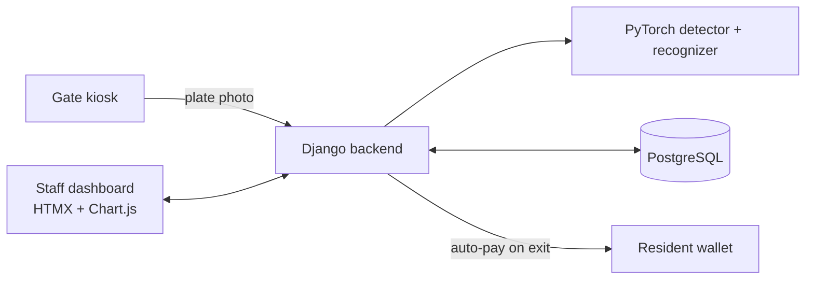
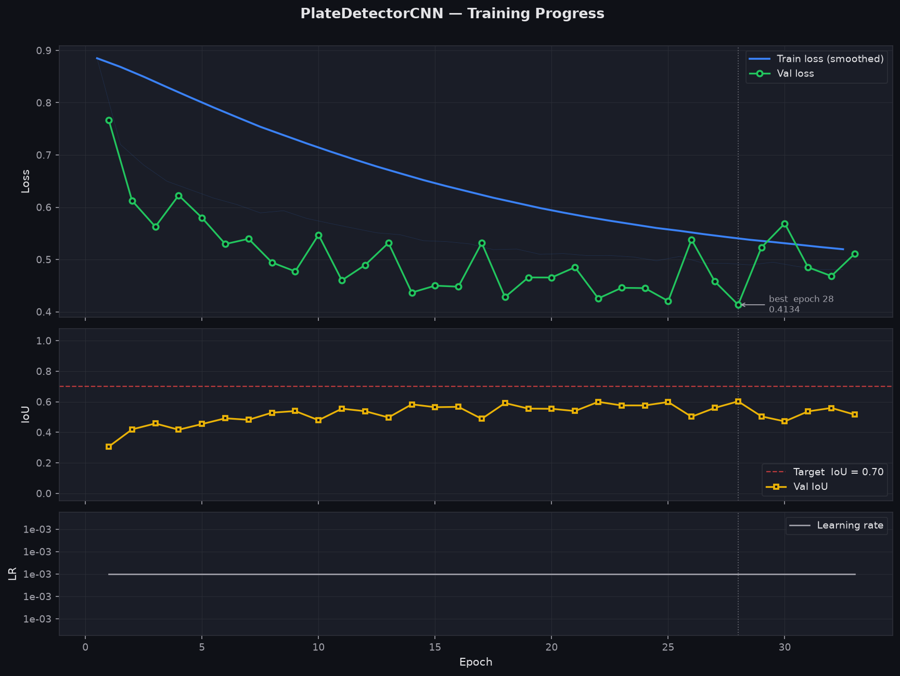
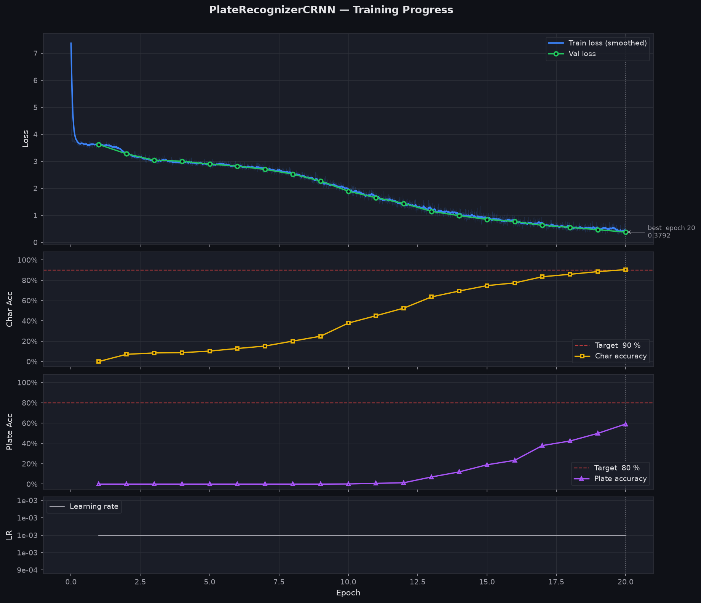

# Parking Lot Tracker

A self-service parking lot system modeled on Chinese license-plate-recognition (LPR) gates. A from-scratch PyTorch plate reader opens and closes sessions at an unmanned kiosk, and registered plates are billed automatically to the owner's prepaid wallet.

**Recognition limitation:** Clearer or more realistic-looking photos are not necessarily easier for this model. During demo preparation, it misread all three cleaner AI-generated test images, with confidence scores above the low-confidence threshold. This small check is not a benchmark, but it shows that confidence does not guarantee a correct plate. The recorded held-out synthetic evaluation achieved only 22% exact end-to-end reads; accuracy on real camera photos is unmeasured. The GIF demonstrates the application flow with selected successful inputs, not reliable real-world recognition. See [known CV limitations](docs/technical/08-limitations.md#cv-models).

## Why

In a lot of Chinese cities, parking no longer involves anyone at all. A camera at the barrier reads your plate, the arm lifts, and when you leave the fee is taken from an account already linked to that plate. There's no ticket, no cashier and no machine to feed coins into. Most parking lots elsewhere still run on paper tickets, pay stations and staff in booths, and I wanted to understand how the self-service version actually works end to end.

So I rebuilt it, including the part most projects would outsource: reading the plate. Instead of calling a cloud OCR API, the detector and recognizer are small networks trained from scratch on synthetic data. That makes every misread something I can open up and debug, down to the tensor.

## Features

- **Unmanned gate kiosk.** Upload a plate photo at an entry or exit lane to open or close a parking session.
- **Custom CV pipeline.** A CNN plate detector plus a CRNN + CTC plate recognizer, built and trained from scratch with no external CV APIs.
- **Auto-pay.** A registered plate's charge is deducted from the owner's wallet on exit. Guests see the amount due at the kiosk.
- **Configurable billing.** Per-minute or per-hour rates, a grace period and a daily cap, set per lot.
- **Resident self-service.** Sign up, link plates, and view the wallet balance and ledger history.
- **Staff oversight.** A live dashboard, session log, and a correction queue for low-confidence or unmatched reads.
- **Revenue analytics.** Daily, per-lot and per-hour charts.
- **Privacy defaults.** Plate images are kept in private storage, the kiosk returns reduced responses, and expired images are cleaned up on a schedule.

## How it works


```mermaid
flowchart LR
    Kiosk["Gate kiosk"] -->|"plate photo"| Django["Django backend"]
    Django --> CV["PyTorch detector + recognizer"]
    Django <--> DB[("PostgreSQL")]
    Django -->|"auto-pay on exit"| Wallet["Resident wallet"]
    Staff["Staff dashboard<br/>HTMX + Chart.js"] <--> Django
```

A driver uploads a plate photo at the kiosk, which stands in for the lane camera. The upload is validated and stored privately. The CV pipeline finds the plate, reads its text and scores its confidence. The session layer then opens a session on entry, or on exit closes it, calculates the charge and debits the owner's wallet in the same transaction. Low-confidence reads still let the car through but are also queued for staff to correct. The gate never blocks on the model being unsure.

A detailed technical walkthrough is in [`docs/technical/`](docs/technical/00-architecture.md).

## Tech stack

| Layer | Technology |
|---|---|
| CV models | PyTorch, OpenCV, Pillow (custom CNN detector + CRNN/CTC recognizer) |
| Backend | Django 5.1 |
| Database | PostgreSQL 16 |
| Frontend | Django templates, HTMX, Chart.js (self-hosted, no Node build) |
| Deployment | Docker Compose, Gunicorn |
| CI | GitHub Actions |

## Setup

Requires Docker with Compose ≥ 2.24. Python 3.11+ is needed only to train the CV models outside Docker.

Create a `.env` file from `.env.example`. It stores the Django secret key, database credentials, `DEBUG`, and the kiosk activation token. Generate the token with `openssl rand -hex 32`.

```bash
cp .env.example .env
docker-compose up --build
docker-compose exec web python manage.py migrate
docker-compose exec web python manage.py setup_defaults     # default lot + billing settings
docker-compose exec web python manage.py createsuperuser    # staff/admin account
```

Open `http://localhost:8000/`:
- the kiosk is at `/` (activate it with the token from `.env`);
- residents sign up at `/register/`;
- staff land on `/staff/` after logging in.

Run the tests:

```bash
docker-compose exec web pytest
docker-compose exec web pytest --cov=apps/accounts --cov=apps/parking --cov-fail-under=80
```

### CV model weights

Scans need both trained weight files in `apps/cv/weights/` (gitignored): `detector.pth` and `recognizer.pth`. Generate synthetic data and train them outside Docker. Training uses MPS on Apple Silicon or CUDA when available. The detector dataset needs parking-lot photos in `data/backgrounds/`.

```bash
python -c "from apps.cv.training.synthetic_data import generate_detector_dataset; generate_detector_dataset(n=1000, output_dir='data/detector', bg_dir='data/backgrounds')"
python -c "from apps.cv.training.synthetic_data import generate_recognizer_dataset; generate_recognizer_dataset(n=5000, output_dir='data/recognizer')"
python apps/cv/training/train_detector.py --epochs 50 --data-dir data/detector --output apps/cv/weights/detector.pth
python apps/cv/training/train_recognizer.py --epochs 100 --data-dir data/recognizer --output apps/cv/weights/recognizer.pth
```

Each script saves a training-curve plot next to its weights:




Current results on synthetic validation data:
- **Recognizer:** 98.59% character accuracy, 91.50% full-plate accuracy.
- **Detector:** about 0.43 IoU, below its 0.70 target.

See [CV Model Status](docs/technical/01-cv-pipeline.md#cv-model-status) for what that means and what to try next.

### Production

```bash
docker compose -f docker-compose.yml -f docker-compose.prod.yml up --build -d
```

This runs Gunicorn, drops the dev bind mount and binds only to `127.0.0.1`, so put it behind a reverse proxy. Schedule `python manage.py cleanup_old_images` nightly to enforce image retention. See [`docs/technical/07-security-and-deployment.md`](docs/technical/07-security-and-deployment.md).

## API reference

| Method | Endpoint | Description |
|---|---|---|
| GET | `/` | Gate kiosk |
| POST | `/kiosk/activate/` | Exchange the kiosk token and lane scope for a browser capability |
| POST | `/kiosk/scan/` | Run CV on an uploaded plate and open/close a session (privacy-reduced response) |
| GET/POST | `/register/` | Resident signup (always non-staff), provisions a wallet |
| GET/POST | `/plates/`, `/plates/<id>/delete/` | Manage the signed-in user's plates |
| GET | `/wallet/` | Balance and ledger history |
| GET/POST | `/wallet/topup/` | Top up through the payment connector (placeholder, fails closed) |
| GET | `/staff/`, `/staff/log/`, `/staff/errors/`, `/staff/revenue/`, `/staff/settings/` | Staff pages |
| GET | `/staff/api/sessions/`, `/staff/api/dashboard-stats/`, `/staff/api/revenue-data/` | HTMX/JSON data for staff pages |
| PATCH | `/staff/api/events/<id>/correct/` | Correct a queued plate read and reconcile its session |
| GET | `/staff/api/events/<id>/image/` | Stream a detection image privately |

Resident routes require login, and `/staff/` routes require `is_staff`. Kiosk, signup, top-up, login and password-reset routes are rate-limited per IP.

## Limitations and roadmap

This is a portfolio-scale system, and several choices reflect that:
- the kiosk takes an uploaded photo instead of a camera feed;
- inference runs in the request, with no task queue;
- there is one global staff role;
- the payment connector is a placeholder that refuses to create credit.

The CV models were trained only on synthetic data, and the detector is the current accuracy bottleneck. The full list, and what changing scope would require, is in [`docs/technical/08-limitations.md`](docs/technical/08-limitations.md).

## Security notes

Two layers check every public upload before any decode:
- **Web layer:** declared MIME type, Pillow header, 10 MB and 12 MP caps, randomized names in private storage.
- **CV layer:** path containment, a content-based format allowlist and a bounded single read.

Model weights load with `torch.load(..., weights_only=True)` and a checked preprocessing version. Plate images are served only to authenticated staff, with `Cache-Control: private, no-store`. Kiosk scans need an activated capability plus a single-use nonce. Wallet money is `Decimal`-only and row-locked, with `balance == SUM(ledger)` as an invariant. Production enforces CSP, HSTS and secure cookies. Details are in [`docs/technical/07-security-and-deployment.md`](docs/technical/07-security-and-deployment.md).

## License

MIT. See [LICENSE](LICENSE).
