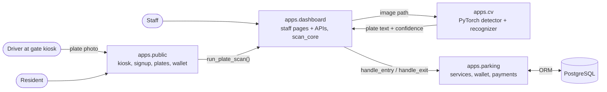
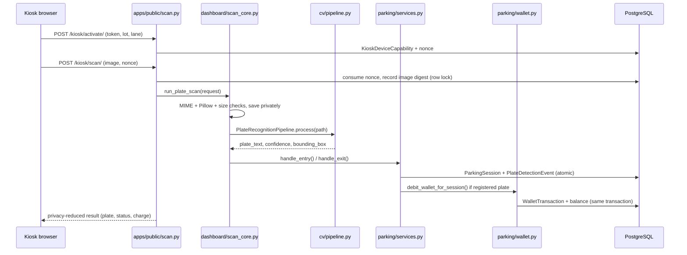

# Architecture

## System overview

The app is a single Django project backed by one PostgreSQL database and deployed as two Docker Compose containers (`web`, `db`). There is no message queue and no separate CV service. The CV models load once per web process and run inside the request. The frontend is server-rendered Django templates with HTMX and Chart.js, and needs no Node build step.

## Kiosk scan flow

## Module boundaries

| App | Responsibility | Depends on |
|---|---|---|
| `apps.accounts` | Custom `User(AbstractUser)`, no extra fields | Django auth |
| `apps.parking` | Models, `services.py` (session and billing logic), `wallet.py` (ledger money ops), `payments.py` (payment seam), `setup_defaults` | `accounts` |
| `apps.cv` | Preprocessing, detector and recognizer models, synthetic data, training scripts, inference pipeline | PyTorch, OpenCV, Pillow |
| `apps.dashboard` | Staff-only pages and APIs under `/staff/`, `staff_required`, and `scan_core.run_plate_scan` (image → CV → session) | `parking`, `cv` |
| `apps.public` | Gate kiosk, resident signup, plate management, wallet and top-up, per-IP rate limiter | `parking`, `dashboard.scan_core` |

## Why this shape

- **`services.py` never loads model weights.** The caller runs the CV pipeline and passes the extracted `plate_text`, `confidence` and `bounding_box` in. That keeps billing logic fast and unit-testable without `.pth` files, and means a CV change cannot break the billing tests.
- **`scan_core.run_plate_scan` is the only place that connects CV to sessions.** It was originally the staff upload endpoint. It became the public kiosk's core without changes, so every upload guard (size, format, dimensions, private storage) applies to the public path as well.
- **`apps/cv` runs without Django.** Training and evaluation use plain scripts (`python apps/cv/training/train_detector.py`), so the models can be trained on Apple Silicon MPS outside Docker and the resulting weights dropped into `apps/cv/weights/`.
- **Wallet debits run inside the session's transaction.** A car's exit and its charge commit together or not at all (see [05-kiosk-wallet-payments.md](05-kiosk-wallet-payments.md)).

## See also

- [01-cv-pipeline.md](01-cv-pipeline.md): preprocessing, detector, recognizer, inference
- [02-cv-training.md](02-cv-training.md): synthetic data, augmentation, training runs
- [03-design-rationale.md](03-design-rationale.md): why the CV stack is shaped this way
- [04-sessions-and-billing.md](04-sessions-and-billing.md): session logic, billing, data model
- [05-kiosk-wallet-payments.md](05-kiosk-wallet-payments.md): kiosk trust model, wallet ledger, payment seam
- [06-staff-dashboard.md](06-staff-dashboard.md): pages, APIs, scheduled cleanup
- [07-security-and-deployment.md](07-security-and-deployment.md): security controls, Docker
- [08-limitations.md](08-limitations.md): known constraints and roadmap
