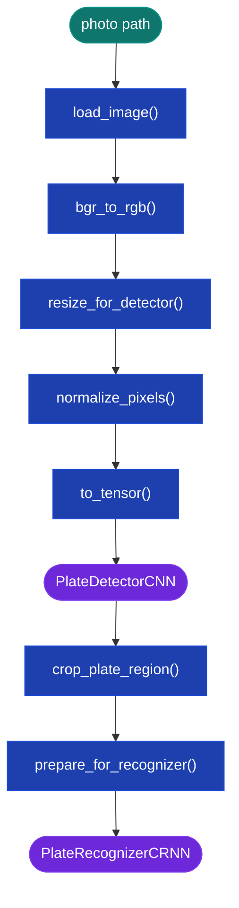
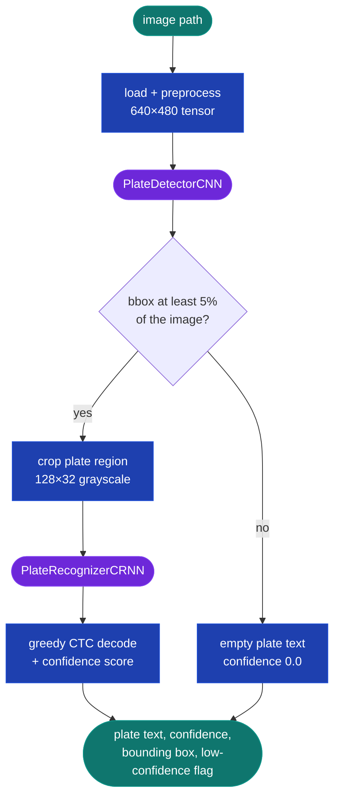

# CV Pipeline

> This checkout includes the five-block detector from the September 2026 retrain.
> See [CV Model Status](#cv-model-status) for measured accuracy and limitations.

This section is the mechanics reference for `apps/cv/` — exact shapes, layers,
constants, and control flow, precise enough to reimplement the pipeline from
this section alone. For *why* each shape and choice was made instead of an
alternative, see [CV Design Rationale](03-design-rationale.md). For measured
accuracy numbers, see [CV Model Status](#cv-model-status).



## Image Preprocessing

Every function below lives in `apps/cv/preprocessing.py`. Signatures and I/O
shapes are exact:

```
path:str → load_image() → bgr_to_rgb() → resize_for_detector()   # (480, 640, 3) uint8 RGB
        → normalize_pixels() → to_tensor()                       # (3, 480, 640) float32 tensor
bbox → crop_plate_region() → prepare_for_recognizer()             # (32, 128) grayscale, recognizer input
```

**`load_image(path: str) -> np.ndarray`** (returns `(H, W, 3)` `uint8` BGR) — the
only function that touches raw, potentially attacker-controlled bytes; on the
public kiosk anyone can reach it with no account, so its load contract is a
security boundary as much as an I/O routine:

- **Path containment** (`_assert_safe_path`) — resolves symlinks and `..`
  segments; the resolved path must live under `MEDIA_ROOT` (or
  `CV_PROCESSING_TEMP_ROOT`). Violations raise `UnsafeImagePathError`
  (a `ValueError` subclass, importable from `preprocessing`).
- **Format allowlist by content, not extension** — Pillow inspects the actual
  file header; only JPEG, PNG, and WEBP pass. BMP is rejected outright
  regardless of extension (richer CVE history in both Pillow's and OpenCV's
  BMP parsers, for a format no real camera upload uses).
- **12 MP cap (4000×3000) before decode** — checked from the header (cheap)
  and again post-decode as defense in depth, rejecting decompression-bomb-style
  images (tiny compressed file, huge decoded buffer) before OpenCV ever
  allocates the pixel array.
- **Single bounded read, not double-open** — the file is read once, capped at
  `MAX_IMAGE_BYTES + 1` bytes; both the Pillow validation and the
  `cv2.imdecode` call operate on that same in-memory buffer, closing a TOCTOU
  window where the file could be swapped between a validate-then-load pair of
  operations.
- **Path-stripped errors** — on failure, callers see a generic
  `FileNotFoundError` or `RuntimeError` with no path in the message; only a
  6-byte hash (`_path_id`) goes to the server log, so an API error response
  can't leak server directory layout even if it echoes the exception text.

OpenCV decodes the validated buffer into a BGR numpy array only after every
check above passes.

**`bgr_to_rgb(image: np.ndarray) -> np.ndarray`** — `(H, W, 3)` BGR → `(H, W,
3)` RGB via `cv2.cvtColor`, not array slicing — `cvtColor` returns a
contiguous array, avoiding a hidden copy later in the pipeline.

**`resize_for_detector(image: np.ndarray) -> np.ndarray`** — any `(H, W, 3)` →
letterboxed `(480, 640, 3)`. The image is scaled to fit and the shorter
dimension is padded with a neutral fill rather than stretched, so aspect
ratio (and plate shape) is preserved.

**`normalize_pixels(image: np.ndarray) -> np.ndarray`** — `uint8 [0, 255]` →
`float32 [0.0, 1.0]` (divide by 255).

**`to_tensor(image: np.ndarray) -> torch.FloatTensor`** — `(H, W, C)` → `(C,
H, W)`; for the detector input this is `(3, 480, 640)`, matching PyTorch's
channels-first convention.

**`crop_plate_region(image: np.ndarray, bbox) -> np.ndarray`** — crops the
resized `(480, 640, 3)` image to a top-left `[x, y, w, h]` box, clamped to
image bounds to absorb any slight over-prediction from the detector.

**`prepare_for_recognizer(crop: np.ndarray) -> np.ndarray`** — crop → grayscale
`(32, 128)`. Grayscale because plate reading is a shape task (color carries no
signal and would triple input size for no accuracy gain); 128×32 is wide
enough for the longest supported plate text and small enough to keep the
encoder fast.

## Plate Detector CNN

`PlateDetectorCNN` (`apps/cv/models/plate_detector.py`) regresses one
normalized bounding box `[cx, cy, w, h]` per image — YOLO center format, all
four values in `[0, 1]`.

**Input:** `(B, 3, H, W)` float32, nominally `(B, 3, 480, 640)` after
preprocessing (`AdaptiveAvgPool2d` below tolerates other sizes).

**Convolutional backbone** — five blocks, each `Conv2d(bias=False) →
BatchNorm2d → ReLU(inplace=True) → MaxPool2d(2×2)`:

| Block | Channels in→out | Output shape (from 480×640 input) |
|---|---|---|
| 1 | 3 → 32 | `(B, 32, 240, 320)` |
| 2 | 32 → 64 | `(B, 64, 120, 160)` |
| 3 | 64 → 128 | `(B, 128, 60, 80)` |
| 4 | 128 → 256 | `(B, 256, 30, 40)` |
| 5 | 256 → 256 | `(B, 256, 15, 20)` |

Blocks 4 and 5 were added in the 2026-09-26 retrain. Three blocks gave each
output position a receptive field of about 22px, while a plate at gate-camera
scale spans 96–256px; five blocks raise it to about 94px (rationale in
[Detector Design Choices](03-design-rationale.md#detector-design-choices)).

`AdaptiveAvgPool2d((3, 4))` then collapses the spatial size to a fixed `(B,
256, 3, 4)`, flattened to `(B, 3072)`. The 3×4 grid keeps the input's 3:4
aspect ratio and evenly divides the 15×20 feature map, which PyTorch's MPS
backend requires for adaptive pooling.

**Fully connected head:** `3072 → 256` (`fc1`) → `ReLU` → `Dropout(p=0.3)` →
`256 → 4` (`fc2`) → `sigmoid`. The final output is `(B, 4)`, `[cx, cy, w, h]`
in `[0, 1]`. Sigmoid is applied **inside** `forward()`, not as a
separate inference-only step, so the loss trains against the exact
`[0, 1]` output space `predict()` returns at inference.

```python
x = self.block1(x)   # (B, 32,  240, 320)
x = self.block2(x)   # (B, 64,  120, 160)
x = self.block3(x)   # (B, 128, 60,  80)
x = self.block4(x)   # (B, 256, 30,  40)
x = self.block5(x)   # (B, 256, 15,  20)
x = self.pool(x)     # (B, 256, 3,   4)
x = x.flatten(1)      # (B, 3072)
x = self.fc1(x)       # (B, 256)
x = self.dropout(self.relu_fc(x))
x = self.fc2(x)       # (B, 4) raw logits
return torch.sigmoid(x)   # (B, 4), [cx, cy, w, h] in [0, 1]
```

**`predict(x)`** wraps `forward()` under `@torch.no_grad()`, temporarily
forces `eval()` mode, and restores the model's prior `training`/`eval` state
via `try/finally` — safe to call mid-training (e.g. a validation callback)
without corrupting the training loop's own mode state. This same
no-grad/eval/restore pattern is used by `PlateRecognizerCRNN.predict()` below.

**Training** (`train_detector.py`): `SmoothL1Loss` (Huber) plus a weighted
GIoU term (`torchvision.ops.generalized_box_iou_loss`, `--giou-weight`), Adam,
and `ReduceLROnPlateau(factor=0.5, patience=5)`. The checkpoint is chosen by
**best validation IoU**, not lowest loss, and training stops early after
`--patience` epochs without an IoU gain. `--val-data-dir` validates against a
dataset generated from backgrounds never used in training. Target: **>0.7 IoU**
on held-out backgrounds — actual result in [CV Model Status](#cv-model-status).


## Plate Recognizer CRNN

`PlateRecognizerCRNN` (`apps/cv/models/recognizer.py`) reads text from a
cropped, grayscale plate image via a CNN backbone → bidirectional LSTM → CTC
output.

**Input:** `(B, 1, 32, 128)` float32 grayscale, values in `[0, 1]`. Height 32
and width 128 must be exact — produced by `prepare_for_recognizer()`.

**Convolutional backbone** — three blocks, each `Conv2d(bias=False) →
BatchNorm2d → ReLU(inplace=True) → MaxPool2d`:

| Block | Channels in→out | Pool kernel | Output shape |
|---|---|---|---|
| 1 | 1 → 64 | `(2, 2)` | `(B, 64, 16, 64)` |
| 2 | 64 → 128 | `(2, 2)` | `(B, 128, 8, 32)` |
| 3 | 128 → 256 | `(1, 2)` | `(B, 256, 8, 16)` |

Block 3's `MaxPool2d(kernel_size=(1, 2))` halves width (32→16) but leaves
height at 8 — width becomes the 16-step character sequence the LSTM reads one
column at a time, while the preserved height keeps vertical stroke detail
that disambiguates look-alikes like `I`/`1` or `O`/`0`.

**Reshape to sequence:** `(B, 256, 8, 16)` → `reshape(B, 2048, 16)` (256
channels × 8 rows flattened to a 2048-dim feature per column) →
`permute(2, 0, 1)` → `(T=16, B, 2048)`. `reshape()` (not `view()`) is used
because `MaxPool2d` can leave the tensor non-contiguous.

**Bidirectional LSTM:** `hidden_size=256, num_layers=2, bidirectional=True,
dropout=0.3` (fires between the two layers only), `batch_first=False`. Input
`(16, B, 2048)` → output `(16, B, 512)` (256 × 2 directions concatenated).

**Output projection:** `Linear(512, 37)` → `log_softmax(dim=-1)` → `(T=16, N,
C=37)` log-probabilities, one distribution over 37 classes (26 letters + 10
digits + 1 CTC blank at index 0) per time-step. `forward()` returns these
log-probs directly — **do not** re-apply `log_softmax`; doing so silently
corrupts `CTCLoss` by compressing probabilities a second time.

```python
x = self.block1(x)                                    # (B, 64,  16, 64)
x = self.block2(x)                                    # (B, 128,  8, 32)
x = self.block3(x)                                    # (B, 256,  8, 16)
x = x.reshape(B, 2048, 16).permute(2, 0, 1)           # (16, B, 2048)
x, _ = self.lstm(x)                                    # (16, B, 512)
x = self.fc(x)                                         # (16, B, 37)
return F.log_softmax(x, dim=-1)                        # (T=16, N, C=37)
```

**`predict(x)`** — same no-grad/eval/restore contract as
`PlateDetectorCNN.predict()` above; returns `(T=16, N, C=37)` log-probs.

**`decode_predictions(output) -> list[str]`** — greedy CTC decode:

1. `argmax(dim=-1)` over the class dimension at every time-step → `(T, N)`
   predicted indices.
2. Collapse consecutive identical tokens (`[A, A, B]` → `[A, B]` — CTC
   spreads one character across multiple frames, it does not mean the plate
   reads `"AAB"`).
3. Drop blank tokens (index 0).
4. Map remaining indices to characters and join.

A plate where every time-step decodes to blank returns `""`.

**Training** (`train_recognizer.py`): `CTCLoss` **must** run on CPU even when
the model trains on MPS — PyTorch's MPS backend has no native CTC-loss
kernel as of PyTorch 2.x. The training loop moves only `log_probs` to CPU
before the loss call (`log_probs.cpu()`); the model itself keeps training on
MPS, and autograd tracks the `.cpu()` transfer as part of the graph so
gradients still flow back correctly. `predict()` and `decode_predictions()`
never touch `CTCLoss`, so kiosk inference runs fully on MPS/CUDA with no
forced CPU hop. Target: **>90% character accuracy, >80% full-plate accuracy**
on synthetic validation data after 100 epochs — actual result and diagnosis
in [CV Model Status](#cv-model-status).


Weights for both models live in `apps/cv/weights/` (gitignored). Load with
`torch.load(..., weights_only=True)`.

## Plate Recognition Pipeline

`PlateRecognitionPipeline` (`apps/cv/pipeline.py`) wires every piece above
into one call: image path in, structured result out.

```python
result = pipeline.process(image_path)
# {"plate_text": "ABC123", "confidence": 0.87, "bounding_box": [x, y, w, h], "is_low_confidence": False}
```



### Model Loading

Both models load once at pipeline construction (`__init__`), not per request
— hundreds of milliseconds per `.pth` load would otherwise land on every
kiosk scan. Weights are loaded with `weights_only=True`, which blocks the
arbitrary code execution a pickle-based load of an untrusted `.pth` file
would allow.

Each checkpoint is a dict, not a bare state dict, and must declare a matching
`preprocessing_version` (`NORMALIZED_PREPROCESSING_VERSION`,
`apps/cv/training/augment.py`) before its `state_dict` is loaded
(`_load_weights`). A checkpoint with no version, or a mismatched one, is
rejected with `RuntimeError` rather than loaded and silently fed input it
was never trained to expect — the load fails closed instead of risking a
confident misread from an invisible normalization mismatch.

- Missing weight file → `FileNotFoundError` naming which training script to
  run.
- Present but corrupt/truncated/incompatible file, or a version mismatch →
  `RuntimeError`.
- In both cases the exception message never contains the real file path;
  only the server log gets the full path, so a future API error response
  can't leak server directory layout.

After loading, both models are moved to the best available device (`MPS →
CUDA → CPU`, `apps/cv/utils/device.py::get_device`, shared by the training
scripts and this pipeline) and switched to `eval()` mode, so `process()`
calls are stateless and safe to run from multiple threads.

### Processing Steps

1. **Load and preprocess** — full preprocessing chain, ending as a `(3, 480,
   640)` normalized tensor.
2. **Detect** — `PlateDetectorCNN.predict()` returns `[cx, cy, w, h]` in
   YOLO center format.
3. **Reject tiny boxes** — if `w` or `h` is below `_MIN_BBOX_SIZE = 0.05`
   (≈32 px on a 640 px image), the pipeline returns early with
   `plate_text=""`, `confidence=0.0`, `is_low_confidence=True` — too small a
   crop to contain readable character strokes regardless of recognizer
   quality.
4. **Crop** — the YOLO center box converts to top-left `[x, y, w, h]` and
   `crop_plate_region()` cuts the plate out of the **resized** (not
   original) image, because the detector's coordinates describe the
   640×480 canvas it actually saw.
5. **Recognize** — `prepare_for_recognizer()` → `(1, 32, 128)` →
   `PlateRecognizerCRNN.predict()` → `decode_predictions()`.
6. **Score** — confidence is computed from the non-blank time-steps (below).

### Confidence Score

The recognizer emits 16 time-steps for every plate regardless of length, so
on a 6-character plate most steps are blank. Confidence is the mean
max-class probability over **non-blank** steps only — including blank steps
would inflate the score and hide genuine uncertainty on the actual
characters. If every step is blank (or `plate_text` is empty), confidence is
`0.0`.

`confidence < LOW_CONFIDENCE_THRESHOLD` (`0.6`, `apps/cv/pipeline.py`) sets
`is_low_confidence=True`. This constant is a CV-layer default, not the value
that gates billing — `services.py` checks the separate, per-lot,
operator-tunable `LotSettings.confidence_threshold` instead (see
[Confidence as a Product Decision](03-design-rationale.md#confidence-as-a-product-decision-not-just-a-metric)
for why two thresholds exist).

### Bounding Box Coordinate System

The detector sees a letterboxed 640×480 canvas — the original photo shrunk to
fit and padded with neutral bars. The dashboard draws boxes on the
**original** upload, so the pipeline removes the padding and re-normalizes
the box back to the original image before returning it. The returned
`bounding_box` is `[x, y, w, h]` (top-left corner plus size, all values in
`[0, 1]`), matching the `PlateDetectionEvent.bounding_box` field.

### Singleton

`get_pipeline(detector_path, recognizer_path)` returns a module-level
singleton — the first call constructs the pipeline, every later call reuses
it, so one Django process shares one loaded copy of both models across all
requests. Construction is guarded by double-checked locking so two
concurrent first requests can't each load their own copy.

The singleton is created lazily on first use, not at Django startup
(`AppConfig.ready()`), because `ready()` also runs during management
commands like `migrate` and `collectstatic`, where weight files may not
exist yet and inference is never needed — eager loading would break those
commands in CI for lacking a trained model no one asked for at that point.

## CV Model Status

**Neither CV model is fully trained yet, and both are expected to get more
accurate with more training and more varied data.** This section states
current results plainly, including where targets were missed. It is the
single source of truth for every CV accuracy number in these docs — other
sections link here rather than repeating them.

### Experimental models (2026-09-26 retrain)

These results come from the September 2026 local retraining run. This checkout
includes its five-block detector, mixed-crop generator, held-out validation
options, and evaluation script. Use checkpoints trained with this architecture;
older three-block detector checkpoints are incompatible.

| Model | Run | Result | Target | Status |
| :--- | :--- | :--- | :--- | :--- |
| `PlateDetectorCNN` (5 blocks, SmoothL1 + GIoU) | 2,500 train images from 10 backgrounds; validated on 400 images from 2 **held-out** backgrounds. Stopped manually at epoch 33 of 40; best epoch 28 | **0.603 val IoU** (0.587 mean IoU on a fresh 100-image holdout evaluation) | >0.70 IoU | **Not met** — up from ~0.43 |
| `PlateRecognizerCRNN` (mixed flat + scene crops) | 8,000 crops, half cut from composited scenes with a ±10% jittered box. 20 of 20 epochs, still improving at the end | **90.5% char accuracy, 59.1% full-plate accuracy** on its mixed validation split | >90% char / >80% full-plate | **Char met, plate not met** |

**End to end** (`apps/cv/training/evaluate_detector.py`, 100 fresh scenes on
the 2 held-out backgrounds):

| Metric | Before retrain | After retrain |
| :--- | ---: | ---: |
| Mean detector IoU | 0.433 | 0.587 |
| Boxes with IoU ≥ 0.5 | 38% | 77% |
| Full-plate reads, detector + recognizer | **0%** | **22%** |
| Full-plate reads given the ground-truth box ("oracle") | 3% | 50% |

The training curves in `docs/images/` match these runs.

### What the retrain found

- **The recognizer was the hidden bottleneck.** The previous recognizer
  scored 98.6% character accuracy on its own validation set, but only 3% of
  plates read correctly when handed a *perfect* crop cut from a composited
  scene. It had only ever seen clean, native-resolution crops, never the
  blur, rotation and perspective a detector crop carries. Training on half
  scene crops raised that oracle number to 50%.
- **Every earlier run used the fallback font.** `apps/cv/training/assets/plate_font.ttf`
  was missing, so plates were rendered with Pillow's low-fidelity bitmap
  font. Liberation Mono Bold is now installed (see `assets/README.md`).
- **The detector's receptive field was too small** for plate-sized objects,
  and its checkpoint was chosen on a loss that had drifted away from IoU.
  Both are fixed (see [Detector Design Choices](03-design-rationale.md#detector-design-choices)).

### Honest limits of these numbers

**Both models were trained and validated exclusively on self-generated
synthetic data and have never been evaluated against real photographs.** The
numbers describe synthetic performance, not real-world accuracy.

- The holdout set is only 2 background photos, so it is a small and noisy
  generalization check; the full background set is still just 12 photos.
- A single plate font and only 5 fixed plate formats (US + Canadian) are
  rendered.
- The detector regresses exactly one box per image with no objectness score:
  it cannot express "no plate present" and cannot handle multiple plates.
- The detector run was stopped by hand at epoch 33 and the recognizer run
  ended while still improving, so neither is converged.

### What to try next, in expected-payoff order

1. **More backgrounds** — tens to low hundreds of distinct lots, angles and
   lighting conditions, with a larger held-out share. This is the biggest
   remaining lever for the detector.
2. **Train the recognizer longer** on scene-heavy data; full-plate accuracy
   was still rising steeply at epoch 20.
3. **An objectness / no-plate output** (for example a small heatmap head) so
   the detector can express confidence instead of always emitting a box.
4. Eventually, fine-tuning on real labeled plate photographs.

## See also

- [00-architecture.md](00-architecture.md): system overview and module boundaries
- [08-limitations.md](08-limitations.md): known constraints and roadmap
