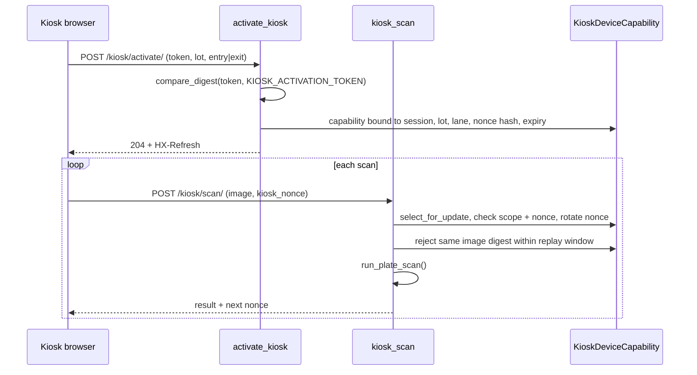

# Kiosk, Wallet, and Payments

## Gate kiosk (`apps/public/scan.py`)

The kiosk at `/` is the unmanned screen at an entry or exit lane. A driver uploads a plate photo in place of a live camera feed. Anyone can load the page, but writing anything requires two things: an **activated browser capability** and a **one-time nonce**.

- **`activate_kiosk`**: exchanges the server-held `KIOSK_ACTIVATION_TOKEN` (compared with `secrets.compare_digest`) plus a fixed lot and lane for a `KioskDeviceCapability` row. The row is tied to the browser session, which lasts `KIOSK_SESSION_SECONDS` (default 12 h). The session key is cycled on activation. Rate-limited to 5 attempts per 5 minutes per IP.
- **`_consume_kiosk_request`**: locks the capability row and checks, in one transaction:
  - the token fingerprint still matches the configured token, so rotating the token revokes every kiosk;
  - the submitted lot and lane match the capability;
  - the nonce matches.

  It then rotates the nonce. A stale nonce gets one replacement nonce back, so a lost response doesn't lock the lane out.
- **Image replay guard**: each accepted upload's digest is stored for `KIOSK_IMAGE_REPLAY_SECONDS` (default 300 s). An identical photo inside that window is rejected. If the scan then fails, the digest is released so the driver can retry the same photo.
- **`kiosk_scan`**: CSRF-protected, POST-only, 20 scans per minute per IP. It calls the shared `scan_core.run_plate_scan` (see [06-staff-dashboard.md](06-staff-dashboard.md) and [07-security-and-deployment.md](07-security-and-deployment.md) for upload validation).

### Privacy-reduced response (`_public_payload`)

The person at the gate sees only:
- the plate text, confidence band and event type;
- on entry, whether the plate is registered;
- on exit, the charge and whether it was billed to an account.

The response never includes the image URL, event id, owner identity or wallet balance.

## Wallet ledger (`apps/parking/wallet.py`)

Each user has one `Wallet` with a cached `balance`. Every money movement appends an immutable `WalletTransaction` row. The invariant, checked by a test, is that `Wallet.balance == SUM(WalletTransaction.amount)`.

| Function | Called from | What it does |
|---|---|---|
| `get_or_create_wallet` | signup | Provisions the wallet when an account is created |
| `credit_wallet` | `apps/public/wallet_views.py::topup` | Positive top-up only. The provider `reference` is an idempotency key: a replayed confirmation returns the original credit. A reused reference with a different wallet or amount raises `ValueError`. |
| `debit_wallet_for_session` | `services.py::_complete_session_for_exit` | Deducts the exit charge **inside the exit transaction**. A `$0.00` charge (grace period) writes no row, and guests are never debited. |
| `reconcile_wallet_for_session_owner` | `services.py::correct_plate` | When staff re-assign a completed session to another owner, appends signed `adjustment` rows so each wallet ends up with the correct net charge. The original charge row is never edited. |

Every write locks the wallet row with `select_for_update()`. The balance **may go negative**: an exit is never blocked for insufficient funds, because the barrier must not strand a car. The account owes the difference, and staff can see it.

## Payment seam (`apps/parking/payments.py`)

`PaymentConnector` is a `Protocol` with one method, `charge(user, amount) -> PaymentResult`. The installed `PlaceholderPaymentConnector` holds no secrets and **fails closed**. It validates the amount, then returns `success=False` ("Payment connector is not configured"). So `/wallet/topup/` renders and validates, but it never creates spendable credit. A real provider (Stripe, WeChat Pay, Alipay) would replace `_payment_connector`. It would keep its secrets server-side and verify the provider's response or signature before `credit_wallet` runs.

For demos and testing, fund a wallet from the Django shell with `credit_wallet(user, Decimal("50.00"), reference="manual-<id>")`.

## See also

- [04-sessions-and-billing.md](04-sessions-and-billing.md): `handle_exit` and `calculate_charge`
- [07-security-and-deployment.md](07-security-and-deployment.md): the "any plate can be uploaded" tradeoff
- [08-limitations.md](08-limitations.md)
